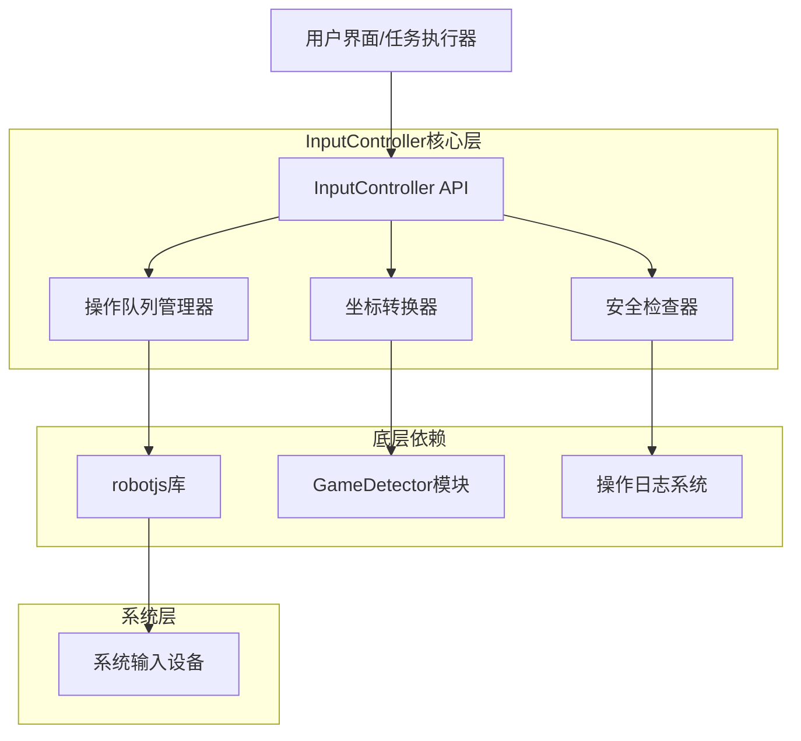
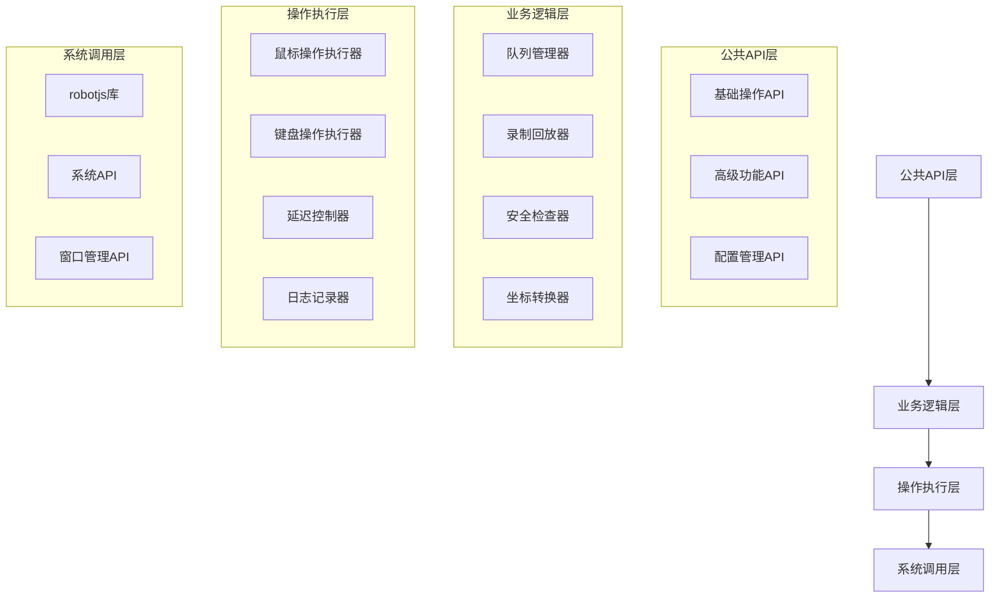
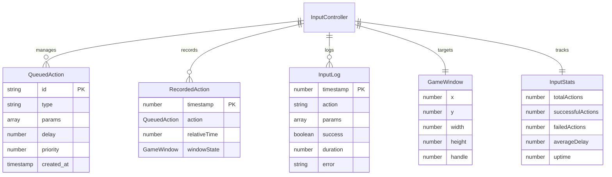

# Week 2: InputController模块技术架构文档

## 1. 架构设计



## 2. 技术描述

- **前端**: TypeScript + robotjs@0.6 + Node.js原生API
- **核心依赖**: robotjs (系统输入控制)
- **辅助库**: 无额外外部依赖
- **测试框架**: Jest + @types/jest

## 3. 路由定义

由于InputController是一个模块类，不涉及路由概念，这里列出主要的公共方法接口：

| 方法名 | 功能描述 |
|--------|----------|
| `enable()` | 启用输入控制器 |
| `disable()` | 禁用输入控制器 |
| `click(x, y, options?)` | 鼠标点击操作 |
| `move(x, y)` | 鼠标移动操作 |
| `key(key, options?)` | 键盘按键操作 |
| `typeText(text)` | 文本输入操作 |
| `drag(fromX, fromY, toX, toY)` | 鼠标拖拽操作 |
| `scroll(x, y, direction, amount)` | 滚轮滚动操作 |
| `smoothMoveTo(x, y, duration?)` | 平滑鼠标移动 |
| `addToQueue(action)` | 添加操作到队列 |
| `executeQueue()` | 执行操作队列 |
| `startRecording()` | 开始录制操作 |
| `stopRecording()` | 停止录制操作 |
| `playback(actions, speed?)` | 回放录制的操作 |

## 4. API定义

### 4.1 核心接口定义

#### 基础操作接口
```typescript
// 点击选项
interface ClickOptions {
  button?: 'left' | 'right' | 'middle';
  double?: boolean;
  delay?: number;
}

// 按键选项
interface KeyOptions {
  shift?: boolean;
  ctrl?: boolean;
  alt?: boolean;
  meta?: boolean;
  delay?: number;
}

// 鼠标位置
interface MousePosition {
  x: number;
  y: number;
}

// 游戏窗口信息
interface GameWindow {
  x: number;
  y: number;
  width: number;
  height: number;
  handle?: number;
}
```

#### 高级功能接口
```typescript
// 队列操作
interface QueuedAction {
  type: 'click' | 'key' | 'move' | 'drag' | 'scroll' | 'type';
  params: any[];
  delay?: number;
  id?: string;
  priority?: number;
}

// 录制操作
interface RecordedAction {
  timestamp: number;
  action: QueuedAction;
  relativeTime: number;
  windowState?: GameWindow;
}

// 操作日志
interface InputLog {
  timestamp: number;
  action: string;
  params: any[];
  success: boolean;
  duration: number;
  error?: string;
}

// 统计信息
interface InputStats {
  totalActions: number;
  successfulActions: number;
  failedActions: number;
  averageDelay: number;
  uptime: number;
}
```

### 4.2 主要方法签名

#### 基础操作方法
```typescript
/**
 * 鼠标点击
 */
public async click(x: number, y: number, options?: ClickOptions): Promise<boolean>

/**
 * 鼠标移动
 */
public async move(x: number, y: number): Promise<boolean>

/**
 * 键盘按键
 */
public async key(key: string, options?: KeyOptions): Promise<boolean>

/**
 * 文本输入
 */
public async typeText(text: string): Promise<boolean>

/**
 * 鼠标拖拽
 */
public async drag(fromX: number, fromY: number, toX: number, toY: number): Promise<boolean>

/**
 * 滚轮滚动
 */
public async scroll(x: number, y: number, direction: 'up' | 'down', amount: number): Promise<boolean>
```

#### 高级功能方法
```typescript
/**
 * 平滑移动鼠标
 */
public async smoothMoveTo(toX: number, toY: number, duration?: number, curve?: 'linear' | 'ease' | 'bezier'): Promise<boolean>

/**
 * 添加操作到队列
 */
public addToQueue(action: QueuedAction): string

/**
 * 执行操作队列
 */
public async executeQueue(): Promise<boolean[]>

/**
 * 开始录制操作
 */
public startRecording(): void

/**
 * 停止录制并返回操作列表
 */
public stopRecording(): RecordedAction[]

/**
 * 回放录制的操作
 */
public async playback(actions: RecordedAction[], speed?: number): Promise<boolean>
```

#### 配置和状态方法
```typescript
/**
 * 设置游戏窗口
 */
public setGameWindow(window: GameWindow): void

/**
 * 获取当前游戏窗口
 */
public getGameWindow(): GameWindow | null

/**
 * 设置默认延迟
 */
public setDefaultDelay(delay: number): void

/**
 * 获取操作统计
 */
public getStats(): InputStats

/**
 * 获取操作日志
 */
public getInputLogs(limit?: number): InputLog[]

/**
 * 清空操作日志
 */
public clearLogs(): void
```

## 5. 服务器架构图

由于InputController是客户端模块，不涉及服务器架构，这里展示模块内部的分层设计：



## 6. 数据模型

### 6.1 数据模型定义



### 6.2 数据定义语言

由于InputController是内存中的数据结构，不涉及数据库，这里展示主要数据结构的初始化：

#### 操作队列初始化
```typescript
// 操作队列
private actionQueue: QueuedAction[] = [];
private queueExecuting: boolean = false;
private queuePaused: boolean = false;

// 初始化队列
private initializeQueue(): void {
    this.actionQueue = [];
    this.queueExecuting = false;
    this.queuePaused = false;
}
```

#### 录制系统初始化
```typescript
// 录制状态
private recording: boolean = false;
private recordedActions: RecordedAction[] = [];
private recordingStartTime: number = 0;

// 初始化录制系统
private initializeRecording(): void {
    this.recording = false;
    this.recordedActions = [];
    this.recordingStartTime = 0;
}
```

#### 日志系统初始化
```typescript
// 操作日志
private inputLogs: InputLog[] = [];
private maxLogEntries: number = 1000;

// 初始化日志系统
private initializeLogs(): void {
    this.inputLogs = [];
    this.maxLogEntries = 1000;
}
```

#### 统计信息初始化
```typescript
// 统计信息
private stats: InputStats = {
    totalActions: 0,
    successfulActions: 0,
    failedActions: 0,
    averageDelay: 0,
    uptime: 0
};

// 初始化统计
private initializeStats(): void {
    this.stats = {
        totalActions: 0,
        successfulActions: 0,
        failedActions: 0,
        averageDelay: 0,
        uptime: Date.now()
    };
}
```

#### 配置参数初始化
```typescript
// 默认配置
private config = {
    defaultDelay: 100,
    safetyChecks: true,
    logActions: true,
    maxRetries: 3,
    smoothMoveDuration: 500,
    queueBatchSize: 10,
    recordingEnabled: true
};

// 初始化配置
private initializeConfig(): void {
    this.config = {
        defaultDelay: 100,
        safetyChecks: true,
        logActions: true,
        maxRetries: 3,
        smoothMoveDuration: 500,
        queueBatchSize: 10,
        recordingEnabled: true
    };
}
```

## 7. 关键技术实现

### 7.1 平滑鼠标移动算法

```typescript
/**
 * 贝塞尔曲线路径计算
 */
private calculateBezierPath(start: MousePosition, end: MousePosition, steps: number): MousePosition[] {
    const path: MousePosition[] = [];
    const controlPoint1 = {
        x: start.x + (end.x - start.x) * 0.25 + (Math.random() - 0.5) * 50,
        y: start.y + (end.y - start.y) * 0.25 + (Math.random() - 0.5) * 50
    };
    const controlPoint2 = {
        x: start.x + (end.x - start.x) * 0.75 + (Math.random() - 0.5) * 50,
        y: start.y + (end.y - start.y) * 0.75 + (Math.random() - 0.5) * 50
    };
    
    for (let i = 0; i <= steps; i++) {
        const t = i / steps;
        const point = this.calculateBezierPoint(start, controlPoint1, controlPoint2, end, t);
        path.push(point);
    }
    
    return path;
}

/**
 * 缓动函数
 */
private easeInOutQuad(t: number): number {
    return t < 0.5 ? 2 * t * t : -1 + (4 - 2 * t) * t;
}
```

### 7.2 操作队列执行机制

```typescript
/**
 * 队列执行器
 */
public async executeQueue(): Promise<boolean[]> {
    if (this.queueExecuting) {
        throw new Error('队列正在执行中');
    }
    
    this.queueExecuting = true;
    const results: boolean[] = [];
    
    try {
        // 按优先级排序
        const sortedQueue = [...this.actionQueue].sort((a, b) => (b.priority || 0) - (a.priority || 0));
        
        for (const action of sortedQueue) {
            if (this.queuePaused) {
                await this.waitForResume();
            }
            
            const result = await this.executeAction(action);
            results.push(result);
            
            if (action.delay) {
                await this.delay(action.delay);
            }
        }
        
        this.actionQueue = [];
        return results;
    } finally {
        this.queueExecuting = false;
    }
}
```

### 7.3 安全检查机制

```typescript
/**
 * 综合安全检查
 */
private async performSafetyCheck(x?: number, y?: number): Promise<boolean> {
    if (!this.config.safetyChecks) {
        return true;
    }
    
    // 检查游戏窗口是否有效
    if (!this.validateGameWindow()) {
        this.logAction('safety_check', [], false, 0, '游戏窗口无效');
        return false;
    }
    
    // 检查坐标是否在窗口内
    if (x !== undefined && y !== undefined) {
        if (!this.isCoordinateInGameWindow(x, y)) {
            this.logAction('safety_check', [x, y], false, 0, '坐标超出游戏窗口');
            return false;
        }
    }
    
    // 检查操作频率
    if (!this.checkOperationFrequency()) {
        this.logAction('safety_check', [], false, 0, '操作频率过高');
        return false;
    }
    
    return true;
}
```

## 8. 性能优化策略

### 8.1 内存管理
- 限制日志条目数量，自动清理旧记录
- 操作队列大小限制，防止内存泄漏
- 录制数据压缩存储

### 8.2 CPU优化
- 智能延迟调整，避免无效等待
- 批量操作优化，减少系统调用
- 异步操作，避免阻塞主线程

### 8.3 稳定性保障
- 操作重试机制
- 异常恢复策略
- 资源使用监控

---

**文档版本**: v1.0  
**创建时间**: 2024年1月  
**最后更新**: 2024年1月  
**维护人员**: 开发团队