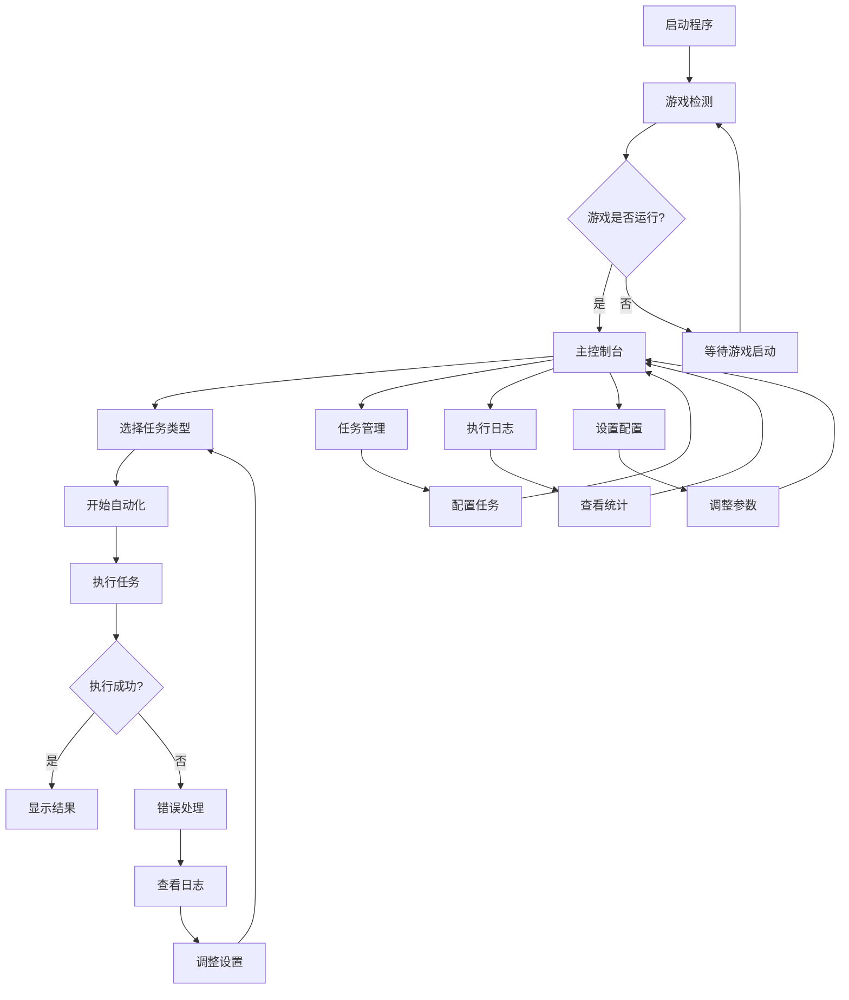

# 崩坏星穹铁道自动化助手 - 产品需求文档

## 1. 产品概述

崩坏星穹铁道自动化助手是一款专为《崩坏：星穹铁道》游戏设计的桌面自动化工具，旨在帮助玩家自动完成重复性的日常任务，提升游戏体验效率。

该产品解决玩家在游戏中需要重复执行大量机械性操作的痛点，通过智能图像识别和自动化控制技术，让玩家能够专注于游戏的核心乐趣而非繁琐的重复操作。

目标是成为星穹铁道玩家的得力助手，显著减少日常任务的时间投入，提升游戏体验的整体满意度。

## 2. 核心功能

### 2.1 用户角色

本产品采用单一用户模式，无需复杂的角色权限管理：

| 角色 | 注册方式 | 核心权限 |
|------|----------|----------|
| 游戏玩家 | 直接使用，无需注册 | 可使用所有自动化功能、配置个人设置、查看执行日志 |

### 2.2 功能模块

我们的自动化助手包含以下核心页面：

1. **主控制台**：游戏状态监控、自动化任务控制、实时执行状态显示
2. **任务管理页**：任务配置、执行计划设置、任务优先级管理
3. **执行日志页**：详细的操作记录、成功率统计、错误分析
4. **设置配置页**：个人偏好设置、安全参数配置、高级选项调整

### 2.3 页面详情

| 页面名称 | 模块名称 | 功能描述 |
|----------|----------|----------|
| 主控制台 | 游戏检测模块 | 实时检测游戏运行状态、窗口位置、游戏版本信息 |
| 主控制台 | 状态监控面板 | 显示当前执行任务、进度条、预计完成时间、系统资源使用情况 |
| 主控制台 | 快速控制区 | 一键启动/停止自动化、紧急暂停按钮、任务切换快捷操作 |
| 任务管理页 | 日常任务配置 | 配置每日委托、体力消耗任务、材料收集任务的自动执行 |
| 任务管理页 | 周常任务设置 | 设置忘却之庭、模拟宇宙等周常内容的自动化参数 |
| 任务管理页 | 自定义任务 | 创建个性化的任务序列、设置执行条件和循环规则 |
| 执行日志页 | 操作记录查看 | 详细记录每次点击、按键、识别结果，支持时间筛选和关键词搜索 |
| 执行日志页 | 统计分析图表 | 显示任务成功率趋势、执行时间统计、效率分析报告 |
| 执行日志页 | 错误诊断工具 | 分析失败原因、提供解决建议、支持错误截图查看 |
| 设置配置页 | 基础参数设置 | 调整点击延迟、识别超时、重试次数等核心参数 |
| 设置配置页 | 安全保护配置 | 设置运行时间限制、异常检测阈值、自动停止条件 |
| 设置配置页 | 界面个性化 | 自定义主题颜色、字体大小、通知方式、快捷键绑定 |

## 3. 核心流程

### 主要用户操作流程

**日常使用流程**：
1. 用户启动程序 → 程序自动检测游戏状态
2. 用户在主控制台选择要执行的任务类型（日常/周常/自定义）
3. 程序开始自动化执行 → 实时显示进度和状态
4. 执行完成后显示结果统计 → 用户可查看详细日志

**配置管理流程**：
1. 用户进入设置页面 → 调整个人偏好参数
2. 在任务管理页配置具体任务 → 设置执行条件和优先级
3. 保存配置 → 返回主控制台应用新设置

**问题处理流程**：
1. 程序检测到异常 → 自动暂停并记录错误信息
2. 用户在日志页查看错误详情 → 根据建议调整设置
3. 重新启动自动化 → 继续执行任务

## 4. 用户界面设计

### 4.1 设计风格

**整体风格定位**：现代简约、专业高效

- **主色调**：深蓝色 (#1890FF) 作为主色，传达专业和可靠感
- **辅助色**：浅灰色 (#F5F5F5) 作为背景色，深灰色 (#595959) 作为文字色
- **强调色**：绿色 (#52C41A) 表示成功状态，红色 (#FF4D4F) 表示错误状态，橙色 (#FA8C16) 表示警告状态
- **按钮风格**：圆角矩形按钮，主要按钮使用渐变效果，次要按钮使用边框样式
- **字体设置**：主要使用 14px 微软雅黑，标题使用 16-20px 加粗，代码和数据使用等宽字体
- **布局风格**：卡片式布局，清晰的模块分割，顶部导航栏 + 侧边栏的经典布局
- **图标风格**：使用 Ant Design 图标库，保持一致的视觉风格，适当使用游戏相关的自定义图标

### 4.2 页面设计概览

| 页面名称 | 模块名称 | UI元素 |
|----------|----------|--------|
| 主控制台 | 游戏状态卡片 | 使用绿色/红色状态指示器，显示游戏窗口缩略图，实时刷新的状态文字 |
| 主控制台 | 任务控制面板 | 大型启动/停止按钮（绿色渐变/红色渐变），进度条使用蓝色渐变，任务列表使用卡片布局 |
| 主控制台 | 实时监控区域 | 深色背景的控制台风格日志显示，滚动文本，彩色状态标签 |
| 任务管理页 | 任务配置表单 | 分组的表单布局，使用 Switch 开关控制任务启用，Slider 调整参数，时间选择器设置执行时间 |
| 任务管理页 | 任务预览区域 | 树形结构显示任务层级，拖拽排序功能，任务状态图标，预计时间标签 |
| 执行日志页 | 日志列表 | 表格布局，支持排序和筛选，操作类型使用不同颜色的标签，时间轴样式的详细视图 |
| 执行日志页 | 统计图表区 | 使用 ECharts 绘制折线图和饼图，蓝色系配色方案，悬停显示详细数据 |
| 设置配置页 | 参数配置面板 | 分类的折叠面板，数值输入框带有单位说明，重要设置使用警告色提示 |
| 设置配置页 | 主题设置区域 | 颜色选择器，预览效果实时显示，预设主题的缩略图选择 |

### 4.3 响应式设计

**设计原则**：桌面优先，考虑不同分辨率的适配

- **主要适配**：1920x1080、1366x768、2560x1440 等常见桌面分辨率
- **最小支持**：1280x720 分辨率，确保核心功能可用
- **布局适应**：使用弹性布局和网格系统，侧边栏在小屏幕下可收缩为图标模式
- **字体缩放**：支持系统字体缩放设置，保证在高DPI显示器下的清晰度
- **交互优化**：主要为鼠标操作优化，关键按钮提供键盘快捷键支持

## 5. 功能优先级与实现计划

### 5.1 MVP核心功能（第一版本必须包含）

**基础自动化能力**：
- 游戏进程检测和窗口管理
- 基本的鼠标点击和键盘输入
- 简单的图像识别（按钮、UI元素）
- 一种日常任务的完整自动化（如每日委托）

**基础用户界面**：
- 主控制台的核心功能
- 基本的启动/停止控制
- 简单的执行状态显示
- 基础的错误提示

### 5.2 增强功能（第二版本）

**扩展自动化能力**：
- 多种任务类型支持
- 高级图像识别（OCR文字识别）
- 智能等待和重试机制
- 任务执行策略优化

**完善用户体验**：
- 完整的任务管理界面
- 详细的执行日志和统计
- 个性化设置和配置
- 用户友好的错误处理

### 5.3 高级功能（第三版本及以后）

**智能化特性**：
- 基于机器学习的策略优化
- 自适应的参数调整
- 游戏更新的自动适配
- 多账号管理支持

**专业化工具**：
- 高级的调试和诊断工具
- 自定义脚本编写支持
- 社区分享和导入功能
- 性能监控和优化建议

## 6. 技术约束与限制

### 6.1 系统要求

**最低配置**：
- 操作系统：Windows 10 64位
- 内存：4GB RAM
- 存储空间：500MB 可用空间
- 显示器：1280x720 分辨率

**推荐配置**：
- 操作系统：Windows 11 64位
- 内存：8GB RAM 或更高
- 存储空间：1GB 可用空间
- 显示器：1920x1080 分辨率或更高

### 6.2 性能要求

**响应时间**：
- 程序启动时间：< 5秒
- 游戏检测响应：< 2秒
- UI操作响应：< 500毫秒
- 图像识别处理：< 3秒

**资源使用**：
- CPU使用率：正常运行时 < 10%
- 内存占用：< 200MB
- 对游戏性能影响：< 5% FPS 下降

### 6.3 安全与合规

**用户数据保护**：
- 所有数据本地存储，不上传到服务器
- 不收集用户的游戏账号信息
- 提供数据清理和导出功能

**游戏规则遵守**：
- 不修改游戏文件或内存
- 不使用外挂或作弊手段
- 模拟真实的用户操作行为
- 提供使用风险提示

## 7. 成功指标

### 7.1 功能性指标

**自动化成功率**：
- 日常任务自动化成功率 > 90%
- 图像识别准确率 > 95%
- 程序稳定运行时间 > 2小时无故障

**用户体验指标**：
- 程序学习成本 < 30分钟
- 用户操作步骤 < 5步完成任务设置
- 错误恢复时间 < 1分钟

### 7.2 性能指标

**效率提升**：
- 相比手动操作节省时间 > 70%
- 任务执行效率提升 > 50%
- 用户日常游戏时间减少 > 60%

**质量指标**：
- 程序崩溃率 < 1%
- 用户报告的严重bug < 5个/版本
- 用户满意度评分 > 4.0/5.0

### 7.3 用户采用指标

**使用频率**：
- 日活跃用户留存率 > 80%
- 平均每日使用时长 > 1小时
- 功能使用覆盖率 > 70%

**用户反馈**：
- 正面评价比例 > 85%
- 功能请求响应时间 < 1周
- 用户推荐意愿 > 75%

通过这个产品需求文档，我们明确了要构建一个真正实用的自动化工具，而不是华而不实的演示程序。每个功能都有明确的用户价值和成功标准，确保开发过程中始终以实用性为导向。