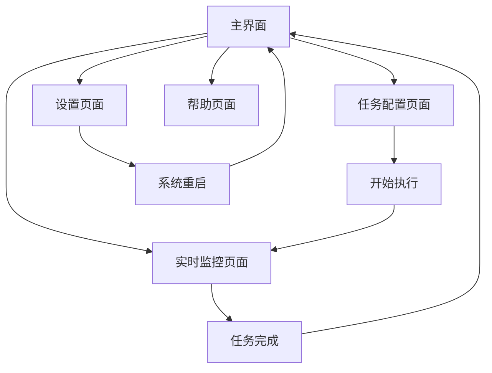

# 崩坏星穹铁道自动化助手 - 产品需求文档

## 1. 产品概述

崩坏星穹铁道自动化助手是一款专为《崩坏：星穹铁道》游戏设计的Windows桌面自动化工具，旨在帮助玩家自动完成日常任务、刷取材料和优化游戏体验。
- 解决玩家重复性操作繁琐、时间消耗大的问题，提供智能化的游戏辅助功能，让玩家专注于策略规划和角色培养。
- 目标用户为有一定游戏经验的玩家，希望通过自动化工具提升游戏效率和体验。

## 2. 核心功能

### 2.1 用户角色

所有用户享有相同的功能权限，通过本地安装启动即可使用全部自动化功能，包括任务配置、实时监控、数据导出和自定义脚本等完整功能。

### 2.2 功能模块

我们的崩坏星穹铁道自动化助手包含以下主要页面：
1. **主界面**：功能导航、状态监控、快速启动面板
2. **任务配置页面**：自动化任务设置、参数配置、计划管理
3. **实时监控页面**：游戏状态监控、执行日志、性能统计
4. **设置页面**：系统配置、账户管理、安全设置
5. **帮助页面**：使用教程、常见问题、更新日志

### 2.3 页面详情

| 页面名称 | 模块名称 | 功能描述 |
|----------|----------|----------|
| 主界面 | 功能导航 | 显示所有可用功能模块，提供快速访问入口 |
| 主界面 | 状态监控 | 实时显示游戏连接状态、当前执行任务、系统资源占用 |
| 主界面 | 快速启动 | 一键启动常用自动化任务，包括日常任务、体力消耗、材料刷取 |
| 任务配置页面 | 日常任务设置 | 配置每日委托、模拟宇宙、忘却之庭等自动化参数 |
| 任务配置页面 | 刷取任务设置 | 设置材料刷取、经验书获取、信用点获取等循环任务 |
| 任务配置页面 | 计划管理 | 创建定时任务计划、设置执行条件、管理任务优先级 |
| 实时监控页面 | 游戏状态监控 | 监控游戏窗口状态、角色信息、背包状态 |
| 实时监控页面 | 执行日志 | 显示详细的操作日志、错误信息、执行统计 |
| 实时监控页面 | 性能统计 | 展示任务完成效率、资源获取统计、时间分析 |
| 设置页面 | 系统配置 | 设置游戏路径、分辨率适配、操作延迟参数 |
| 设置页面 | 账户管理 | 管理多账户切换、数据备份、云同步设置 |
| 设置页面 | 安全设置 | 配置防检测参数、操作随机化、安全模式开关 |
| 帮助页面 | 使用教程 | 提供详细的功能使用指南、视频教程、最佳实践 |
| 帮助页面 | 常见问题 | 解答用户常见问题、故障排除、技术支持 |
| 帮助页面 | 更新日志 | 显示版本更新内容、新功能介绍、已知问题修复 |

## 3. 核心流程

**用户操作流程：**
用户启动程序 → 检测游戏状态 → 选择自动化任务 → 配置任务参数 → 启动自动执行 → 监控执行过程 → 查看执行结果 → 数据分析导出 → 优化执行策略

## 4. 用户界面设计

### 4.1 设计风格

- **主色调**：深蓝色 (#1a237e) 和金色 (#ffc107)，符合星穹铁道的科幻主题
- **辅助色**：灰色 (#424242) 和白色 (#ffffff)
- **按钮样式**：圆角矩形按钮，带有渐变效果和悬停动画
- **字体**：微软雅黑 14px（正文），16px（标题），12px（说明文字）
- **布局风格**：卡片式布局，左侧导航栏，顶部状态栏
- **图标风格**：线性图标配合填充图标，使用星空和科技元素

### 4.2 页面设计概览

| 页面名称 | 模块名称 | UI元素 |
|----------|----------|--------|
| 主界面 | 功能导航 | 左侧垂直导航栏，深蓝色背景，金色图标，悬停高亮效果 |
| 主界面 | 状态监控 | 顶部状态栏，实时数据卡片，绿色/红色状态指示器 |
| 主界面 | 快速启动 | 中央网格布局，大型功能卡片，渐变背景，图标+文字 |
| 任务配置页面 | 设置面板 | 分组折叠面板，表单控件，滑块和开关，实时预览 |
| 实时监控页面 | 日志显示 | 滚动文本区域，颜色编码日志级别，搜索过滤功能 |
| 实时监控页面 | 数据图表 | 实时更新的线图和饼图，深色主题，金色数据线 |
| 设置页面 | 配置表单 | 分类标签页，输入框和下拉菜单，保存/重置按钮 |
| 帮助页面 | 内容展示 | 左侧目录树，右侧内容区域，搜索框，返回顶部按钮 |

### 4.3 响应式设计

桌面优先设计，支持1920x1080及以上分辨率，最小支持1366x768。界面采用固定布局，不考虑移动端适配，专注于鼠标和键盘交互优化。