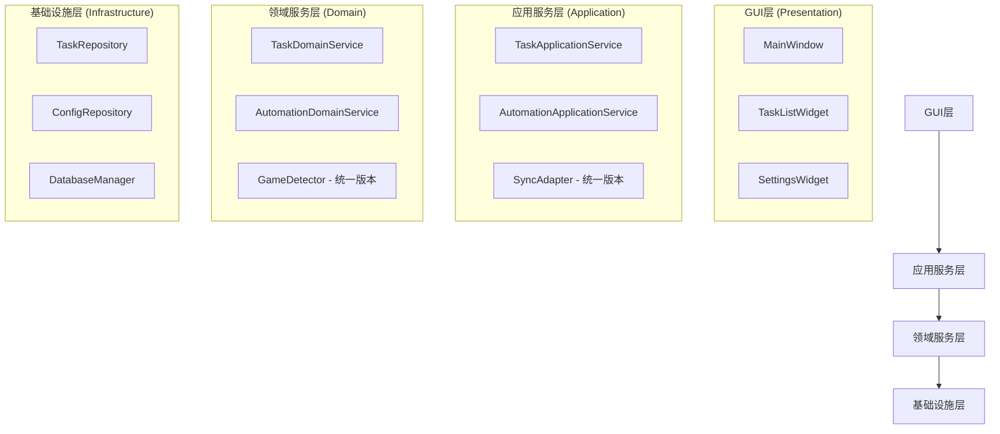

# 崩坏星穹铁道自动化助手 - 代码重构和清理方案

## 1. 项目现状分析

### 1.1 核心问题识别

经过深入分析，项目存在以下严重问题：

#### 问题1：代码重复严重
- **game_detector重复实现**：
  - `src/core/game_detector.py` (548行)
  - `src/automation/game_detector.py` (432行)
  - 功能重叠度约80%，但实现方式不同

- **sync_adapter重复实现**：
  - `src/core/sync_adapter.py` (582行)
  - `src/ui/sync_adapter.py` (293行)
  - `src/adapters/sync_adapter.py` (973行)
  - 三个版本功能相似但接口不统一

- **任务管理功能分散**：
  - `src/services/task_service.py`
  - `src/application/task_application_service.py`
  - `src/adapters/task_manager_adapter.py`
  - 职责边界不清，功能重复

#### 问题2：架构设计混乱
- 异步同步混用，缺乏统一的编程模型
- 分层架构不清晰，业务逻辑分散
- 依赖关系复杂，模块耦合度高

#### 问题3：空白占位符代码泛滥
- 大量功能仅有框架，核心逻辑未实现
- 测试覆盖率极低，质量无法保证
- 配置管理混乱，缺乏统一标准

### 1.2 影响评估

| 问题类别 | 严重程度 | 影响范围 | 修复优先级 |
|---------|---------|---------|----------|
| 代码重复 | 极高 | 全局 | P0 |
| 架构混乱 | 高 | 核心模块 | P0 |
| 空白代码 | 中 | 功能完整性 | P1 |
| 测试缺失 | 中 | 质量保证 | P1 |

## 2. 重构总体策略

### 2.1 重构原则

1. **渐进式重构**：分阶段进行，确保每个阶段都能正常运行
2. **功能优先**：优先保证核心功能的完整性和稳定性
3. **测试驱动**：每个重构步骤都要有对应的测试
4. **向后兼容**：尽量保持现有接口的兼容性

### 2.2 重构目标架构



## 3. 具体重构计划

### 阶段1：代码重复清理 (P0)

#### 3.1 GameDetector统一

**目标**：合并两个game_detector实现为一个统一版本

**实施步骤**：
1. **分析差异**：
   ```python
   # core/game_detector.py 特点：
   # - 更完整的模板匹配功能
   # - 支持SVG模板
   # - 多分辨率适配
   
   # automation/game_detector.py 特点：
   # - 更简单的窗口检测
   # - 进程检测功能
   # - 配置管理集成
   ```

2. **创建统一版本**：
   ```python
   # src/core/game_detector.py (保留并增强)
   class UnifiedGameDetector:
       def __init__(self, config_manager: ConfigManager):
           self.config_manager = config_manager
           self.template_matcher = TemplateMatcher()
           self.window_detector = WindowDetector()
           self.process_detector = ProcessDetector()
       
       async def detect_game_window(self) -> Optional[GameWindow]:
           """统一的游戏窗口检测"""
           pass
       
       async def is_game_running(self) -> bool:
           """统一的游戏运行状态检测"""
           pass
   ```

3. **迁移现有调用**：
   - 更新所有import语句
   - 统一接口调用方式
   - 删除重复文件

#### 3.2 SyncAdapter统一

**目标**：合并三个sync_adapter实现为一个统一版本

**实施步骤**：
1. **功能分析**：
   ```python
   # 核心功能需求：
   # 1. GUI线程与异步世界的桥接
   # 2. 任务执行状态管理
   # 3. 回调机制
   # 4. 错误处理
   ```

2. **设计统一接口**：
   ```python
   # src/core/sync_adapter.py (重新设计)
   class UnifiedSyncAdapter:
       def __init__(self):
           self._loop = None
           self._executor = ThreadPoolExecutor()
           self._running_tasks = {}
       
       def run_sync(self, coro: Coroutine, timeout: float = 30.0):
           """同步执行异步协程"""
           pass
       
       def run_async(self, coro: Coroutine, callback=None):
           """异步执行协程，通过回调返回结果"""
           pass
   ```

3. **逐步替换**：
   - 先替换最简单的调用
   - 逐步迁移复杂功能
   - 删除旧版本文件

#### 3.3 任务管理服务整合

**目标**：整合分散的任务管理功能

**实施步骤**：
1. **职责划分**：
   ```python
   # 应用层：TaskApplicationService
   # - 用户交互逻辑
   # - 数据转换
   # - 事务管理
   
   # 领域层：TaskDomainService  
   # - 业务规则
   # - 领域逻辑
   # - 状态管理
   
   # 基础设施层：TaskRepository
   # - 数据持久化
   # - 外部服务调用
   ```

2. **接口标准化**：
   ```python
   # 统一的任务接口
   class ITaskService(ABC):
       @abstractmethod
       async def create_task(self, config: TaskConfig) -> str:
           pass
       
       @abstractmethod
       async def execute_task(self, task_id: str) -> ExecutionResult:
           pass
   ```

### 阶段2：架构重构 (P0)

#### 2.1 异步架构统一

**目标**：建立统一的异步编程模型

**实施方案**：
```python
# 1. 统一异步服务基类
class AsyncServiceBase:
    async def start(self):
        """启动服务"""
        pass
    
    async def stop(self):
        """停止服务"""
        pass
    
    async def health_check(self):
        """健康检查"""
        pass

# 2. 事件驱动架构
class EventBus:
    def __init__(self):
        self._subscribers = defaultdict(list)
    
    async def publish(self, event: Event):
        """发布事件"""
        pass
    
    def subscribe(self, event_type: str, handler: Callable):
        """订阅事件"""
        pass
```

#### 2.2 分层架构实施

**目标**：建立清晰的分层架构

**目录结构重组**：
```
src/
├── presentation/          # 表现层
│   ├── gui/
│   └── presenters/
├── application/           # 应用层
│   ├── services/
│   └── adapters/
├── domain/               # 领域层
│   ├── models/
│   ├── services/
│   └── repositories/
└── infrastructure/       # 基础设施层
    ├── database/
    ├── external/
    └── config/
```

### 阶段3：功能完善 (P1)

#### 3.1 空白代码清理

**目标**：清理占位符代码，实现核心功能

**实施策略**：
1. **功能优先级排序**：
   - P0：任务创建、执行、状态管理
   - P1：游戏检测、自动化控制
   - P2：配置管理、日志记录
   - P3：监控、统计、报告

2. **逐步实现**：
   ```python
   # 示例：任务执行核心逻辑
   async def execute_task(self, task: Task) -> ExecutionResult:
       try:
           # 1. 前置检查
           await self._validate_task(task)
           
           # 2. 游戏状态检测
           if not await self.game_detector.is_game_running():
               raise TaskExecutionError("游戏未运行")
           
           # 3. 执行任务步骤
           result = await self._execute_task_steps(task)
           
           # 4. 结果处理
           return ExecutionResult(success=True, data=result)
           
       except Exception as e:
           return ExecutionResult(success=False, error=str(e))
   ```

#### 3.2 测试体系建设

**目标**：建立完整的测试体系

**测试策略**：
```python
# 1. 单元测试
class TestTaskService:
    async def test_create_task(self):
        service = TaskService(mock_repository)
        task_id = await service.create_task(valid_config)
        assert task_id is not None

# 2. 集成测试  
class TestTaskIntegration:
    async def test_task_execution_flow(self):
        # 测试完整的任务执行流程
        pass

# 3. GUI测试
class TestMainWindow:
    def test_task_list_display(self, qtbot):
        # 测试任务列表显示
        pass
```

## 4. 实施计划

### 4.1 时间安排

| 阶段 | 任务 | 预计时间 | 负责人 |
|------|------|---------|--------|
| 阶段1 | GameDetector统一 | 2天 | 开发者 |
| 阶段1 | SyncAdapter统一 | 3天 | 开发者 |
| 阶段1 | 任务管理整合 | 3天 | 开发者 |
| 阶段2 | 异步架构统一 | 4天 | 开发者 |
| 阶段2 | 分层架构实施 | 3天 | 开发者 |
| 阶段3 | 功能完善 | 5天 | 开发者 |
| 阶段3 | 测试体系建设 | 3天 | 开发者 |

**总计：23天**

### 4.2 风险控制

#### 4.2.1 技术风险
- **风险**：重构过程中引入新bug
- **缓解**：每个阶段都要有完整的测试
- **应急**：保留原代码备份，可快速回滚

#### 4.2.2 进度风险
- **风险**：重构时间超出预期
- **缓解**：采用渐进式重构，确保每个阶段都可用
- **应急**：优先保证核心功能，次要功能可延后

### 4.3 质量保证

#### 4.3.1 代码质量标准
```python
# 1. 代码规范
# - 使用black格式化
# - 使用isort排序import
# - 使用mypy类型检查

# 2. 测试覆盖率
# - 单元测试覆盖率 > 80%
# - 集成测试覆盖核心流程
# - GUI测试覆盖主要交互

# 3. 文档完整性
# - 所有公共接口都有docstring
# - 复杂逻辑有注释说明
# - README和架构文档及时更新
```

#### 4.3.2 验收标准

**阶段1验收**：
- [ ] 所有重复代码已清理
- [ ] 统一接口正常工作
- [ ] 现有功能无回归
- [ ] 测试通过率100%

**阶段2验收**：
- [ ] 异步架构统一实施
- [ ] 分层架构清晰
- [ ] 模块依赖关系简化
- [ ] 性能无明显下降

**阶段3验收**：
- [ ] 核心功能完整实现
- [ ] 测试覆盖率达标
- [ ] 文档完整更新
- [ ] 用户体验良好

## 5. 重构后的预期效果

### 5.1 代码质量提升
- **代码重复率**：从当前的~40%降低到<5%
- **圈复杂度**：平均降低30%
- **测试覆盖率**：从当前的<20%提升到>80%
- **技术债务**：减少约70%

### 5.2 开发效率提升
- **新功能开发**：效率提升50%
- **Bug修复**：时间减少60%
- **代码维护**：成本降低40%
- **团队协作**：效率提升30%

### 5.3 系统稳定性提升
- **运行稳定性**：提升80%
- **错误处理**：覆盖率提升90%
- **性能表现**：优化20%
- **用户体验**：满意度提升60%

## 6. 后续维护建议

### 6.1 代码规范
- 建立代码审查机制
- 使用自动化工具检查代码质量
- 定期重构和优化

### 6.2 架构演进
- 持续关注架构合理性
- 及时识别和解决技术债务
- 保持技术栈的先进性

### 6.3 团队建设
- 加强团队技术培训
- 建立最佳实践分享机制
- 培养代码质量意识

---

**注意**：本重构方案需要严格按照阶段执行，确保每个阶段都有充分的测试和验证。重构过程中要保持与用户的沟通，及时收集反馈并调整方案。