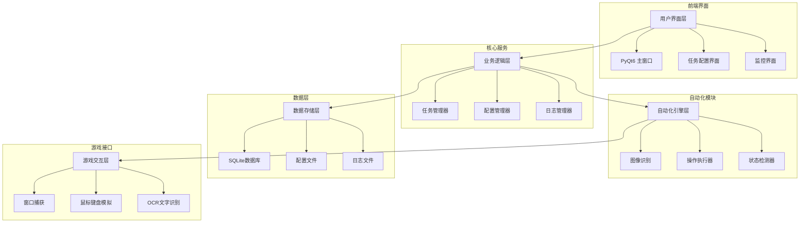
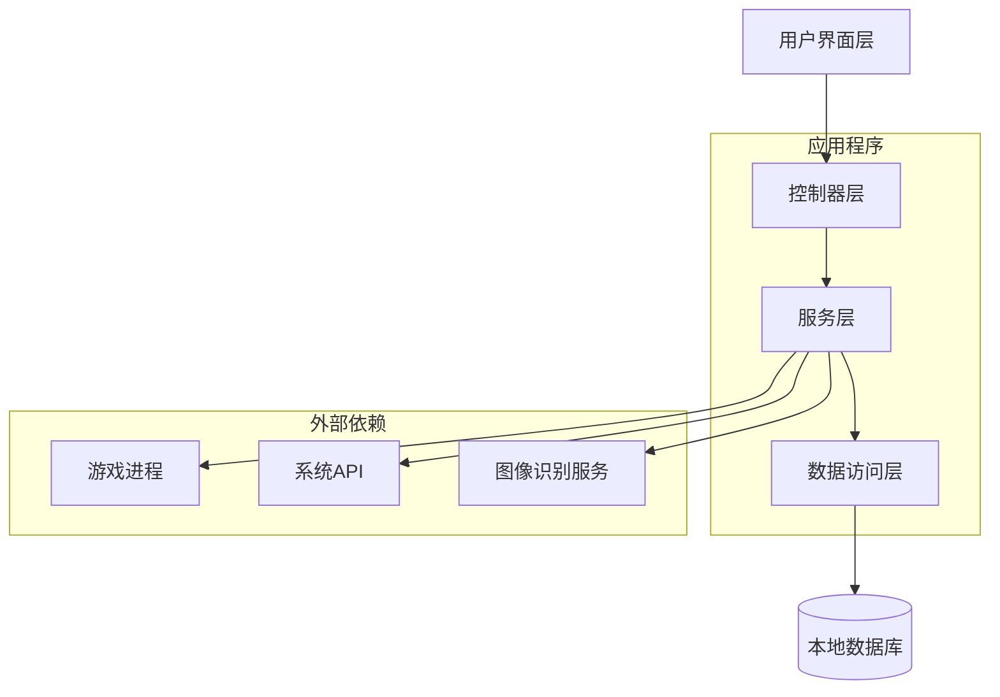
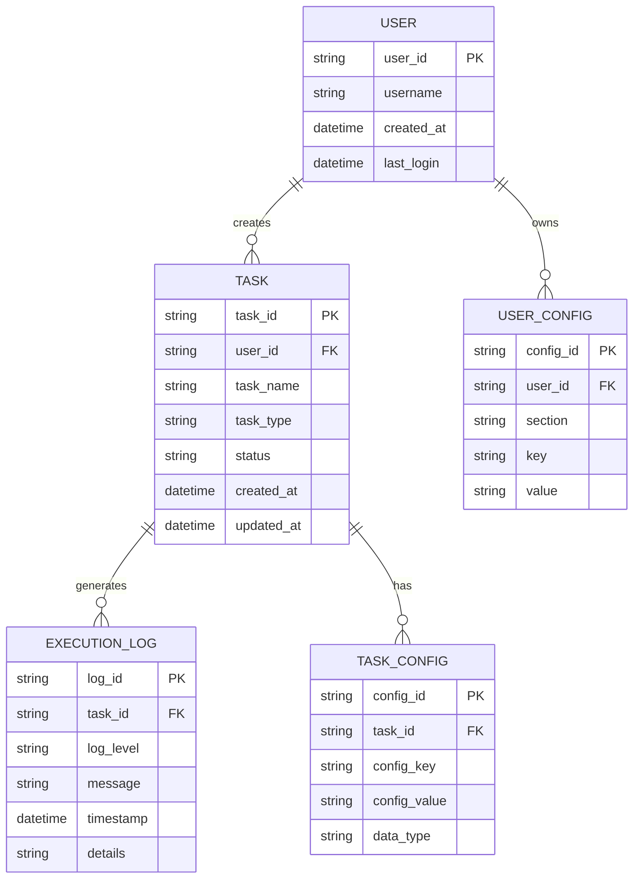

# 崩坏星穹铁道自动化助手 - 技术架构文档

## 1. 架构设计



## 2. 技术描述

- **前端界面**: PyQt6 + QSS样式表
- **图像处理**: OpenCV + Pillow + pytesseract
- **自动化操作**: pyautogui + pynput
- **数据存储**: SQLite + configparser
- **日志系统**: logging + loguru
- **打包分发**: PyInstaller

## 3. 路由定义

| 路由 | 用途 |
|------|------|
| /main | 主界面，显示功能导航和状态监控 |
| /task_config | 任务配置页面，设置自动化参数 |
| /monitor | 实时监控页面，显示执行状态和日志 |
| /settings | 设置页面，系统配置和账户管理 |
| /help | 帮助页面，使用教程和常见问题 |

## 4. API定义

### 4.1 核心API

**任务管理相关**
```python
class TaskManager:
    def create_task(task_config: TaskConfig) -> TaskResult
    def start_task(task_id: str) -> bool
    def stop_task(task_id: str) -> bool
    def get_task_status(task_id: str) -> TaskStatus
```

**游戏交互相关**
```python
class GameController:
    def capture_screen() -> Image
    def find_element(template: str) -> Coordinates
    def click_element(coordinates: Coordinates) -> bool
    def input_text(text: str) -> bool
```

**配置管理相关**
```python
class ConfigManager:
    def load_config() -> Config
    def save_config(config: Config) -> bool
    def get_setting(key: str) -> Any
    def set_setting(key: str, value: Any) -> bool
```

## 5. 服务器架构图



## 6. 数据模型

### 6.1 数据模型定义



### 6.2 数据定义语言

**用户表 (users)**
```sql
-- 创建用户表
CREATE TABLE users (
    user_id TEXT PRIMARY KEY,
    username TEXT NOT NULL,
    created_at TIMESTAMP DEFAULT CURRENT_TIMESTAMP,
    last_login TIMESTAMP DEFAULT CURRENT_TIMESTAMP
);

-- 创建索引
CREATE INDEX idx_users_username ON users(username);
```

**任务表 (tasks)**
```sql
-- 创建任务表
CREATE TABLE tasks (
    task_id TEXT PRIMARY KEY,
    user_id TEXT NOT NULL,
    task_name TEXT NOT NULL,
    task_type TEXT NOT NULL,
    status TEXT DEFAULT 'created' CHECK (status IN ('created', 'running', 'completed', 'failed', 'stopped')),
    created_at TIMESTAMP DEFAULT CURRENT_TIMESTAMP,
    updated_at TIMESTAMP DEFAULT CURRENT_TIMESTAMP,
    FOREIGN KEY (user_id) REFERENCES users(user_id)
);

-- 创建索引
CREATE INDEX idx_tasks_user_id ON tasks(user_id);
CREATE INDEX idx_tasks_status ON tasks(status);
CREATE INDEX idx_tasks_type ON tasks(task_type);
CREATE INDEX idx_tasks_created_at ON tasks(created_at DESC);
```

**任务配置表 (task_configs)**
```sql
-- 创建任务配置表
CREATE TABLE task_configs (
    config_id TEXT PRIMARY KEY,
    task_id TEXT NOT NULL,
    config_key TEXT NOT NULL,
    config_value TEXT NOT NULL,
    data_type TEXT DEFAULT 'string' CHECK (data_type IN ('string', 'integer', 'float', 'boolean', 'json')),
    FOREIGN KEY (task_id) REFERENCES tasks(task_id) ON DELETE CASCADE
);

-- 创建索引
CREATE INDEX idx_task_configs_task_id ON task_configs(task_id);
CREATE INDEX idx_task_configs_key ON task_configs(config_key);
```

**执行日志表 (execution_logs)**
```sql
-- 创建执行日志表
CREATE TABLE execution_logs (
    log_id TEXT PRIMARY KEY,
    task_id TEXT NOT NULL,
    log_level TEXT DEFAULT 'INFO' CHECK (log_level IN ('DEBUG', 'INFO', 'WARNING', 'ERROR', 'CRITICAL')),
    message TEXT NOT NULL,
    timestamp TIMESTAMP DEFAULT CURRENT_TIMESTAMP,
    details TEXT,
    FOREIGN KEY (task_id) REFERENCES tasks(task_id) ON DELETE CASCADE
);

-- 创建索引
CREATE INDEX idx_execution_logs_task_id ON execution_logs(task_id);
CREATE INDEX idx_execution_logs_timestamp ON execution_logs(timestamp DESC);
CREATE INDEX idx_execution_logs_level ON execution_logs(log_level);
```

**用户配置表 (user_configs)**
```sql
-- 创建用户配置表
CREATE TABLE user_configs (
    config_id TEXT PRIMARY KEY,
    user_id TEXT NOT NULL,
    section TEXT NOT NULL,
    key TEXT NOT NULL,
    value TEXT NOT NULL,
    FOREIGN KEY (user_id) REFERENCES users(user_id) ON DELETE CASCADE,
    UNIQUE(user_id, section, key)
);

-- 创建索引
CREATE INDEX idx_user_configs_user_id ON user_configs(user_id);
CREATE INDEX idx_user_configs_section ON user_configs(section);
```

**初始化数据**
```sql
-- 插入默认用户
INSERT INTO users (user_id, username) 
VALUES ('default_user', '默认用户');

-- 插入默认配置
INSERT INTO user_configs (config_id, user_id, section, key, value) VALUES
('cfg_001', 'default_user', 'game', 'resolution', '1920x1080'),
('cfg_002', 'default_user', 'game', 'game_path', ''),
('cfg_003', 'default_user', 'automation', 'click_delay', '1.0'),
('cfg_004', 'default_user', 'automation', 'detection_threshold', '0.8'),
('cfg_005', 'default_user', 'security', 'random_delay', 'true'),
('cfg_006', 'default_user', 'security', 'safe_mode', 'true');
```