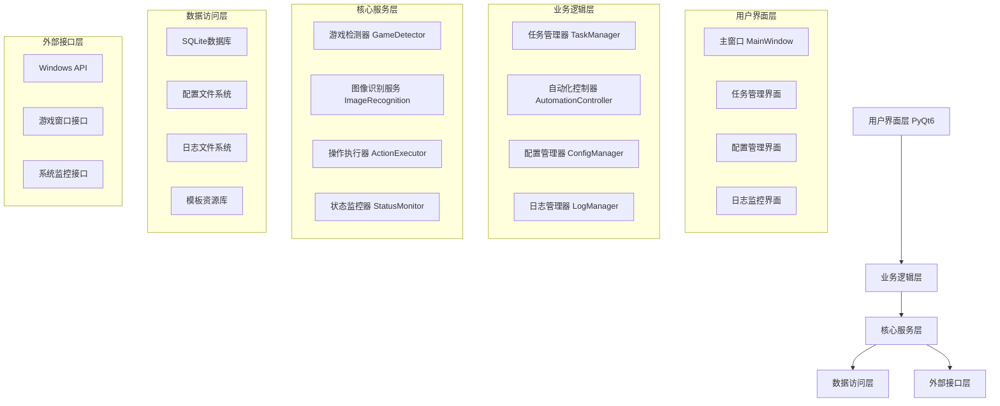
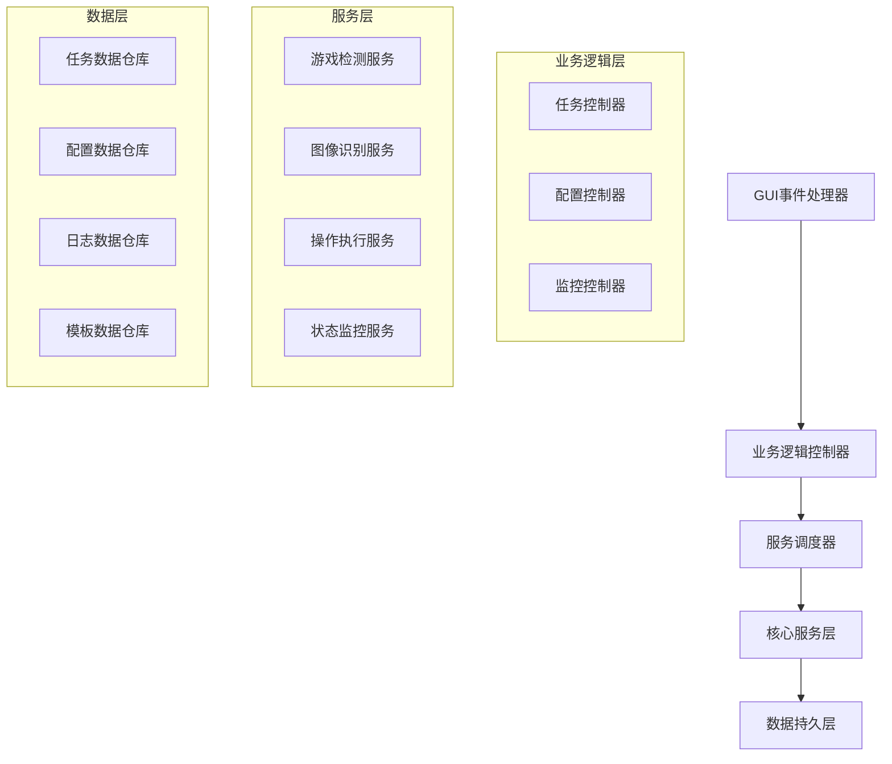
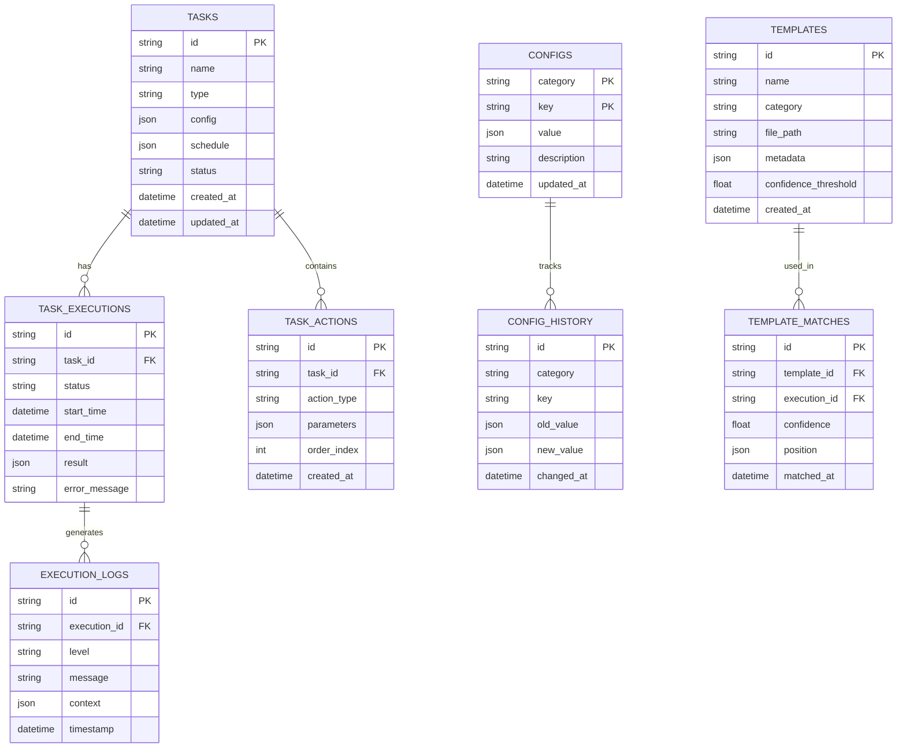

# 崩坏星穹铁道自动化助手 - 技术架构设计文档

## 1. 架构设计



## 2. 技术描述

- **前端界面**: PyQt6 + 自定义样式
- **核心框架**: Python 3.9+ + 异步处理
- **图像处理**: OpenCV + NumPy + Pillow
- **数据库**: SQLite + SQLAlchemy ORM
- **配置管理**: JSON + 配置验证
- **日志系统**: Loguru + 文件轮转
- **系统接口**: Win32API + psutil
- **打包分发**: PyInstaller + NSIS

## 3. 路由定义

| 界面路由 | 功能描述 |
|---------|----------|
| /main | 主界面，显示整体状态和快速操作 |
| /tasks | 任务管理界面，创建、编辑、执行任务 |
| /config/game | 游戏设置界面，游戏路径、窗口配置 |
| /config/automation | 自动化配置界面，操作参数、安全设置 |
| /logs | 日志查看界面，实时日志、历史记录 |
| /monitor | 监控界面，性能指标、执行统计 |
| /settings | 系统设置界面，全局配置、主题设置 |

## 4. API定义

### 4.1 核心API

#### 任务管理相关
```python
# 创建任务
POST /api/tasks/create
```

请求参数:
| 参数名 | 参数类型 | 是否必需 | 描述 |
|--------|----------|----------|------|
| name | string | true | 任务名称 |
| type | string | true | 任务类型 (daily/combat/explore) |
| config | object | true | 任务配置参数 |
| schedule | object | false | 调度配置 |

响应参数:
| 参数名 | 参数类型 | 描述 |
|--------|----------|------|
| task_id | string | 任务唯一标识 |
| status | string | 创建状态 |
| message | string | 响应消息 |

示例:
```json
{
  "name": "每日体力消耗",
  "type": "daily",
  "config": {
    "target_stamina": 0,
    "preferred_stages": ["材料本-经验"],
    "auto_use_items": true
  },
  "schedule": {
    "enabled": true,
    "time": "06:00",
    "repeat": "daily"
  }
}
```

#### 游戏检测相关
```python
# 检测游戏状态
GET /api/game/status
```

响应参数:
| 参数名 | 参数类型 | 描述 |
|--------|----------|------|
| is_running | boolean | 游戏是否运行 |
| window_info | object | 窗口信息 |
| current_scene | string | 当前场景 |
| resolution | object | 分辨率信息 |

#### 自动化控制相关
```python
# 执行操作序列
POST /api/automation/execute
```

请求参数:
| 参数名 | 参数类型 | 是否必需 | 描述 |
|--------|----------|----------|------|
| actions | array | true | 操作序列 |
| options | object | false | 执行选项 |

### 4.2 配置管理API

#### 获取配置
```python
GET /api/config/{category}
```

#### 更新配置
```python
PUT /api/config/{category}
```

#### 导入配置
```python
POST /api/config/import
```

#### 导出配置
```python
GET /api/config/export
```

## 5. 服务架构图



## 6. 数据模型

### 6.1 数据模型定义



### 6.2 数据定义语言

#### 任务表 (tasks)
```sql
-- 创建任务表
CREATE TABLE tasks (
    id VARCHAR(36) PRIMARY KEY DEFAULT (lower(hex(randomblob(4))) || '-' || lower(hex(randomblob(2))) || '-4' || substr(lower(hex(randomblob(2))),2) || '-' || substr('89ab',abs(random()) % 4 + 1, 1) || substr(lower(hex(randomblob(2))),2) || '-' || lower(hex(randomblob(6)))),
    name VARCHAR(255) NOT NULL,
    type VARCHAR(50) NOT NULL CHECK (type IN ('daily', 'combat', 'explore', 'custom')),
    config JSON NOT NULL,
    schedule JSON,
    status VARCHAR(20) DEFAULT 'inactive' CHECK (status IN ('inactive', 'active', 'running', 'paused', 'completed', 'failed')),
    created_at DATETIME DEFAULT CURRENT_TIMESTAMP,
    updated_at DATETIME DEFAULT CURRENT_TIMESTAMP
);

-- 创建索引
CREATE INDEX idx_tasks_type ON tasks(type);
CREATE INDEX idx_tasks_status ON tasks(status);
CREATE INDEX idx_tasks_created_at ON tasks(created_at DESC);

-- 初始化数据
INSERT INTO tasks (name, type, config, schedule) VALUES
('每日体力消耗', 'daily', '{"target_stamina": 0, "preferred_stages": ["材料本-经验"], "auto_use_items": true}', '{"enabled": true, "time": "06:00", "repeat": "daily"}'),
('模拟宇宙', 'combat', '{"difficulty": "normal", "auto_battle": true, "target_points": 1000}', '{"enabled": false}'),
('每日任务', 'daily', '{"auto_claim": true, "priority_order": ["dispatch", "assignment", "synthesis"]}', '{"enabled": true, "time": "07:00", "repeat": "daily"}');
```

#### 任务操作表 (task_actions)
```sql
-- 创建任务操作表
CREATE TABLE task_actions (
    id VARCHAR(36) PRIMARY KEY DEFAULT (lower(hex(randomblob(4))) || '-' || lower(hex(randomblob(2))) || '-4' || substr(lower(hex(randomblob(2))),2) || '-' || substr('89ab',abs(random()) % 4 + 1, 1) || substr(lower(hex(randomblob(2))),2) || '-' || lower(hex(randomblob(6)))),
    task_id VARCHAR(36) NOT NULL,
    action_type VARCHAR(50) NOT NULL CHECK (action_type IN ('click', 'key_press', 'wait', 'template_match', 'scroll', 'drag')),
    parameters JSON NOT NULL,
    order_index INTEGER NOT NULL,
    created_at DATETIME DEFAULT CURRENT_TIMESTAMP,
    FOREIGN KEY (task_id) REFERENCES tasks(id) ON DELETE CASCADE
);

-- 创建索引
CREATE INDEX idx_task_actions_task_id ON task_actions(task_id);
CREATE INDEX idx_task_actions_order ON task_actions(task_id, order_index);
```

#### 任务执行记录表 (task_executions)
```sql
-- 创建任务执行记录表
CREATE TABLE task_executions (
    id VARCHAR(36) PRIMARY KEY DEFAULT (lower(hex(randomblob(4))) || '-' || lower(hex(randomblob(2))) || '-4' || substr(lower(hex(randomblob(2))),2) || '-' || substr('89ab',abs(random()) % 4 + 1, 1) || substr(lower(hex(randomblob(2))),2) || '-' || lower(hex(randomblob(6)))),
    task_id VARCHAR(36) NOT NULL,
    status VARCHAR(20) DEFAULT 'running' CHECK (status IN ('running', 'completed', 'failed', 'cancelled')),
    start_time DATETIME DEFAULT CURRENT_TIMESTAMP,
    end_time DATETIME,
    result JSON,
    error_message TEXT,
    FOREIGN KEY (task_id) REFERENCES tasks(id) ON DELETE CASCADE
);

-- 创建索引
CREATE INDEX idx_task_executions_task_id ON task_executions(task_id);
CREATE INDEX idx_task_executions_start_time ON task_executions(start_time DESC);
CREATE INDEX idx_task_executions_status ON task_executions(status);
```

#### 配置表 (configs)
```sql
-- 创建配置表
CREATE TABLE configs (
    category VARCHAR(50) NOT NULL,
    key VARCHAR(100) NOT NULL,
    value JSON NOT NULL,
    description TEXT,
    updated_at DATETIME DEFAULT CURRENT_TIMESTAMP,
    PRIMARY KEY (category, key)
);

-- 初始化配置数据
INSERT INTO configs (category, key, value, description) VALUES
('game', 'window_title', '"崩坏：星穹铁道"', '游戏窗口标题'),
('game', 'resolution', '{"width": 1920, "height": 1080}', '游戏分辨率'),
('automation', 'click_delay', '{"min": 100, "max": 300}', '点击延迟范围(毫秒)'),
('automation', 'template_threshold', '0.8', '模板匹配阈值'),
('automation', 'max_retry_count', '3', '最大重试次数'),
('ui', 'theme', '"dark"', '界面主题'),
('ui', 'language', '"zh_CN"', '界面语言'),
('logging', 'level', '"INFO"', '日志级别'),
('logging', 'max_file_size', '10485760', '日志文件最大大小(字节)');
```

#### 模板表 (templates)
```sql
-- 创建模板表
CREATE TABLE templates (
    id VARCHAR(36) PRIMARY KEY DEFAULT (lower(hex(randomblob(4))) || '-' || lower(hex(randomblob(2))) || '-4' || substr(lower(hex(randomblob(2))),2) || '-' || substr('89ab',abs(random()) % 4 + 1, 1) || substr(lower(hex(randomblob(2))),2) || '-' || lower(hex(randomblob(6)))),
    name VARCHAR(255) NOT NULL,
    category VARCHAR(50) NOT NULL,
    file_path VARCHAR(500) NOT NULL,
    metadata JSON,
    confidence_threshold REAL DEFAULT 0.8,
    created_at DATETIME DEFAULT CURRENT_TIMESTAMP
);

-- 创建索引
CREATE INDEX idx_templates_category ON templates(category);
CREATE INDEX idx_templates_name ON templates(name);

-- 初始化模板数据
INSERT INTO templates (name, category, file_path, metadata, confidence_threshold) VALUES
('主界面-开始游戏', 'main_menu', 'assets/templates/main_menu/start_game.png', '{"description": "主界面开始游戏按钮", "resolution": "1920x1080"}', 0.85),
('战斗-自动战斗', 'combat', 'assets/templates/combat/auto_battle.png', '{"description": "战斗界面自动战斗按钮"}', 0.9),
('背包-确认按钮', 'inventory', 'assets/templates/common/confirm_button.png', '{"description": "通用确认按钮"}', 0.8),
('任务-领取奖励', 'mission', 'assets/templates/mission/claim_reward.png', '{"description": "任务奖励领取按钮"}', 0.85);
```

## 7. 核心组件设计

### 7.1 任务管理器 (TaskManager)
```python
class TaskManager:
    """任务管理器，负责任务的创建、调度和执行管理"""
    
    def __init__(self, db_manager, automation_controller):
        self.db_manager = db_manager
        self.automation_controller = automation_controller
        self.running_tasks = {}
        self.scheduler = TaskScheduler()
    
    async def create_task(self, task_config: TaskConfig) -> str:
        """创建新任务"""
        
    async def start_task(self, task_id: str) -> bool:
        """启动任务执行"""
        
    async def stop_task(self, task_id: str) -> bool:
        """停止任务执行"""
        
    async def get_task_status(self, task_id: str) -> TaskStatus:
        """获取任务状态"""
```

### 7.2 游戏检测器 (GameDetector)
```python
class GameDetector:
    """游戏检测器，负责游戏窗口检测和状态识别"""
    
    def __init__(self, config_manager):
        self.config_manager = config_manager
        self.template_matcher = TemplateMatcher()
        self.window_manager = WindowManager()
    
    def detect_game_window(self) -> Optional[GameWindow]:
        """检测游戏窗口"""
        
    def detect_current_scene(self) -> SceneType:
        """检测当前游戏场景"""
        
    def find_ui_element(self, template_name: str) -> Optional[UIElement]:
        """查找UI元素"""
```

### 7.3 自动化控制器 (AutomationController)
```python
class AutomationController:
    """自动化控制器，负责执行具体的游戏操作"""
    
    def __init__(self, game_detector, action_executor):
        self.game_detector = game_detector
        self.action_executor = action_executor
        self.safety_checker = SafetyChecker()
    
    async def execute_action_sequence(self, actions: List[Action]) -> ExecutionResult:
        """执行操作序列"""
        
    async def execute_single_action(self, action: Action) -> ActionResult:
        """执行单个操作"""
        
    def validate_action_safety(self, action: Action) -> bool:
        """验证操作安全性"""
```

## 8. 安全和性能考虑

### 8.1 安全措施
- **操作频率限制**: 防止过于频繁的操作被检测
- **随机延迟**: 模拟人类操作的随机性
- **安全检查**: 执行前验证操作的安全性
- **异常处理**: 完善的异常捕获和恢复机制

### 8.2 性能优化
- **图像缓存**: 缓存常用模板和截图
- **异步处理**: 使用异步编程提升响应性
- **资源管理**: 及时释放不需要的资源
- **算法优化**: 优化图像匹配和检测算法

### 8.3 监控和诊断
- **性能指标**: 监控CPU、内存使用情况
- **执行统计**: 记录操作成功率和耗时
- **错误追踪**: 详细的错误日志和堆栈信息
- **健康检查**: 定期检查系统组件状态

## 9. 部署和维护

### 9.1 部署方案
- **单文件打包**: 使用PyInstaller打包为单个可执行文件
- **依赖管理**: 内置所有必要的依赖库
- **配置初始化**: 首次运行自动创建配置文件
- **数据库初始化**: 自动创建和初始化数据库

### 9.2 更新机制
- **版本检查**: 定期检查新版本
- **增量更新**: 支持配置和模板的增量更新
- **回滚机制**: 支持版本回滚
- **兼容性检查**: 确保配置和数据的向后兼容

### 9.3 维护工具
- **日志分析**: 提供日志分析和统计工具
- **数据备份**: 自动备份重要数据
- **性能分析**: 提供性能分析和优化建议
- **故障诊断**: 自动诊断常见问题