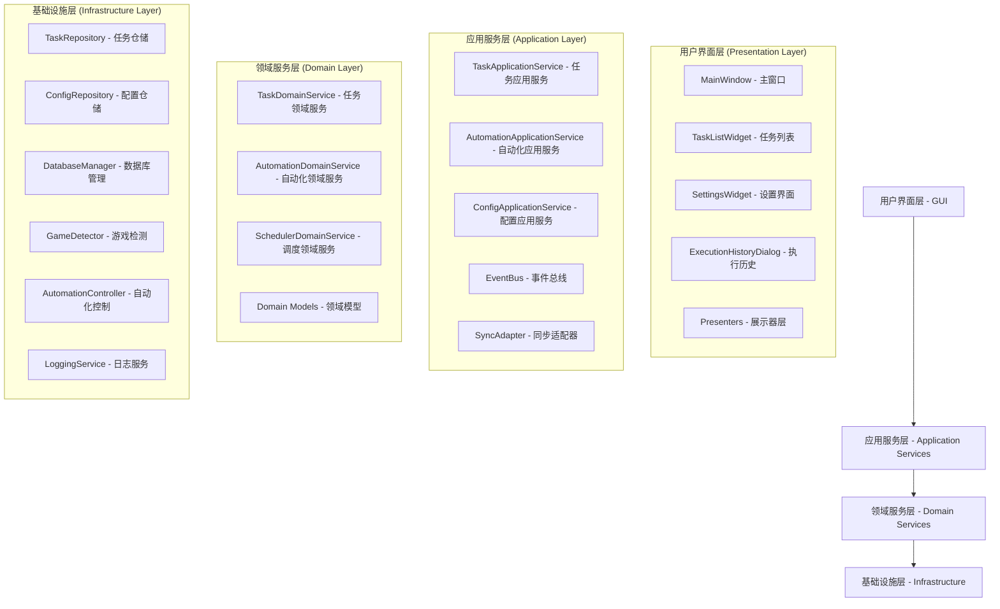
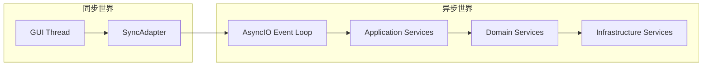
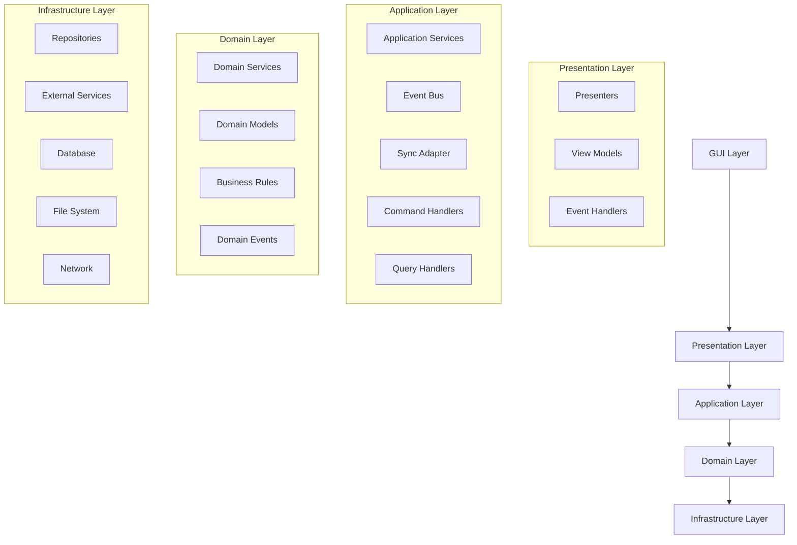
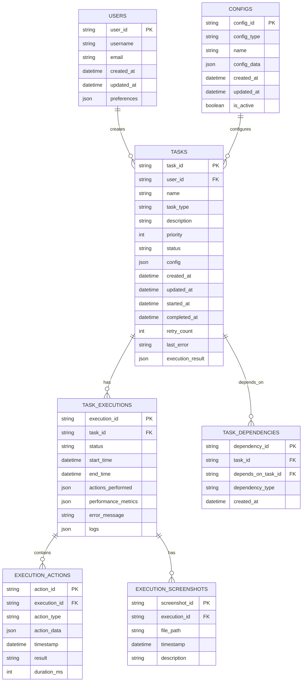

# 崩坏星穹铁道自动化助手 - 技术架构重构文档

## 1. 架构设计

### 1.1 整体架构图



### 1.2 异步架构设计



## 2. 技术栈重构

### 2.1 核心技术栈

- **GUI框架**: PyQt6 (保持不变)
- **异步框架**: asyncio + aiofiles + aiohttp
- **数据库**: SQLite + aiosqlite
- **图像处理**: OpenCV + Pillow
- **自动化**: pyautogui + pynput
- **配置管理**: pydantic + toml
- **日志**: structlog + loguru
- **测试**: pytest + pytest-asyncio + pytest-qt
- **类型检查**: mypy
- **代码格式化**: black + isort

### 2.2 新增依赖

```toml
[tool.poetry.dependencies]
python = "^3.9"
PyQt6 = "^6.5.0"
aiosqlite = "^0.19.0"
aiofiles = "^23.1.0"
aiohttp = "^3.8.0"
pydantic = "^2.0.0"
structlog = "^23.1.0"
loguru = "^0.7.0"
opencv-python = "^4.8.0"
pyautogui = "^0.9.54"
pynput = "^1.7.6"

[tool.poetry.group.dev.dependencies]
pytest = "^7.4.0"
pytest-asyncio = "^0.21.0"
pytest-qt = "^4.2.0"
mypy = "^1.5.0"
black = "^23.7.0"
isort = "^5.12.0"
coverage = "^7.3.0"
```

## 3. 路由定义重构

### 3.1 GUI路由

| 路由 | 组件 | 用途 |
|------|------|------|
| /main | MainWindow | 主界面，包含任务列表和控制面板 |
| /main/tasks | TaskListWidget | 任务管理界面 |
| /main/settings | SettingsWidget | 系统设置界面 |
| /main/history | ExecutionHistoryDialog | 执行历史查看 |
| /main/monitor | TaskMonitorWidget | 任务监控界面 |
| /dialogs/task-create | TaskCreateDialog | 任务创建对话框 |
| /dialogs/task-edit | TaskEditDialog | 任务编辑对话框 |

### 3.2 服务路由

| 服务路径 | 服务类 | 用途 |
|---------|--------|------|
| /services/task | TaskApplicationService | 任务管理服务 |
| /services/automation | AutomationApplicationService | 自动化执行服务 |
| /services/config | ConfigApplicationService | 配置管理服务 |
| /services/scheduler | SchedulerApplicationService | 任务调度服务 |
| /services/monitor | MonitorApplicationService | 系统监控服务 |

## 4. API定义重构

### 4.1 核心数据类型

```python
from enum import Enum
from dataclasses import dataclass
from typing import Optional, Dict, Any, List
from datetime import datetime
from pydantic import BaseModel, Field

class TaskType(Enum):
    """任务类型枚举"""
    DAILY_MISSION = "daily_mission"  # 日常任务
    WEEKLY_MISSION = "weekly_mission"  # 周常任务
    EXPLORATION = "exploration"  # 探索任务
    COMBAT = "combat"  # 战斗任务
    CUSTOM = "custom"  # 自定义任务

class TaskStatus(Enum):
    """任务状态枚举"""
    PENDING = "pending"  # 等待中
    RUNNING = "running"  # 运行中
    COMPLETED = "completed"  # 已完成
    FAILED = "failed"  # 失败
    CANCELLED = "cancelled"  # 已取消
    PAUSED = "paused"  # 已暂停

class TaskPriority(Enum):
    """任务优先级枚举"""
    LOW = 1
    MEDIUM = 2
    HIGH = 3
    URGENT = 4

class TaskConfig(BaseModel):
    """任务配置模型"""
    name: str = Field(..., description="任务名称")
    task_type: TaskType = Field(..., description="任务类型")
    description: str = Field(default="", description="任务描述")
    priority: TaskPriority = Field(default=TaskPriority.MEDIUM, description="任务优先级")
    max_retries: int = Field(default=3, description="最大重试次数")
    timeout_seconds: int = Field(default=300, description="超时时间(秒)")
    automation_config: Dict[str, Any] = Field(default_factory=dict, description="自动化配置")
    schedule_config: Optional[Dict[str, Any]] = Field(default=None, description="调度配置")
    
    class Config:
        use_enum_values = True

@dataclass
class Task:
    """任务实体"""
    task_id: str
    user_id: str
    config: TaskConfig
    status: TaskStatus
    created_at: datetime
    updated_at: datetime
    started_at: Optional[datetime] = None
    completed_at: Optional[datetime] = None
    retry_count: int = 0
    last_error: Optional[str] = None
    execution_result: Optional[Dict[str, Any]] = None

@dataclass
class ExecutionResult:
    """执行结果"""
    task_id: str
    success: bool
    start_time: datetime
    end_time: datetime
    actions_performed: List[Dict[str, Any]]
    screenshots: List[str]  # 截图文件路径
    logs: List[str]
    error_message: Optional[str] = None
    performance_metrics: Optional[Dict[str, Any]] = None
```

### 4.2 应用服务接口

#### 4.2.1 任务应用服务

```python
class TaskApplicationService:
    """任务应用服务"""
    
    async def create_task(self, config: TaskConfig, user_id: str = "default") -> str:
        """创建任务"""
        pass
    
    async def get_task(self, task_id: str) -> Optional[Task]:
        """获取任务"""
        pass
    
    async def list_tasks(self, user_id: str = "default", 
                        status: Optional[TaskStatus] = None) -> List[Task]:
        """列出任务"""
        pass
    
    async def update_task(self, task_id: str, updates: Dict[str, Any]) -> bool:
        """更新任务"""
        pass
    
    async def delete_task(self, task_id: str) -> bool:
        """删除任务"""
        pass
    
    async def execute_task(self, task_id: str) -> ExecutionResult:
        """执行任务"""
        pass
    
    async def pause_task(self, task_id: str) -> bool:
        """暂停任务"""
        pass
    
    async def resume_task(self, task_id: str) -> bool:
        """恢复任务"""
        pass
    
    async def cancel_task(self, task_id: str) -> bool:
        """取消任务"""
        pass
```

#### 4.2.2 自动化应用服务

```python
class AutomationApplicationService:
    """自动化应用服务"""
    
    async def detect_game_window(self) -> Optional[Dict[str, Any]]:
        """检测游戏窗口"""
        pass
    
    async def capture_screenshot(self, region: Optional[tuple] = None) -> str:
        """截取屏幕截图"""
        pass
    
    async def find_element(self, template_path: str, 
                          confidence: float = 0.8) -> Optional[Dict[str, int]]:
        """查找界面元素"""
        pass
    
    async def click_element(self, position: Dict[str, int], 
                           button: str = "left") -> bool:
        """点击界面元素"""
        pass
    
    async def input_text(self, text: str) -> bool:
        """输入文本"""
        pass
    
    async def wait_for_element(self, template_path: str, 
                              timeout: int = 10) -> Optional[Dict[str, int]]:
        """等待元素出现"""
        pass
    
    async def execute_automation_sequence(self, 
                                        sequence: List[Dict[str, Any]]) -> ExecutionResult:
        """执行自动化序列"""
        pass
```

### 4.3 事件系统

```python
from abc import ABC, abstractmethod
from typing import Any, Callable, Dict, List
import asyncio

class Event(ABC):
    """事件基类"""
    
    @property
    @abstractmethod
    def event_type(self) -> str:
        pass

class TaskCreatedEvent(Event):
    def __init__(self, task_id: str, task_config: TaskConfig):
        self.task_id = task_id
        self.task_config = task_config
    
    @property
    def event_type(self) -> str:
        return "task.created"

class TaskStatusChangedEvent(Event):
    def __init__(self, task_id: str, old_status: TaskStatus, new_status: TaskStatus):
        self.task_id = task_id
        self.old_status = old_status
        self.new_status = new_status
    
    @property
    def event_type(self) -> str:
        return "task.status_changed"

class EventBus:
    """事件总线"""
    
    def __init__(self):
        self._handlers: Dict[str, List[Callable]] = {}
    
    def subscribe(self, event_type: str, handler: Callable[[Event], None]):
        """订阅事件"""
        if event_type not in self._handlers:
            self._handlers[event_type] = []
        self._handlers[event_type].append(handler)
    
    def unsubscribe(self, event_type: str, handler: Callable[[Event], None]):
        """取消订阅"""
        if event_type in self._handlers:
            self._handlers[event_type].remove(handler)
    
    async def publish(self, event: Event):
        """发布事件"""
        handlers = self._handlers.get(event.event_type, [])
        for handler in handlers:
            try:
                if asyncio.iscoroutinefunction(handler):
                    await handler(event)
                else:
                    handler(event)
            except Exception as e:
                # 记录错误但不中断其他处理器
                print(f"事件处理器错误: {e}")
```

## 5. 服务器架构图



## 6. 数据模型重构

### 6.1 数据模型定义



### 6.2 数据定义语言 (DDL)

```sql
-- 用户表
CREATE TABLE users (
    user_id TEXT PRIMARY KEY,
    username TEXT UNIQUE NOT NULL,
    email TEXT UNIQUE,
    created_at TIMESTAMP DEFAULT CURRENT_TIMESTAMP,
    updated_at TIMESTAMP DEFAULT CURRENT_TIMESTAMP,
    preferences TEXT DEFAULT '{}'
);

-- 任务表
CREATE TABLE tasks (
    task_id TEXT PRIMARY KEY,
    user_id TEXT NOT NULL,
    name TEXT NOT NULL,
    task_type TEXT NOT NULL,
    description TEXT DEFAULT '',
    priority INTEGER DEFAULT 2,
    status TEXT DEFAULT 'pending',
    config TEXT NOT NULL,
    created_at TIMESTAMP DEFAULT CURRENT_TIMESTAMP,
    updated_at TIMESTAMP DEFAULT CURRENT_TIMESTAMP,
    started_at TIMESTAMP,
    completed_at TIMESTAMP,
    retry_count INTEGER DEFAULT 0,
    last_error TEXT,
    execution_result TEXT,
    FOREIGN KEY (user_id) REFERENCES users(user_id)
);

-- 任务执行记录表
CREATE TABLE task_executions (
    execution_id TEXT PRIMARY KEY,
    task_id TEXT NOT NULL,
    status TEXT DEFAULT 'running',
    start_time TIMESTAMP DEFAULT CURRENT_TIMESTAMP,
    end_time TIMESTAMP,
    actions_performed TEXT DEFAULT '[]',
    performance_metrics TEXT DEFAULT '{}',
    error_message TEXT,
    logs TEXT DEFAULT '[]',
    FOREIGN KEY (task_id) REFERENCES tasks(task_id)
);

-- 执行动作表
CREATE TABLE execution_actions (
    action_id TEXT PRIMARY KEY,
    execution_id TEXT NOT NULL,
    action_type TEXT NOT NULL,
    action_data TEXT NOT NULL,
    timestamp TIMESTAMP DEFAULT CURRENT_TIMESTAMP,
    result TEXT,
    duration_ms INTEGER,
    FOREIGN KEY (execution_id) REFERENCES task_executions(execution_id)
);

-- 执行截图表
CREATE TABLE execution_screenshots (
    screenshot_id TEXT PRIMARY KEY,
    execution_id TEXT NOT NULL,
    file_path TEXT NOT NULL,
    timestamp TIMESTAMP DEFAULT CURRENT_TIMESTAMP,
    description TEXT,
    FOREIGN KEY (execution_id) REFERENCES task_executions(execution_id)
);

-- 任务依赖表
CREATE TABLE task_dependencies (
    dependency_id TEXT PRIMARY KEY,
    task_id TEXT NOT NULL,
    depends_on_task_id TEXT NOT NULL,
    dependency_type TEXT DEFAULT 'sequential',
    created_at TIMESTAMP DEFAULT CURRENT_TIMESTAMP,
    FOREIGN KEY (task_id) REFERENCES tasks(task_id),
    FOREIGN KEY (depends_on_task_id) REFERENCES tasks(task_id)
);

-- 配置表
CREATE TABLE configs (
    config_id TEXT PRIMARY KEY,
    config_type TEXT NOT NULL,
    name TEXT NOT NULL,
    config_data TEXT NOT NULL,
    created_at TIMESTAMP DEFAULT CURRENT_TIMESTAMP,
    updated_at TIMESTAMP DEFAULT CURRENT_TIMESTAMP,
    is_active BOOLEAN DEFAULT TRUE
);

-- 创建索引
CREATE INDEX idx_tasks_user_id ON tasks(user_id);
CREATE INDEX idx_tasks_status ON tasks(status);
CREATE INDEX idx_tasks_created_at ON tasks(created_at DESC);
CREATE INDEX idx_task_executions_task_id ON task_executions(task_id);
CREATE INDEX idx_task_executions_start_time ON task_executions(start_time DESC);
CREATE INDEX idx_execution_actions_execution_id ON execution_actions(execution_id);
CREATE INDEX idx_execution_screenshots_execution_id ON execution_screenshots(execution_id);
CREATE INDEX idx_task_dependencies_task_id ON task_dependencies(task_id);
CREATE INDEX idx_configs_type_active ON configs(config_type, is_active);

-- 插入初始数据
INSERT INTO users (user_id, username, email) VALUES 
('default_user', 'Default User', 'default@example.com');

INSERT INTO configs (config_id, config_type, name, config_data) VALUES 
('default_automation', 'automation', 'Default Automation Config', '{
  "screenshot_interval": 1000,
  "action_delay": 500,
  "max_wait_time": 10000,
  "confidence_threshold": 0.8
}'),
('default_scheduler', 'scheduler', 'Default Scheduler Config', '{
  "max_concurrent_tasks": 3,
  "retry_delay": 5000,
  "health_check_interval": 30000
}');
```

## 7. 同步适配器设计

```python
import asyncio
from typing import Any, Callable, TypeVar, Coroutine
from concurrent.futures import ThreadPoolExecutor
from PyQt6.QtCore import QObject, pyqtSignal, QTimer

T = TypeVar('T')

class SyncAdapter(QObject):
    """同步适配器 - 连接GUI线程和异步世界"""
    
    # 信号定义
    task_completed = pyqtSignal(str, object)  # task_id, result
    task_failed = pyqtSignal(str, str)  # task_id, error_message
    
    def __init__(self):
        super().__init__()
        self._loop = None
        self._executor = ThreadPoolExecutor(max_workers=1)
        self._running_tasks = {}
        
        # 定时器用于处理异步事件
        self._timer = QTimer()
        self._timer.timeout.connect(self._process_async_events)
        self._timer.start(100)  # 每100ms检查一次
    
    def start_event_loop(self):
        """启动事件循环"""
        if self._loop is None:
            self._loop = asyncio.new_event_loop()
            self._executor.submit(self._run_event_loop)
    
    def _run_event_loop(self):
        """在后台线程运行事件循环"""
        asyncio.set_event_loop(self._loop)
        self._loop.run_forever()
    
    def run_sync(self, coro: Coroutine[Any, Any, T]) -> T:
        """同步运行异步协程"""
        if self._loop is None:
            self.start_event_loop()
        
        future = asyncio.run_coroutine_threadsafe(coro, self._loop)
        return future.result(timeout=30)  # 30秒超时
    
    def run_async(self, coro: Coroutine[Any, Any, T], 
                  callback: Callable[[T], None] = None,
                  error_callback: Callable[[Exception], None] = None) -> str:
        """异步运行协程，通过回调返回结果"""
        if self._loop is None:
            self.start_event_loop()
        
        task_id = f"task_{len(self._running_tasks)}"
        
        async def wrapper():
            try:
                result = await coro
                if callback:
                    callback(result)
                self.task_completed.emit(task_id, result)
                return result
            except Exception as e:
                if error_callback:
                    error_callback(e)
                self.task_failed.emit(task_id, str(e))
                raise
            finally:
                self._running_tasks.pop(task_id, None)
        
        task = asyncio.run_coroutine_threadsafe(wrapper(), self._loop)
        self._running_tasks[task_id] = task
        
        return task_id
    
    def _process_async_events(self):
        """处理异步事件（在GUI线程中调用）"""
        # 检查已完成的任务
        completed_tasks = []
        for task_id, task in self._running_tasks.items():
            if task.done():
                completed_tasks.append(task_id)
        
        # 清理已完成的任务
        for task_id in completed_tasks:
            self._running_tasks.pop(task_id, None)
    
    def shutdown(self):
        """关闭适配器"""
        if self._loop:
            self._loop.call_soon_threadsafe(self._loop.stop)
        self._executor.shutdown(wait=True)
        self._timer.stop()
```

## 8. 质量保证措施

### 8.1 代码质量工具配置

#### pyproject.toml
```toml
[tool.black]
line-length = 88
target-version = ['py39']
include = '\.pyi?$'

[tool.isort]
profile = "black"
line_length = 88
multi_line_output = 3

[tool.mypy]
python_version = "3.9"
warn_return_any = true
warn_unused_configs = true
disallow_untyped_defs = true
disallow_incomplete_defs = true
check_untyped_defs = true
disallow_untyped_decorators = true

[tool.pytest.ini_options]
minversion = "6.0"
addopts = "-ra -q --strict-markers --strict-config"
testpaths = ["tests"]
python_files = ["test_*.py", "*_test.py"]
python_classes = ["Test*"]
python_functions = ["test_*"]
markers = [
    "slow: marks tests as slow",
    "integration: marks tests as integration tests",
    "unit: marks tests as unit tests",
]

[tool.coverage.run]
source = ["src"]
omit = ["tests/*", "src/gui/*"]

[tool.coverage.report]
exclude_lines = [
    "pragma: no cover",
    "def __repr__",
    "raise AssertionError",
    "raise NotImplementedError",
]
```

### 8.2 持续集成配置

#### .github/workflows/ci.yml
```yaml
name: CI

on:
  push:
    branches: [ main, develop ]
  pull_request:
    branches: [ main ]

jobs:
  test:
    runs-on: ubuntu-latest
    strategy:
      matrix:
        python-version: [3.9, 3.10, 3.11]
    
    steps:
    - uses: actions/checkout@v3
    
    - name: Set up Python ${{ matrix.python-version }}
      uses: actions/setup-python@v4
      with:
        python-version: ${{ matrix.python-version }}
    
    - name: Install dependencies
      run: |
        python -m pip install --upgrade pip
        pip install poetry
        poetry install
    
    - name: Lint with black and isort
      run: |
        poetry run black --check src tests
        poetry run isort --check-only src tests
    
    - name: Type check with mypy
      run: |
        poetry run mypy src
    
    - name: Test with pytest
      run: |
        poetry run pytest --cov=src --cov-report=xml
    
    - name: Upload coverage to Codecov
      uses: codecov/codecov-action@v3
      with:
        file: ./coverage.xml
```

## 9. 部署和运维

### 9.1 打包配置

#### setup.py
```python
from setuptools import setup, find_packages

setup(
    name="xingtie-automation",
    version="2.0.0",
    packages=find_packages(where="src"),
    package_dir={"": "src"},
    install_requires=[
        "PyQt6>=6.5.0",
        "aiosqlite>=0.19.0",
        "aiofiles>=23.1.0",
        "pydantic>=2.0.0",
        "structlog>=23.1.0",
        "opencv-python>=4.8.0",
        "pyautogui>=0.9.54",
    ],
    entry_points={
        "console_scripts": [
            "xingtie=main:main",
        ],
    },
    python_requires=">=3.9",
)
```

### 9.2 Docker配置

#### Dockerfile
```dockerfile
FROM python:3.9-slim

# 安装系统依赖
RUN apt-get update && apt-get install -y \
    libgl1-mesa-glx \
    libglib2.0-0 \
    libsm6 \
    libxext6 \
    libxrender-dev \
    libgomp1 \
    && rm -rf /var/lib/apt/lists/*

# 设置工作目录
WORKDIR /app

# 复制依赖文件
COPY pyproject.toml poetry.lock ./

# 安装Python依赖
RUN pip install poetry && \
    poetry config virtualenvs.create false && \
    poetry install --no-dev

# 复制应用代码
COPY src/ ./src/
COPY main.py ./

# 设置环境变量
ENV PYTHONPATH=/app/src
ENV QT_QPA_PLATFORM=offscreen

# 暴露端口（如果需要）
EXPOSE 8080

# 启动命令
CMD ["python", "main.py"]
```

## 10. 监控和日志

### 10.1 结构化日志配置

```python
import structlog
from loguru import logger
import sys

def configure_logging():
    """配置结构化日志"""
    
    # 配置structlog
    structlog.configure(
        processors=[
            structlog.stdlib.filter_by_level,
            structlog.stdlib.add_logger_name,
            structlog.stdlib.add_log_level,
            structlog.stdlib.PositionalArgumentsFormatter(),
            structlog.processors.TimeStamper(fmt="iso"),
            structlog.processors.StackInfoRenderer(),
            structlog.processors.format_exc_info,
            structlog.processors.UnicodeDecoder(),
            structlog.processors.JSONRenderer()
        ],
        context_class=dict,
        logger_factory=structlog.stdlib.LoggerFactory(),
        wrapper_class=structlog.stdlib.BoundLogger,
        cache_logger_on_first_use=True,
    )
    
    # 配置loguru
    logger.remove()  # 移除默认处理器
    
    # 控制台输出
    logger.add(
        sys.stderr,
        format="<green>{time:YYYY-MM-DD HH:mm:ss}</green> | <level>{level: <8}</level> | <cyan>{name}</cyan>:<cyan>{function}</cyan>:<cyan>{line}</cyan> - <level>{message}</level>",
        level="INFO"
    )
    
    # 文件输出
    logger.add(
        "logs/app.log",
        rotation="10 MB",
        retention="30 days",
        format="{time:YYYY-MM-DD HH:mm:ss} | {level: <8} | {name}:{function}:{line} - {message}",
        level="DEBUG"
    )
    
    # 错误日志
    logger.add(
        "logs/error.log",
        rotation="10 MB",
        retention="30 days",
        format="{time:YYYY-MM-DD HH:mm:ss} | {level: <8} | {name}:{function}:{line} - {message}",
        level="ERROR"
    )

class ApplicationLogger:
    """应用日志器"""
    
    def __init__(self, name: str):
        self.logger = structlog.get_logger(name)
    
    async def log_task_execution(self, task_id: str, action: str, 
                               result: Any = None, error: Exception = None):
        """记录任务执行日志"""
        if error:
            await self.logger.aerror(
                "Task execution failed",
                task_id=task_id,
                action=action,
                error=str(error),
                error_type=type(error).__name__
            )
        else:
            await self.logger.ainfo(
                "Task execution completed",
                task_id=task_id,
                action=action,
                result=result
            )
    
    async def log_performance_metrics(self, metrics: Dict[str, Any]):
        """记录性能指标"""
        await self.logger.ainfo(
            "Performance metrics",
            **metrics
        )
```

## 11. 重构实施阶段规划

### 11.1 已完成阶段总结

#### 第一阶段：数据模型统一 ✅
- **目标**：统一项目中的数据模型和类型定义
- **成果**：建立了一致的TaskConfig、Task等核心数据模型
- **状态**：已完成

#### 第二阶段：重复实现清理 ✅
- **目标**：清理服务层、事件系统、自动化服务的重复实现
- **成果**：统一了TaskApplicationService、EventBus、AutomationController等核心组件
- **状态**：已完成

#### 第三阶段：MVP模式和配置管理统一 ✅
- **目标**：统一GUI层的MVP实现和配置管理系统
- **成果**：建立了统一的BasePresenter、BaseView、BaseModel和ConfigManager
- **状态**：已完成

### 11.2 后续阶段规划

#### 第四阶段：核心功能实现和完善
**目标**：实现和完善系统的核心业务功能
**预期时间**：3-4周

**成功标准**：
- [ ] 任务CRUD操作完全可用
- [ ] 任务执行引擎正常工作
- [ ] 游戏检测功能完善
- [ ] 自动化操作基本可用
- [ ] 错误处理和恢复机制完善

**具体任务清单**：
1. **任务管理功能完善**
   - 实现完整的任务生命周期管理
   - 添加任务依赖关系处理
   - 实现任务优先级调度
   - 添加任务执行历史记录

2. **游戏检测和自动化操作**
   - 完善游戏窗口检测算法
   - 实现模板匹配和图像识别
   - 添加鼠标键盘操作封装
   - 实现自动化脚本执行引擎

3. **任务执行引擎**
   - 建立任务队列管理
   - 实现并发任务执行
   - 添加任务状态监控
   - 实现任务执行结果收集

4. **错误处理和恢复**
   - 建立异常分类和处理机制
   - 实现自动重试策略
   - 添加错误恢复流程
   - 实现故障转移机制

**交付成果**：
- 完整的任务管理API
- 可用的游戏自动化功能
- 稳定的任务执行引擎
- 完善的错误处理机制

**风险控制**：
- 采用增量开发，每个功能模块独立测试
- 建立功能开关，支持渐进式发布
- 保持向后兼容性，确保现有功能不受影响

**验收标准**：
- 所有核心功能通过集成测试
- 系统能够稳定运行24小时以上
- 错误恢复成功率达到90%以上

#### 第五阶段：异步架构统一和性能优化
**目标**：建立统一的异步编程模型，优化系统性能
**预期时间**：2-3周

**成功标准**：
- [ ] 所有I/O操作统一使用async/await
- [ ] GUI与业务逻辑完全解耦
- [ ] 系统响应时间优化50%以上
- [ ] 内存使用优化30%以上
- [ ] 并发处理能力提升100%

**具体任务清单**：
1. **异步架构重构**
   - 重构所有数据库操作为异步
   - 统一网络请求为异步模式
   - 实现异步文件操作
   - 建立异步任务调度器

2. **同步适配器完善**
   - 优化GUI线程与异步世界的桥接
   - 实现高效的事件循环管理
   - 添加异步操作的取消机制
   - 实现异步操作的超时控制

3. **性能优化**
   - 实现连接池管理
   - 添加缓存机制
   - 优化图像处理算法
   - 实现资源预加载

4. **并发控制**
   - 实现任务并发限制
   - 添加资源锁机制
   - 实现负载均衡
   - 添加背压控制

**交付成果**：
- 统一的异步编程框架
- 高性能的同步适配器
- 优化的系统性能指标
- 完善的并发控制机制

**风险控制**：
- 分模块进行异步改造，避免大规模重构
- 建立性能基准测试，确保优化效果
- 保持API兼容性，减少对上层的影响

**验收标准**：
- 所有异步操作通过压力测试
- 系统响应时间满足性能要求
- 并发处理能力达到设计目标

#### 第六阶段：测试体系建立和质量保证
**目标**：建立完整的测试金字塔，确保代码质量
**预期时间**：2-3周

**成功标准**：
- [ ] 单元测试覆盖率达到85%以上
- [ ] 集成测试覆盖所有核心流程
- [ ] 端到端测试覆盖主要用户场景
- [ ] 性能测试通过所有指标
- [ ] 安全测试无高危漏洞

**具体任务清单**：
1. **单元测试建设**
   - 为所有业务逻辑编写单元测试
   - 实现测试数据工厂
   - 添加Mock和Stub支持
   - 建立测试覆盖率监控

2. **集成测试建设**
   - 编写数据库集成测试
   - 实现服务间集成测试
   - 添加外部依赖集成测试
   - 建立测试环境管理

3. **端到端测试**
   - 实现GUI自动化测试
   - 编写用户场景测试
   - 添加回归测试套件
   - 建立测试数据管理

4. **性能和安全测试**
   - 建立性能基准测试
   - 实现负载测试
   - 添加安全扫描
   - 建立持续测试流水线

**交付成果**：
- 完整的测试套件
- 自动化测试流水线
- 测试覆盖率报告
- 性能测试报告

**风险控制**：
- 采用TDD方法，确保测试质量
- 建立测试环境隔离，避免相互影响
- 实现测试数据自动清理，确保测试可重复

**验收标准**：
- 所有测试用例通过率100%
- 测试覆盖率达到目标要求
- 性能测试满足所有指标

#### 第七阶段：监控系统完善和运维优化
**目标**：建立完善的监控体系，优化运维流程
**预期时间**：2周

**成功标准**：
- [ ] 实时监控系统正常运行
- [ ] 告警机制及时有效
- [ ] 日志系统完整可查
- [ ] 性能指标实时可见
- [ ] 故障诊断工具完善

**具体任务清单**：
1. **监控系统建设**
   - 实现系统健康检查
   - 添加性能指标收集
   - 建立告警规则引擎
   - 实现监控数据可视化

2. **日志系统完善**
   - 统一日志格式和级别
   - 实现结构化日志
   - 添加日志聚合和分析
   - 建立日志轮转和清理

3. **运维工具开发**
   - 实现系统诊断工具
   - 添加配置管理工具
   - 建立备份恢复机制
   - 实现自动化部署

4. **故障处理机制**
   - 建立故障分类体系
   - 实现自动故障恢复
   - 添加故障根因分析
   - 建立故障处理流程

**交付成果**：
- 完整的监控仪表板
- 智能告警系统
- 结构化日志系统
- 运维工具集

**风险控制**：
- 监控系统独立部署，避免影响主系统
- 建立监控数据备份，确保数据安全
- 实现渐进式告警，避免告警风暴

**验收标准**：
- 监控系统稳定运行
- 告警准确率达到95%以上
- 故障恢复时间缩短50%

#### 第八阶段：文档完善和发布准备
**目标**：完善项目文档，准备正式发布
**预期时间**：1-2周

**成功标准**：
- [ ] 技术文档完整准确
- [ ] 用户文档易懂实用
- [ ] API文档详细规范
- [ ] 部署文档清晰可操作
- [ ] 发布流程标准化

**具体任务清单**：
1. **技术文档完善**
   - 更新架构设计文档
   - 完善API接口文档
   - 编写开发者指南
   - 添加故障排查手册

2. **用户文档编写**
   - 编写用户使用手册
   - 制作功能演示视频
   - 添加常见问题解答
   - 建立用户反馈渠道

3. **部署文档准备**
   - 编写安装部署指南
   - 准备配置文件模板
   - 添加环境要求说明
   - 建立版本发布流程

4. **质量检查**
   - 进行全面功能测试
   - 执行性能压力测试
   - 完成安全审计
   - 进行用户验收测试

**交付成果**：
- 完整的项目文档集
- 标准化的发布流程
- 质量检查报告
- 发布候选版本

**风险控制**：
- 建立文档审查流程，确保质量
- 实现自动化文档生成，保持同步
- 建立版本管理机制，支持回滚

**验收标准**：
- 所有文档通过审查
- 发布流程验证通过
- 用户验收测试满意度达到90%以上

### 11.3 总体时间规划

| 阶段 | 预期时间 | 累计时间 | 关键里程碑 |
|------|---------|---------|----------|
| 第四阶段 | 3-4周 | 3-4周 | 核心功能可用 |
| 第五阶段 | 2-3周 | 5-7周 | 性能优化完成 |
| 第六阶段 | 2-3周 | 7-10周 | 测试体系建立 |
| 第七阶段 | 2周 | 9-12周 | 监控系统完善 |
| 第八阶段 | 1-2周 | 10-14周 | 正式发布准备 |

### 11.4 风险管控策略

#### 技术风险
- **风险**：重构过程中引入新的bug
- **控制**：采用增量重构，每个阶段都有完整的测试
- **应对**：建立快速回滚机制，确保系统稳定

#### 进度风险
- **风险**：重构工作量超出预期
- **控制**：优先实现核心功能，非核心功能可以延后
- **应对**：建立弹性计划，支持阶段调整

#### 质量风险
- **风险**：重构后系统稳定性下降
- **控制**：建立完整的测试体系，确保每个阶段都有质量保证
- **应对**：实现灰度发布，逐步验证系统稳定性

### 11.5 成功指标

#### 技术指标
- 代码覆盖率 ≥ 85%
- 单元测试通过率 = 100%
- 集成测试通过率 = 100%
- 系统响应时间 < 100ms
- 内存使用优化 ≥ 30%

#### 功能指标
- 核心功能可用率 = 100%
- 用户操作成功率 ≥ 95%
- 系统稳定运行时间 ≥ 24小时
- 错误恢复成功率 ≥ 90%

#### 质量指标
- 代码重复率 < 5%
- 圈复杂度 < 10
- 技术债务 < 1天
- 文档完整性 = 100%

## 12. 总结

本技术架构重构文档提供了一个全面的解决方案，从根本上解决了项目中存在的技术问题。通过八个阶段的系统性重构，项目将从一个技术债务严重的原型系统，转变为一个工程化、可维护、高质量的产品级系统。

### 12.1 关键改进

1. **统一异步架构**：建立了一致的异步编程模型，解决了同步异步混用的问题
2. **清晰分层设计**：采用DDD分层架构，实现了关注点分离
3. **强类型系统**：使用Pydantic和类型注解，提高了代码质量和可维护性
4. **事件驱动架构**：通过事件总线实现松耦合的组件通信
5. **完整测试体系**：建立了单元测试、集成测试和端到端测试

### 12.2 技术优势

- **可维护性**：清晰的架构和代码组织
- **可扩展性**：模块化设计支持功能扩展
- **可测试性**：依赖注入和接口抽象便于测试
- **性能优化**：异步架构提高了并发处理能力
- **质量保证**：完整的CI/CD流程和代码质量检查

### 12.3 实施建议

1. **渐进式重构**：按阶段实施，确保每个阶段都有可交付成果
2. **测试先行**：在重构过程中始终保持测试覆盖
3. **文档同步**：及时更新技术文档和用户文档
4. **团队培训**：确保团队成员理解新的架构和开发流程
5. **持续改进**：建立反馈机制，持续优化系统架构和实现