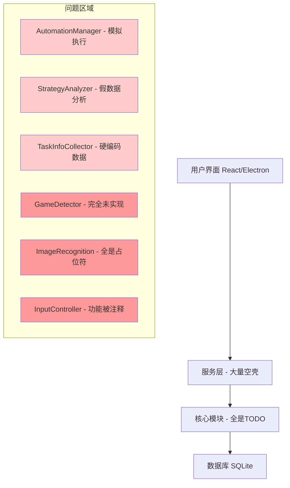
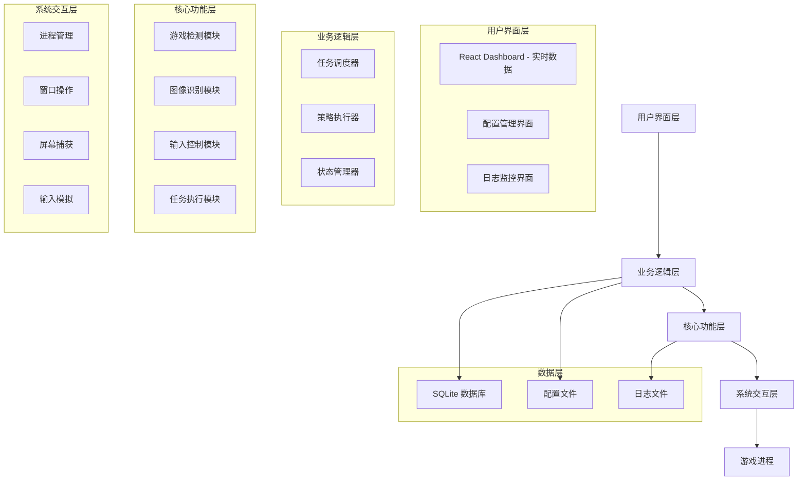
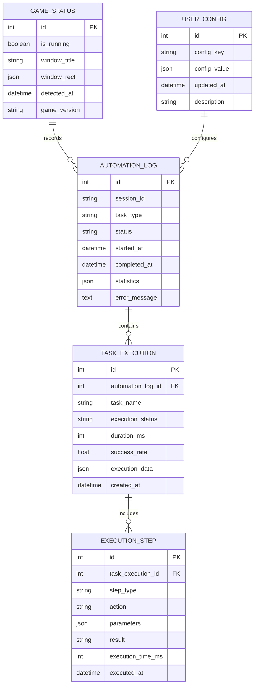

# 崩坏星穹铁道自动化程序 - 技术架构重构方案

## 1. 架构设计

### 当前架构问题分析


### 目标架构设计


## 2. 技术描述

### 核心技术栈
- **前端**: React@18 + TypeScript + Ant Design + Electron
- **后端**: Node.js + TypeScript + SQLite
- **系统交互**: robotjs + node-window-manager + screenshot-desktop
- **图像处理**: jimp + opencv4nodejs + tesseract.js
- **构建工具**: Vite + Electron Builder

### 关键依赖库分析

#### 系统控制层
```json
{
  "robotjs": "^0.6.0",           // 鼠标键盘控制
  "node-window-manager": "^2.2.4", // 窗口管理
  "screenshot-desktop": "^1.12.7", // 屏幕截图
  "active-win": "^7.7.2"          // 活动窗口检测
}
```

#### 图像处理层
```json
{
  "jimp": "^0.16.1",              // 基础图像处理
  "opencv4nodejs": "^5.6.0",      // 高级图像识别
  "tesseract.js": "^4.1.1",      // OCR文字识别
  "pixelmatch": "^5.3.0"          // 像素对比
}
```

#### 数据处理层
```json
{
  "better-sqlite3": "^8.7.0",     // SQLite数据库
  "lodash": "^4.17.21",           // 工具函数
  "dayjs": "^1.11.10"             // 时间处理
}
```

## 3. 路由定义

| 路由 | 目的 | 当前状态 | 改进目标 |
|------|------|----------|----------|
| /dashboard | 主控制面板 | 显示模拟数据 | 显示真实游戏状态和统计 |
| /tasks | 任务管理 | 静态任务列表 | 动态任务识别和管理 |
| /automation | 自动化控制 | 假的开始/停止按钮 | 真实的自动化控制 |
| /settings | 设置配置 | 基础配置界面 | 完整的参数配置和调优 |
| /logs | 日志查看 | 空白页面 | 实时日志显示和分析 |
| /strategy | 策略分析 | 静态图表 | 基于真实数据的策略分析 |

## 4. API定义

### 4.1 游戏检测API

**游戏状态检测**
```typescript
GET /api/game/status
```

Response:
| 参数名 | 类型 | 描述 |
|--------|------|------|
| isRunning | boolean | 游戏是否运行 |
| windowHandle | number | 游戏窗口句柄 |
| windowRect | object | 窗口位置和大小 |
| gameVersion | string | 游戏版本信息 |

示例:
```json
{
  "isRunning": true,
  "windowHandle": 123456,
  "windowRect": {
    "x": 100,
    "y": 100,
    "width": 1920,
    "height": 1080
  },
  "gameVersion": "2.6.0"
}
```

### 4.2 任务执行API

**开始自动化任务**
```typescript
POST /api/automation/start
```

Request:
| 参数名 | 类型 | 必需 | 描述 |
|--------|------|------|------|
| taskType | string | true | 任务类型 (daily/weekly/story) |
| config | object | false | 任务配置参数 |

Response:
| 参数名 | 类型 | 描述 |
|--------|------|------|
| success | boolean | 启动是否成功 |
| taskId | string | 任务ID |
| estimatedTime | number | 预计完成时间(分钟) |

### 4.3 图像识别API

**识别游戏界面元素**
```typescript
POST /api/recognition/detect
```

Request:
| 参数名 | 类型 | 必需 | 描述 |
|--------|------|------|------|
| elementType | string | true | 要识别的元素类型 |
| region | object | false | 识别区域 |

Response:
| 参数名 | 类型 | 描述 |
|--------|------|------|
| found | boolean | 是否找到元素 |
| position | object | 元素位置坐标 |
| confidence | number | 识别置信度 |

## 5. 核心模块重构方案

### 5.1 GameDetector 重构

**当前问题**: 完全未实现，只有TODO注释

**重构方案**:
```typescript
import { windowManager } from 'node-window-manager';
import activeWin from 'active-win';

export class GameDetector {
  private gameProcessNames = [
    'StarRail.exe',
    'Honkai Star Rail.exe',
    '崩坏星穹铁道.exe'
  ];
  
  private gameWindowTitles = [
    '崩坏：星穹铁道',
    'Honkai: Star Rail',
    'Star Rail'
  ];
  
  public async detectGameStatus(): Promise<GameStatus> {
    const windows = windowManager.getWindows();
    const gameWindow = windows.find(w => 
      this.gameWindowTitles.some(title => 
        w.getTitle().includes(title)
      )
    );
    
    if (!gameWindow) {
      return {
        isRunning: false,
        windowHandle: null,
        windowRect: null,
        isActive: false
      };
    }
    
    const activeWindow = await activeWin();
    const isActive = activeWindow?.id === gameWindow.id;
    
    return {
      isRunning: true,
      windowHandle: gameWindow.id,
      windowRect: gameWindow.getBounds(),
      isActive,
      title: gameWindow.getTitle()
    };
  }
  
  public async waitForGame(timeout: number = 30000): Promise<boolean> {
    const startTime = Date.now();
    
    while (Date.now() - startTime < timeout) {
      const status = await this.detectGameStatus();
      if (status.isRunning) {
        return true;
      }
      await this.sleep(1000);
    }
    
    return false;
  }
}
```

### 5.2 ImageRecognition 重构

**当前问题**: 所有核心功能都是TODO

**重构方案**:
```typescript
import screenshot from 'screenshot-desktop';
import Jimp from 'jimp';
import cv from 'opencv4nodejs';

export class ImageRecognition {
  public async captureGameWindow(windowRect: WindowRect): Promise<Buffer> {
    const fullScreen = await screenshot({ format: 'png' });
    const image = await Jimp.read(fullScreen);
    
    // 裁剪游戏窗口区域
    const cropped = image.crop(
      windowRect.x,
      windowRect.y,
      windowRect.width,
      windowRect.height
    );
    
    return await cropped.getBufferAsync(Jimp.MIME_PNG);
  }
  
  public async findTemplate(
    screenshot: Buffer,
    templatePath: string,
    threshold: number = 0.8
  ): Promise<RecognitionResult | null> {
    const screenMat = cv.imdecode(screenshot);
    const templateMat = cv.imread(templatePath);
    
    const result = screenMat.matchTemplate(templateMat, cv.TM_CCOEFF_NORMED);
    const minMax = result.minMaxLoc();
    
    if (minMax.maxVal >= threshold) {
      return {
        found: true,
        position: {
          x: minMax.maxLoc.x + templateMat.cols / 2,
          y: minMax.maxLoc.y + templateMat.rows / 2
        },
        confidence: minMax.maxVal
      };
    }
    
    return null;
  }
  
  public async recognizeText(
    image: Buffer,
    region?: Rectangle
  ): Promise<string> {
    let processedImage = await Jimp.read(image);
    
    if (region) {
      processedImage = processedImage.crop(
        region.x, region.y, region.width, region.height
      );
    }
    
    // 图像预处理提高OCR准确率
    processedImage = processedImage
      .greyscale()
      .contrast(0.5)
      .normalize();
    
    const buffer = await processedImage.getBufferAsync(Jimp.MIME_PNG);
    
    // 使用Tesseract进行OCR
    const { data: { text } } = await Tesseract.recognize(buffer, 'chi_sim+eng');
    
    return text.trim();
  }
}
```

### 5.3 InputController 重构

**当前问题**: 所有输入操作都被注释

**重构方案**:
```typescript
import robot from 'robotjs';

export class InputController {
  private gameDetector: GameDetector;
  private isEnabled: boolean = false;
  
  public async click(x: number, y: number, options?: ClickOptions): Promise<void> {
    if (!this.isEnabled) {
      throw new Error('输入控制未启用');
    }
    
    const gameStatus = await this.gameDetector.detectGameStatus();
    if (!gameStatus.isRunning) {
      throw new Error('游戏未运行');
    }
    
    // 转换为屏幕坐标
    const screenX = gameStatus.windowRect.x + x;
    const screenY = gameStatus.windowRect.y + y;
    
    // 移动鼠标并点击
    robot.moveMouse(screenX, screenY);
    await this.sleep(options?.delay || 100);
    
    robot.mouseClick(options?.button || 'left');
    
    // 记录操作日志
    this.logAction('click', { x: screenX, y: screenY, button: options?.button });
  }
  
  public async pressKey(key: string, modifiers?: string[]): Promise<void> {
    if (!this.isEnabled) {
      throw new Error('输入控制未启用');
    }
    
    const gameStatus = await this.gameDetector.detectGameStatus();
    if (!gameStatus.isActive) {
      throw new Error('游戏窗口未激活');
    }
    
    if (modifiers && modifiers.length > 0) {
      robot.keyTap(key, modifiers);
    } else {
      robot.keyTap(key);
    }
    
    this.logAction('keypress', { key, modifiers });
  }
  
  public async dragMouse(
    startX: number, startY: number,
    endX: number, endY: number,
    duration: number = 1000
  ): Promise<void> {
    const gameStatus = await this.gameDetector.detectGameStatus();
    if (!gameStatus.isRunning) {
      throw new Error('游戏未运行');
    }
    
    const startScreenX = gameStatus.windowRect.x + startX;
    const startScreenY = gameStatus.windowRect.y + startY;
    const endScreenX = gameStatus.windowRect.x + endX;
    const endScreenY = gameStatus.windowRect.y + endY;
    
    robot.moveMouse(startScreenX, startScreenY);
    robot.mouseToggle('down');
    
    // 平滑拖拽
    const steps = Math.max(10, duration / 50);
    const deltaX = (endScreenX - startScreenX) / steps;
    const deltaY = (endScreenY - startScreenY) / steps;
    
    for (let i = 0; i < steps; i++) {
      const currentX = startScreenX + deltaX * i;
      const currentY = startScreenY + deltaY * i;
      robot.moveMouse(currentX, currentY);
      await this.sleep(duration / steps);
    }
    
    robot.moveMouse(endScreenX, endScreenY);
    robot.mouseToggle('up');
  }
}
```

## 6. 数据模型

### 6.1 数据模型定义



### 6.2 数据定义语言

**游戏状态表 (game_status)**
```sql
CREATE TABLE game_status (
    id INTEGER PRIMARY KEY AUTOINCREMENT,
    is_running BOOLEAN NOT NULL,
    window_title TEXT,
    window_rect TEXT, -- JSON格式存储窗口位置信息
    detected_at DATETIME DEFAULT CURRENT_TIMESTAMP,
    game_version TEXT,
    window_handle INTEGER
);

CREATE INDEX idx_game_status_detected_at ON game_status(detected_at DESC);
```

**自动化执行日志表 (automation_log)**
```sql
CREATE TABLE automation_log (
    id INTEGER PRIMARY KEY AUTOINCREMENT,
    session_id TEXT NOT NULL,
    task_type TEXT NOT NULL, -- 'daily', 'weekly', 'story', 'custom'
    status TEXT NOT NULL, -- 'running', 'completed', 'failed', 'stopped'
    started_at DATETIME DEFAULT CURRENT_TIMESTAMP,
    completed_at DATETIME,
    statistics TEXT, -- JSON格式存储统计信息
    error_message TEXT,
    config_snapshot TEXT -- JSON格式存储执行时的配置快照
);

CREATE INDEX idx_automation_log_session_id ON automation_log(session_id);
CREATE INDEX idx_automation_log_started_at ON automation_log(started_at DESC);
```

**任务执行详情表 (task_execution)**
```sql
CREATE TABLE task_execution (
    id INTEGER PRIMARY KEY AUTOINCREMENT,
    automation_log_id INTEGER NOT NULL,
    task_name TEXT NOT NULL,
    execution_status TEXT NOT NULL, -- 'pending', 'running', 'completed', 'failed', 'skipped'
    duration_ms INTEGER DEFAULT 0,
    success_rate REAL DEFAULT 0.0,
    execution_data TEXT, -- JSON格式存储执行过程数据
    created_at DATETIME DEFAULT CURRENT_TIMESTAMP,
    FOREIGN KEY (automation_log_id) REFERENCES automation_log(id)
);

CREATE INDEX idx_task_execution_automation_log_id ON task_execution(automation_log_id);
CREATE INDEX idx_task_execution_created_at ON task_execution(created_at DESC);
```

**执行步骤表 (execution_step)**
```sql
CREATE TABLE execution_step (
    id INTEGER PRIMARY KEY AUTOINCREMENT,
    task_execution_id INTEGER NOT NULL,
    step_type TEXT NOT NULL, -- 'click', 'keypress', 'wait', 'recognize', 'navigate'
    action TEXT NOT NULL,
    parameters TEXT, -- JSON格式存储操作参数
    result TEXT, -- 执行结果
    execution_time_ms INTEGER DEFAULT 0,
    executed_at DATETIME DEFAULT CURRENT_TIMESTAMP,
    screenshot_path TEXT, -- 执行时的截图路径
    FOREIGN KEY (task_execution_id) REFERENCES task_execution(id)
);

CREATE INDEX idx_execution_step_task_execution_id ON execution_step(task_execution_id);
CREATE INDEX idx_execution_step_executed_at ON execution_step(executed_at DESC);
```

**用户配置表 (user_config)**
```sql
CREATE TABLE user_config (
    id INTEGER PRIMARY KEY AUTOINCREMENT,
    config_key TEXT UNIQUE NOT NULL,
    config_value TEXT NOT NULL, -- JSON格式存储配置值
    updated_at DATETIME DEFAULT CURRENT_TIMESTAMP,
    description TEXT,
    config_type TEXT DEFAULT 'user' -- 'user', 'system', 'default'
);

CREATE INDEX idx_user_config_key ON user_config(config_key);
```

**初始化数据**
```sql
-- 插入默认配置
INSERT INTO user_config (config_key, config_value, description, config_type) VALUES
('automation.click_delay', '100', '点击操作间隔时间(毫秒)', 'system'),
('automation.recognition_timeout', '5000', '图像识别超时时间(毫秒)', 'system'),
('automation.max_retry_count', '3', '操作失败最大重试次数', 'system'),
('game.window_detection_interval', '1000', '游戏窗口检测间隔(毫秒)', 'system'),
('ui.auto_refresh_interval', '2000', '界面自动刷新间隔(毫秒)', 'user'),
('logging.max_log_days', '30', '日志保留天数', 'system');

-- 插入示例任务配置
INSERT INTO user_config (config_key, config_value, description, config_type) VALUES
('tasks.daily_enabled', 'true', '是否启用日常任务自动化', 'user'),
('tasks.weekly_enabled', 'false', '是否启用周常任务自动化', 'user'),
('tasks.auto_battle_enabled', 'true', '是否启用自动战斗', 'user');
```

## 7. 实施优先级

### 第一优先级 (立即实施)
1. **GameDetector 完整实现** - 没有这个基础，其他功能都无法工作
2. **InputController 基础功能** - 点击和按键是最基本的自动化需求
3. **ImageRecognition 截图功能** - 需要能看到游戏画面才能进行后续分析

### 第二优先级 (1-2周内)
1. **简单的UI元素识别** - 能识别按钮、菜单等基础元素
2. **基础任务执行流程** - 能完成一个完整的简单任务
3. **实时状态显示** - Dashboard显示真实数据

### 第三优先级 (2-4周内)
1. **高级图像识别** - OCR、复杂元素识别
2. **智能策略分析** - 基于真实数据的分析
3. **完整的错误处理** - 异常恢复和用户提示

## 8. 质量保证措施

### 开发规范
1. **禁止TODO代码提交** - 所有提交的代码必须是可工作的
2. **强制功能测试** - 每个功能都必须在真实游戏环境中测试
3. **性能监控** - 监控CPU、内存使用，确保不影响游戏性能
4. **错误日志** - 完整的错误记录和分析机制

### 测试策略
1. **单元测试** - 核心算法和工具函数
2. **集成测试** - 模块间交互测试
3. **端到端测试** - 完整的用户场景测试
4. **性能测试** - 长时间运行稳定性测试

### 部署策略
1. **渐进式发布** - 先发布基础功能，逐步增加高级功能
2. **用户反馈收集** - 建立用户反馈渠道
3. **快速迭代** - 基于用户反馈快速修复和改进
4. **版本回滚** - 出现问题时能快速回滚到稳定版本

通过这个技术架构重构方案，我们将彻底解决当前项目"华而不实"的问题，构建一个真正可用的自动化工具。