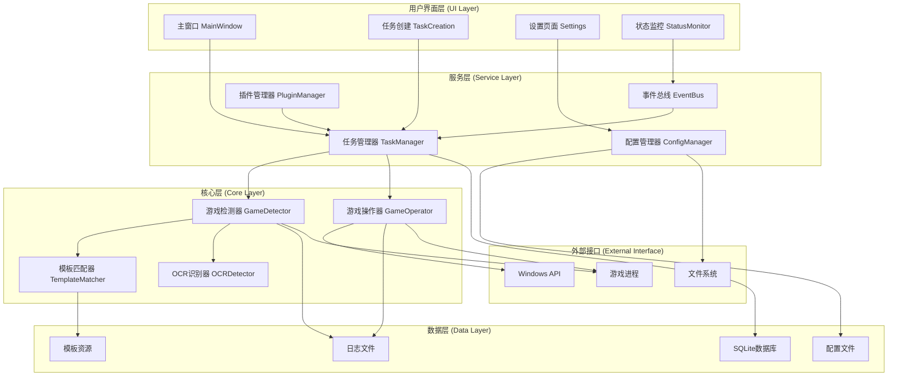
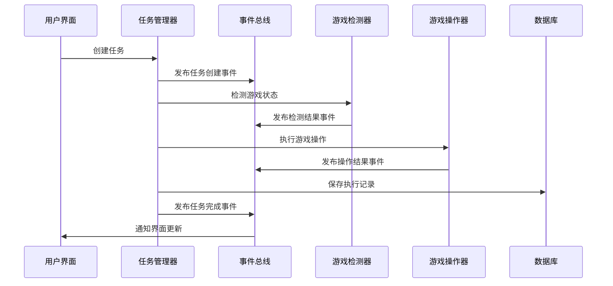

# 架构设计文档

## 目录

1. [概述](#概述)
2. [设计原则](#设计原则)
3. [系统架构](#系统架构)
4. [模块设计](#模块设计)
5. [数据流设计](#数据流设计)
6. [接口设计](#接口设计)
7. [安全架构](#安全架构)
8. [性能架构](#性能架构)
9. [部署架构](#部署架构)
10. [扩展性设计](#扩展性设计)

## 概述

崩坏星穹铁道自动化助手是一个基于Python和PyQt6的桌面应用程序，旨在为玩家提供智能化的游戏辅助功能。本文档详细描述了系统的架构设计、技术选型和实现策略。

### 项目特点

- **模块化设计**: 清晰的模块分离和职责划分
- **事件驱动**: 基于事件总线的松耦合架构
- **插件化**: 支持功能扩展和自定义
- **高性能**: 优化的图像处理和操作执行
- **可维护**: 良好的代码组织和文档

### 技术栈

```
┌─────────────────────────────────────────────────────────────┐
│                        技术栈概览                            │
├─────────────────────────────────────────────────────────────┤
│ 编程语言: Python 3.13                                       │
│ GUI框架: PyQt6                                              │
│ 图像处理: OpenCV, Pillow                                    │
│ 数据库: SQLite                                              │
│ 测试框架: pytest                                            │
│ 代码质量: mypy, bandit, black                               │
│ 构建工具: setuptools, wheel                                 │
│ 文档工具: Sphinx, MkDocs                                    │
└─────────────────────────────────────────────────────────────┘
```

## 设计原则

### 1. SOLID原则

#### 单一职责原则 (SRP)
每个类和模块都有明确的单一职责：

```python
# 游戏检测器 - 只负责游戏状态检测
class GameDetector:
    def find_game_window(self) -> Optional[WindowInfo]:
        pass
    
    def detect_template(self, template_name: str) -> DetectionResult:
        pass

# 游戏操作器 - 只负责游戏操作
class GameOperator:
    def click(self, x: int, y: int) -> OperationResult:
        pass
    
    def send_key(self, key: str) -> OperationResult:
        pass

# 任务管理器 - 只负责任务管理
class TaskManager:
    def create_task(self, config: TaskConfig) -> str:
        pass
    
    def execute_task(self, task_id: str) -> bool:
        pass
```

#### 开闭原则 (OCP)
通过接口和抽象类支持扩展：

```python
from abc import ABC, abstractmethod

class BaseDetector(ABC):
    @abstractmethod
    def detect(self, image: np.ndarray) -> DetectionResult:
        pass

class TemplateDetector(BaseDetector):
    def detect(self, image: np.ndarray) -> DetectionResult:
        # 模板匹配实现
        pass

class AIDetector(BaseDetector):
    def detect(self, image: np.ndarray) -> DetectionResult:
        # AI检测实现
        pass
```

#### 里氏替换原则 (LSP)
子类可以完全替换父类：

```python
class BaseTask(ABC):
    @abstractmethod
    async def execute(self) -> TaskResult:
        pass

class DailyTask(BaseTask):
    async def execute(self) -> TaskResult:
        # 每日任务实现
        pass

class WeeklyTask(BaseTask):
    async def execute(self) -> TaskResult:
        # 周常任务实现
        pass
```

#### 接口隔离原则 (ISP)
细粒度的接口设计：

```python
class Detectable(Protocol):
    def detect_template(self, template: str) -> DetectionResult:
        pass

class Clickable(Protocol):
    def click(self, x: int, y: int) -> OperationResult:
        pass

class Configurable(Protocol):
    def load_config(self, config: dict) -> bool:
        pass
```

#### 依赖倒置原则 (DIP)
依赖抽象而非具体实现：

```python
class AutomationController:
    def __init__(self, 
                 detector: Detectable,
                 operator: Clickable,
                 task_manager: TaskManagerInterface):
        self.detector = detector
        self.operator = operator
        self.task_manager = task_manager
```

### 2. 设计模式

#### 观察者模式
事件驱动的架构设计：

```python
class EventBus:
    def __init__(self):
        self._subscribers: Dict[str, List[Callable]] = {}
    
    def subscribe(self, event: str, callback: Callable):
        if event not in self._subscribers:
            self._subscribers[event] = []
        self._subscribers[event].append(callback)
    
    def publish(self, event: str, data: Any):
        if event in self._subscribers:
            for callback in self._subscribers[event]:
                callback(data)
```

#### 策略模式
可配置的算法选择：

```python
class DetectionStrategy(ABC):
    @abstractmethod
    def detect(self, image: np.ndarray, template: np.ndarray) -> float:
        pass

class TemplateMatchingStrategy(DetectionStrategy):
    def detect(self, image: np.ndarray, template: np.ndarray) -> float:
        return cv2.matchTemplate(image, template, cv2.TM_CCOEFF_NORMED)

class FeatureMatchingStrategy(DetectionStrategy):
    def detect(self, image: np.ndarray, template: np.ndarray) -> float:
        # SIFT/ORB特征匹配实现
        pass
```

#### 工厂模式
对象创建的统一管理：

```python
class TaskFactory:
    _task_types = {
        'daily': DailyTask,
        'weekly': WeeklyTask,
        'custom': CustomTask
    }
    
    @classmethod
    def create_task(cls, task_type: str, config: dict) -> BaseTask:
        if task_type not in cls._task_types:
            raise ValueError(f"Unknown task type: {task_type}")
        return cls._task_types[task_type](config)
```

## 系统架构

### 整体架构图



### 分层架构详解

#### 1. 用户界面层 (UI Layer)

**职责**: 用户交互和界面展示

**组件**:
- **MainWindow**: 主窗口，整合所有功能模块
- **TaskCreation**: 任务创建和编辑界面
- **Settings**: 配置管理界面
- **StatusMonitor**: 实时状态监控界面

**技术实现**:
```python
class MainWindow(QMainWindow):
    def __init__(self):
        super().__init__()
        self.task_manager = TaskManager()
        self.event_bus = EventBus()
        self.setup_ui()
        self.connect_signals()
    
    def setup_ui(self):
        # UI组件初始化
        self.central_widget = QWidget()
        self.layout = QVBoxLayout()
        # ...
    
    def connect_signals(self):
        # 信号槽连接
        self.event_bus.subscribe('task_completed', self.on_task_completed)
        # ...
```

#### 2. 服务层 (Service Layer)

**职责**: 业务逻辑和服务协调

**组件**:
- **TaskManager**: 任务生命周期管理
- **EventBus**: 事件发布订阅
- **ConfigManager**: 配置管理
- **PluginManager**: 插件管理

**架构模式**:
```python
class ServiceContainer:
    def __init__(self):
        self._services = {}
        self._singletons = {}
    
    def register(self, interface: Type, implementation: Type, singleton: bool = False):
        self._services[interface] = implementation
        if singleton:
            self._singletons[interface] = None
    
    def get(self, interface: Type):
        if interface in self._singletons:
            if self._singletons[interface] is None:
                self._singletons[interface] = self._services[interface]()
            return self._singletons[interface]
        return self._services[interface]()
```

#### 3. 核心层 (Core Layer)

**职责**: 核心算法和游戏交互

**组件**:
- **GameDetector**: 游戏状态检测
- **GameOperator**: 游戏操作执行
- **TemplateMatcher**: 模板匹配算法
- **OCRDetector**: 文字识别

**性能优化**:
```python
class OptimizedGameDetector:
    def __init__(self):
        self.template_cache = LRUCache(maxsize=100)
        self.screenshot_cache = TTLCache(maxsize=10, ttl=1.0)
        self.thread_pool = ThreadPoolExecutor(max_workers=4)
    
    async def detect_template_async(self, template_name: str) -> DetectionResult:
        # 异步检测实现
        loop = asyncio.get_event_loop()
        return await loop.run_in_executor(
            self.thread_pool, 
            self._detect_template_sync, 
            template_name
        )
```

#### 4. 数据层 (Data Layer)

**职责**: 数据持久化和资源管理

**组件**:
- **SQLite数据库**: 任务历史、统计数据
- **配置文件**: JSON格式的配置存储
- **模板资源**: 图像模板文件
- **日志文件**: 运行日志和调试信息

**数据模型**:
```python
from sqlalchemy import Column, Integer, String, DateTime, Float, Text
from sqlalchemy.ext.declarative import declarative_base

Base = declarative_base()

class TaskExecution(Base):
    __tablename__ = 'task_executions'
    
    id = Column(Integer, primary_key=True)
    task_name = Column(String(100), nullable=False)
    start_time = Column(DateTime, nullable=False)
    end_time = Column(DateTime)
    status = Column(String(20), nullable=False)
    result = Column(Text)
    duration = Column(Float)
    error_message = Column(Text)

class GameSession(Base):
    __tablename__ = 'game_sessions'
    
    id = Column(Integer, primary_key=True)
    start_time = Column(DateTime, nullable=False)
    end_time = Column(DateTime)
    game_version = Column(String(20))
    resolution = Column(String(20))
    total_operations = Column(Integer, default=0)
```

## 模块设计

### 1. 游戏检测模块

#### 架构设计

```python
class GameDetectionSystem:
    def __init__(self):
        self.window_detector = WindowDetector()
        self.template_matcher = TemplateMatcher()
        self.ocr_detector = OCRDetector()
        self.state_machine = GameStateMachine()
    
    def detect_game_state(self) -> GameState:
        # 综合检测游戏状态
        window_info = self.window_detector.find_game_window()
        if not window_info:
            return GameState.NOT_FOUND
        
        screenshot = self.capture_screenshot(window_info)
        ui_elements = self.template_matcher.detect_ui_elements(screenshot)
        text_content = self.ocr_detector.extract_text(screenshot)
        
        return self.state_machine.determine_state(ui_elements, text_content)
```

#### 模板匹配算法

```python
class AdvancedTemplateMatcher:
    def __init__(self):
        self.methods = {
            'template_matching': self._template_matching,
            'feature_matching': self._feature_matching,
            'deep_learning': self._deep_learning_matching
        }
    
    def match(self, image: np.ndarray, template: np.ndarray, 
             method: str = 'template_matching') -> MatchResult:
        if method not in self.methods:
            raise ValueError(f"Unknown matching method: {method}")
        
        return self.methods[method](image, template)
    
    def _template_matching(self, image: np.ndarray, template: np.ndarray) -> MatchResult:
        # 传统模板匹配
        result = cv2.matchTemplate(image, template, cv2.TM_CCOEFF_NORMED)
        min_val, max_val, min_loc, max_loc = cv2.minMaxLoc(result)
        
        return MatchResult(
            confidence=max_val,
            position=max_loc,
            method='template_matching'
        )
    
    def _feature_matching(self, image: np.ndarray, template: np.ndarray) -> MatchResult:
        # 特征点匹配
        sift = cv2.SIFT_create()
        kp1, des1 = sift.detectAndCompute(template, None)
        kp2, des2 = sift.detectAndCompute(image, None)
        
        if des1 is None or des2 is None:
            return MatchResult(confidence=0.0, position=None, method='feature_matching')
        
        matcher = cv2.BFMatcher()
        matches = matcher.knnMatch(des1, des2, k=2)
        
        # 应用Lowe's ratio test
        good_matches = []
        for match_pair in matches:
            if len(match_pair) == 2:
                m, n = match_pair
                if m.distance < 0.7 * n.distance:
                    good_matches.append(m)
        
        if len(good_matches) < 4:
            return MatchResult(confidence=0.0, position=None, method='feature_matching')
        
        # 计算单应性矩阵
        src_pts = np.float32([kp1[m.queryIdx].pt for m in good_matches]).reshape(-1, 1, 2)
        dst_pts = np.float32([kp2[m.trainIdx].pt for m in good_matches]).reshape(-1, 1, 2)
        
        M, mask = cv2.findHomography(src_pts, dst_pts, cv2.RANSAC, 5.0)
        
        if M is None:
            return MatchResult(confidence=0.0, position=None, method='feature_matching')
        
        # 计算模板在图像中的位置
        h, w = template.shape[:2]
        pts = np.float32([[0, 0], [w, 0], [w, h], [0, h]]).reshape(-1, 1, 2)
        dst = cv2.perspectiveTransform(pts, M)
        
        # 计算中心点
        center_x = int(np.mean(dst[:, 0, 0]))
        center_y = int(np.mean(dst[:, 0, 1]))
        
        # 计算置信度（基于内点数量）
        confidence = np.sum(mask) / len(mask)
        
        return MatchResult(
            confidence=confidence,
            position=(center_x, center_y),
            method='feature_matching'
        )
```

### 2. 任务管理模块

#### 任务生命周期

```python
class TaskLifecycleManager:
    def __init__(self):
        self.state_machine = TaskStateMachine()
        self.executor = TaskExecutor()
        self.scheduler = TaskScheduler()
        self.monitor = TaskMonitor()
    
    async def execute_task(self, task: BaseTask) -> TaskResult:
        try:
            # 1. 任务准备
            self.state_machine.transition(task.id, TaskState.PREPARING)
            await self._prepare_task(task)
            
            # 2. 任务执行
            self.state_machine.transition(task.id, TaskState.RUNNING)
            result = await self.executor.execute(task)
            
            # 3. 任务完成
            self.state_machine.transition(task.id, TaskState.COMPLETED)
            await self._cleanup_task(task)
            
            return result
            
        except Exception as e:
            self.state_machine.transition(task.id, TaskState.FAILED)
            await self._handle_task_error(task, e)
            raise
    
    async def _prepare_task(self, task: BaseTask):
        # 检查前置条件
        if not await task.check_prerequisites():
            raise TaskError("Prerequisites not met")
        
        # 初始化资源
        await task.initialize_resources()
        
        # 发送事件
        self.event_bus.publish('task_prepared', {
            'task_id': task.id,
            'task_name': task.name
        })
```

#### 任务调度器

```python
class AdvancedTaskScheduler:
    def __init__(self):
        self.priority_queue = PriorityQueue()
        self.running_tasks = {}
        self.max_concurrent = 3
        self.scheduler_thread = None
        self.running = False
    
    def start(self):
        self.running = True
        self.scheduler_thread = threading.Thread(target=self._scheduler_loop)
        self.scheduler_thread.start()
    
    def stop(self):
        self.running = False
        if self.scheduler_thread:
            self.scheduler_thread.join()
    
    def schedule_task(self, task: BaseTask, priority: int = 0, delay: float = 0):
        scheduled_time = time.time() + delay
        self.priority_queue.put((
            -priority,  # 负数用于最大堆
            scheduled_time,
            task
        ))
    
    def _scheduler_loop(self):
        while self.running:
            try:
                # 检查是否有可执行的任务
                if (len(self.running_tasks) < self.max_concurrent and 
                    not self.priority_queue.empty()):
                    
                    priority, scheduled_time, task = self.priority_queue.get_nowait()
                    
                    if time.time() >= scheduled_time:
                        # 启动任务
                        future = asyncio.create_task(self._execute_task_wrapper(task))
                        self.running_tasks[task.id] = future
                    else:
                        # 重新放回队列
                        self.priority_queue.put((priority, scheduled_time, task))
                
                # 清理完成的任务
                completed_tasks = []
                for task_id, future in self.running_tasks.items():
                    if future.done():
                        completed_tasks.append(task_id)
                
                for task_id in completed_tasks:
                    del self.running_tasks[task_id]
                
                time.sleep(0.1)
                
            except queue.Empty:
                time.sleep(0.5)
            except Exception as e:
                logging.error(f"Scheduler error: {e}")
    
    async def _execute_task_wrapper(self, task: BaseTask):
        try:
            result = await task.execute()
            self.event_bus.publish('task_completed', {
                'task_id': task.id,
                'result': result
            })
        except Exception as e:
            self.event_bus.publish('task_failed', {
                'task_id': task.id,
                'error': str(e)
            })
```

### 3. 配置管理模块

#### 分层配置系统

```python
class HierarchicalConfigManager:
    def __init__(self):
        self.config_layers = [
            DefaultConfigLayer(),
            FileConfigLayer('config/app_config.json'),
            UserConfigLayer('config/user_config.json'),
            RuntimeConfigLayer()
        ]
        self.cache = {}
        self.watchers = {}
    
    def get(self, key: str, default: Any = None) -> Any:
        if key in self.cache:
            return self.cache[key]
        
        # 从高优先级到低优先级查找
        for layer in reversed(self.config_layers):
            if layer.has_key(key):
                value = layer.get(key)
                self.cache[key] = value
                return value
        
        return default
    
    def set(self, key: str, value: Any, layer: str = 'user'):
        # 设置到指定层
        target_layer = self._get_layer_by_name(layer)
        target_layer.set(key, value)
        
        # 清除缓存
        if key in self.cache:
            del self.cache[key]
        
        # 通知观察者
        self._notify_watchers(key, value)
    
    def watch(self, key: str, callback: Callable[[str, Any], None]):
        if key not in self.watchers:
            self.watchers[key] = []
        self.watchers[key].append(callback)
    
    def _notify_watchers(self, key: str, value: Any):
        if key in self.watchers:
            for callback in self.watchers[key]:
                try:
                    callback(key, value)
                except Exception as e:
                    logging.error(f"Config watcher error: {e}")
```

## 数据流设计

### 事件驱动数据流



### 数据处理管道

```python
class DataProcessingPipeline:
    def __init__(self):
        self.stages = []
        self.error_handlers = {}
    
    def add_stage(self, stage: ProcessingStage):
        self.stages.append(stage)
        return self
    
    def add_error_handler(self, stage_type: Type, handler: Callable):
        self.error_handlers[stage_type] = handler
        return self
    
    async def process(self, data: Any) -> Any:
        current_data = data
        
        for stage in self.stages:
            try:
                current_data = await stage.process(current_data)
            except Exception as e:
                if type(stage) in self.error_handlers:
                    current_data = await self.error_handlers[type(stage)](current_data, e)
                else:
                    raise
        
        return current_data

# 使用示例
screenshot_pipeline = (DataProcessingPipeline()
    .add_stage(ScreenshotCaptureStage())
    .add_stage(ImagePreprocessingStage())
    .add_stage(TemplateMatchingStage())
    .add_stage(ResultValidationStage())
    .add_error_handler(ScreenshotCaptureStage, handle_capture_error)
)
```

## 接口设计

### RESTful API设计

虽然这是一个桌面应用，但我们设计了内部API接口用于模块间通信：

```python
class InternalAPIServer:
    def __init__(self, task_manager: TaskManager):
        self.task_manager = task_manager
        self.routes = {
            'GET /api/tasks': self.list_tasks,
            'POST /api/tasks': self.create_task,
            'GET /api/tasks/{task_id}': self.get_task,
            'PUT /api/tasks/{task_id}': self.update_task,
            'DELETE /api/tasks/{task_id}': self.delete_task,
            'POST /api/tasks/{task_id}/start': self.start_task,
            'POST /api/tasks/{task_id}/stop': self.stop_task,
        }
    
    async def list_tasks(self, request: APIRequest) -> APIResponse:
        tasks = self.task_manager.list_tasks()
        return APIResponse({
            'tasks': [task.to_dict() for task in tasks],
            'total': len(tasks)
        })
    
    async def create_task(self, request: APIRequest) -> APIResponse:
        task_config = TaskConfig.from_dict(request.json)
        task_id = self.task_manager.create_task(task_config)
        return APIResponse({'task_id': task_id}, status=201)
```

### 插件接口设计

```python
class PluginInterface(ABC):
    @abstractmethod
    def get_name(self) -> str:
        """获取插件名称"""
        pass
    
    @abstractmethod
    def get_version(self) -> str:
        """获取插件版本"""
        pass
    
    @abstractmethod
    def get_dependencies(self) -> List[str]:
        """获取插件依赖"""
        pass
    
    @abstractmethod
    async def initialize(self, context: PluginContext) -> bool:
        """初始化插件"""
        pass
    
    @abstractmethod
    async def cleanup(self) -> bool:
        """清理插件资源"""
        pass

class TaskPlugin(PluginInterface):
    @abstractmethod
    def get_task_types(self) -> List[str]:
        """获取支持的任务类型"""
        pass
    
    @abstractmethod
    async def create_task(self, task_type: str, config: dict) -> BaseTask:
        """创建任务实例"""
        pass

class DetectionPlugin(PluginInterface):
    @abstractmethod
    def get_detection_methods(self) -> List[str]:
        """获取支持的检测方法"""
        pass
    
    @abstractmethod
    async def detect(self, method: str, image: np.ndarray, **kwargs) -> DetectionResult:
        """执行检测"""
        pass
```

## 安全架构

### 权限控制

```python
class PermissionManager:
    def __init__(self):
        self.permissions = {
            'system.admin': ['*'],
            'task.manager': ['task.*', 'config.read'],
            'task.executor': ['task.execute', 'game.operate'],
            'config.manager': ['config.*'],
            'plugin.developer': ['plugin.*', 'api.*']
        }
        self.user_roles = {}
    
    def check_permission(self, user: str, action: str) -> bool:
        user_roles = self.user_roles.get(user, [])
        
        for role in user_roles:
            role_permissions = self.permissions.get(role, [])
            
            for permission in role_permissions:
                if permission == '*' or self._match_permission(permission, action):
                    return True
        
        return False
    
    def _match_permission(self, permission: str, action: str) -> bool:
        if permission.endswith('*'):
            return action.startswith(permission[:-1])
        return permission == action

# 权限装饰器
def require_permission(action: str):
    def decorator(func):
        def wrapper(self, *args, **kwargs):
            if not self.permission_manager.check_permission(self.current_user, action):
                raise PermissionError(f"Permission denied for action: {action}")
            return func(self, *args, **kwargs)
        return wrapper
    return decorator
```

### 数据加密

```python
class DataEncryption:
    def __init__(self, key: bytes = None):
        if key is None:
            key = self._generate_key()
        self.cipher_suite = Fernet(key)
    
    def _generate_key(self) -> bytes:
        return Fernet.generate_key()
    
    def encrypt(self, data: str) -> str:
        encrypted_data = self.cipher_suite.encrypt(data.encode())
        return base64.b64encode(encrypted_data).decode()
    
    def decrypt(self, encrypted_data: str) -> str:
        encrypted_bytes = base64.b64decode(encrypted_data.encode())
        decrypted_data = self.cipher_suite.decrypt(encrypted_bytes)
        return decrypted_data.decode()

class SecureConfigManager(ConfigManager):
    def __init__(self, encryption_key: bytes = None):
        super().__init__()
        self.encryption = DataEncryption(encryption_key)
        self.encrypted_keys = ['password', 'token', 'secret']
    
    def set(self, key: str, value: Any):
        if any(encrypted_key in key.lower() for encrypted_key in self.encrypted_keys):
            value = self.encryption.encrypt(str(value))
        super().set(key, value)
    
    def get(self, key: str, default: Any = None) -> Any:
        value = super().get(key, default)
        if value and any(encrypted_key in key.lower() for encrypted_key in self.encrypted_keys):
            try:
                value = self.encryption.decrypt(value)
            except Exception:
                # 如果解密失败，返回原值（可能是未加密的旧数据）
                pass
        return value
```

## 性能架构

### 缓存策略

```python
class MultiLevelCache:
    def __init__(self):
        self.l1_cache = LRUCache(maxsize=100)  # 内存缓存
        self.l2_cache = DiskCache(maxsize=1000)  # 磁盘缓存
        self.l3_cache = DatabaseCache()  # 数据库缓存
    
    async def get(self, key: str) -> Optional[Any]:
        # L1缓存查找
        value = self.l1_cache.get(key)
        if value is not None:
            return value
        
        # L2缓存查找
        value = await self.l2_cache.get(key)
        if value is not None:
            self.l1_cache.set(key, value)
            return value
        
        # L3缓存查找
        value = await self.l3_cache.get(key)
        if value is not None:
            self.l1_cache.set(key, value)
            await self.l2_cache.set(key, value)
            return value
        
        return None
    
    async def set(self, key: str, value: Any, ttl: int = 3600):
        # 写入所有缓存层
        self.l1_cache.set(key, value)
        await self.l2_cache.set(key, value, ttl)
        await self.l3_cache.set(key, value, ttl)
```

### 异步处理

```python
class AsyncTaskProcessor:
    def __init__(self, max_workers: int = 4):
        self.executor = ThreadPoolExecutor(max_workers=max_workers)
        self.semaphore = asyncio.Semaphore(max_workers)
    
    async def process_batch(self, tasks: List[Callable]) -> List[Any]:
        async def process_single(task):
            async with self.semaphore:
                loop = asyncio.get_event_loop()
                return await loop.run_in_executor(self.executor, task)
        
        results = await asyncio.gather(*[process_single(task) for task in tasks])
        return results
    
    async def process_with_timeout(self, task: Callable, timeout: float) -> Any:
        try:
            return await asyncio.wait_for(
                self.process_single(task), 
                timeout=timeout
            )
        except asyncio.TimeoutError:
            raise TaskTimeoutError(f"Task timed out after {timeout} seconds")
```

### 性能监控

```python
class PerformanceMonitor:
    def __init__(self):
        self.metrics = defaultdict(list)
        self.start_times = {}
    
    def start_timer(self, operation: str):
        self.start_times[operation] = time.perf_counter()
    
    def end_timer(self, operation: str):
        if operation in self.start_times:
            duration = time.perf_counter() - self.start_times[operation]
            self.metrics[f"{operation}_duration"].append(duration)
            del self.start_times[operation]
            return duration
        return None
    
    def record_metric(self, name: str, value: float):
        self.metrics[name].append(value)
    
    def get_statistics(self, metric_name: str) -> Dict[str, float]:
        values = self.metrics.get(metric_name, [])
        if not values:
            return {}
        
        return {
            'count': len(values),
            'mean': statistics.mean(values),
            'median': statistics.median(values),
            'min': min(values),
            'max': max(values),
            'std_dev': statistics.stdev(values) if len(values) > 1 else 0
        }

# 性能监控装饰器
def monitor_performance(operation_name: str):
    def decorator(func):
        async def async_wrapper(*args, **kwargs):
            monitor = PerformanceMonitor.get_instance()
            monitor.start_timer(operation_name)
            try:
                result = await func(*args, **kwargs)
                return result
            finally:
                monitor.end_timer(operation_name)
        
        def sync_wrapper(*args, **kwargs):
            monitor = PerformanceMonitor.get_instance()
            monitor.start_timer(operation_name)
            try:
                result = func(*args, **kwargs)
                return result
            finally:
                monitor.end_timer(operation_name)
        
        return async_wrapper if asyncio.iscoroutinefunction(func) else sync_wrapper
    return decorator
```

## 部署架构

### 打包和分发

```python
# setup.py
from setuptools import setup, find_packages

setup(
    name="xingtie-automation",
    version="1.0.0",
    packages=find_packages(),
    install_requires=[
        "PyQt6>=6.5.0",
        "opencv-python>=4.8.0",
        "Pillow>=10.0.0",
        "numpy>=1.24.0",
        "sqlalchemy>=2.0.0",
        "aiofiles>=23.0.0",
        "cryptography>=41.0.0",
    ],
    extras_require={
        "dev": [
            "pytest>=7.4.0",
            "mypy>=1.5.0",
            "black>=23.7.0",
            "bandit>=1.7.5",
        ]
    },
    entry_points={
        "console_scripts": [
            "xingtie=src.main:main",
        ]
    },
    package_data={
        "src": ["assets/**/*", "config/**/*", "templates/**/*"]
    },
    python_requires=">=3.13",
)
```

### 配置管理

```yaml
# docker-compose.yml (用于开发环境)
version: '3.8'
services:
  xingtie-dev:
    build:
      context: .
      dockerfile: Dockerfile.dev
    volumes:
      - .:/app
      - /tmp/.X11-unix:/tmp/.X11-unix:rw
    environment:
      - DISPLAY=${DISPLAY}
      - PYTHONPATH=/app
    networks:
      - xingtie-network

networks:
  xingtie-network:
    driver: bridge
```

## 扩展性设计

### 插件架构

```python
class PluginManager:
    def __init__(self):
        self.plugins = {}
        self.hooks = defaultdict(list)
        self.plugin_loader = PluginLoader()
    
    def load_plugin(self, plugin_path: str) -> bool:
        try:
            plugin = self.plugin_loader.load(plugin_path)
            
            # 验证插件接口
            if not isinstance(plugin, PluginInterface):
                raise PluginError("Plugin does not implement PluginInterface")
            
            # 检查依赖
            dependencies = plugin.get_dependencies()
            for dep in dependencies:
                if dep not in self.plugins:
                    raise PluginError(f"Missing dependency: {dep}")
            
            # 初始化插件
            context = PluginContext(
                app=self.app,
                config=self.config,
                event_bus=self.event_bus
            )
            
            if await plugin.initialize(context):
                self.plugins[plugin.get_name()] = plugin
                self._register_plugin_hooks(plugin)
                return True
            
        except Exception as e:
            logging.error(f"Failed to load plugin {plugin_path}: {e}")
        
        return False
    
    def _register_plugin_hooks(self, plugin: PluginInterface):
        # 注册插件提供的钩子
        if hasattr(plugin, 'get_hooks'):
            hooks = plugin.get_hooks()
            for hook_name, hook_func in hooks.items():
                self.hooks[hook_name].append(hook_func)
    
    async def execute_hook(self, hook_name: str, *args, **kwargs) -> List[Any]:
        results = []
        for hook_func in self.hooks.get(hook_name, []):
            try:
                result = await hook_func(*args, **kwargs)
                results.append(result)
            except Exception as e:
                logging.error(f"Hook execution error: {e}")
        return results
```

### 微服务架构准备

```python
class ServiceRegistry:
    def __init__(self):
        self.services = {}
        self.health_checks = {}
    
    def register_service(self, name: str, endpoint: str, health_check: Callable = None):
        self.services[name] = {
            'endpoint': endpoint,
            'status': 'healthy',
            'last_check': time.time()
        }
        
        if health_check:
            self.health_checks[name] = health_check
    
    async def get_service(self, name: str) -> Optional[str]:
        if name not in self.services:
            return None
        
        service = self.services[name]
        
        # 检查服务健康状态
        if name in self.health_checks:
            try:
                is_healthy = await self.health_checks[name]()
                service['status'] = 'healthy' if is_healthy else 'unhealthy'
                service['last_check'] = time.time()
            except Exception:
                service['status'] = 'unhealthy'
        
        return service['endpoint'] if service['status'] == 'healthy' else None

class ServiceClient:
    def __init__(self, registry: ServiceRegistry):
        self.registry = registry
        self.circuit_breakers = {}
    
    async def call_service(self, service_name: str, method: str, **kwargs):
        endpoint = await self.registry.get_service(service_name)
        if not endpoint:
            raise ServiceUnavailableError(f"Service {service_name} is not available")
        
        # 断路器模式
        circuit_breaker = self.circuit_breakers.get(service_name)
        if circuit_breaker and circuit_breaker.is_open():
            raise CircuitBreakerOpenError(f"Circuit breaker is open for {service_name}")
        
        try:
            # 实际的服务调用
            result = await self._make_request(endpoint, method, **kwargs)
            
            # 重置断路器
            if circuit_breaker:
                circuit_breaker.record_success()
            
            return result
            
        except Exception as e:
            # 记录失败
            if circuit_breaker:
                circuit_breaker.record_failure()
            raise
```

---

## 总结

本架构设计文档详细描述了崩坏星穹铁道自动化助手的技术架构，包括：

1. **模块化设计**: 清晰的职责分离和接口定义
2. **事件驱动**: 松耦合的组件通信机制
3. **性能优化**: 多级缓存和异步处理
4. **安全保障**: 权限控制和数据加密
5. **扩展性**: 插件系统和微服务准备

该架构设计确保了系统的可维护性、可扩展性和高性能，为项目的长期发展奠定了坚实的技术基础。

---

**文档版本**: 1.0  
**最后更新**: 2024年1月  
**维护者**: 项目架构团队