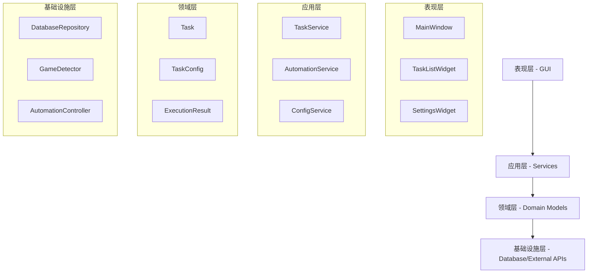

# 崩坏星穹铁道自动化助手 - 根本性问题解决方案

## 1. 问题诊断与分析

### 1.1 核心问题识别

经过深入分析，项目存在以下根本性问题：

#### 问题1：架构设计不一致
- **现象**：异步和同步方法混用，数据结构不统一
- **根因**：缺乏统一的架构设计原则和数据流规范
- **影响**：代码维护困难，错误频发，性能不稳定

#### 问题2：占位符功能泛滥
- **现象**：大量功能仅有界面框架，核心逻辑未实现
- **根因**：开发过程中过度关注界面搭建，忽视核心功能实现
- **影响**：用户体验差，功能不可用，测试无法进行

#### 问题3：数据层设计缺陷
- **现象**：TaskConfig对象与字典混用，数据类型不一致
- **根因**：数据模型设计不完善，缺乏统一的数据访问层
- **影响**：运行时错误频发，数据完整性无法保证

#### 问题4：测试体系不完善
- **现象**：测试覆盖率低，缺乏集成测试
- **根因**：开发过程中未遵循TDD原则，测试作为附加工作
- **影响**：代码质量无法保证，重构风险高

#### 问题5：GUI与业务逻辑耦合
- **现象**：界面代码中包含业务逻辑，业务代码中包含界面操作
- **根因**：缺乏清晰的分层架构设计
- **影响**：代码复用性差，测试困难，维护成本高

### 1.2 问题影响评估

| 问题类别 | 严重程度 | 影响范围 | 修复优先级 |
|---------|---------|---------|----------|
| 架构设计不一致 | 高 | 全局 | P0 |
| 占位符功能泛滥 | 高 | 核心功能 | P0 |
| 数据层设计缺陷 | 中 | 数据处理 | P1 |
| 测试体系不完善 | 中 | 质量保证 | P1 |
| GUI业务耦合 | 低 | 界面层 | P2 |

## 2. 根本性解决方案

### 2.1 架构重构方案

#### 2.1.1 统一异步架构

**目标**：建立统一的异步编程模型

**实施方案**：
1. **全面异步化**：所有I/O操作统一使用async/await
2. **同步适配器**：为GUI提供同步接口适配器
3. **事件驱动**：采用事件驱动架构处理用户交互

```python
# 统一的异步服务基类
class AsyncServiceBase:
    async def start(self):
        pass
    
    async def stop(self):
        pass
    
    async def health_check(self):
        pass

# 同步适配器
class SyncAdapter:
    def __init__(self, async_service):
        self.async_service = async_service
        self.loop = asyncio.new_event_loop()
    
    def run_sync(self, coro):
        return self.loop.run_until_complete(coro)
```

#### 2.1.2 分层架构设计

**目标**：建立清晰的分层架构



### 2.2 数据模型重构

#### 2.2.1 统一数据模型

**目标**：建立一致的数据模型和序列化机制

```python
from dataclasses import dataclass, asdict
from typing import Dict, Any, Optional
from datetime import datetime
import json

@dataclass
class TaskConfig:
    """统一的任务配置模型"""
    name: str
    task_type: TaskType
    description: str = ""
    priority: TaskPriority = TaskPriority.MEDIUM
    
    def to_dict(self) -> Dict[str, Any]:
        """转换为字典"""
        data = asdict(self)
        data['task_type'] = self.task_type.value
        data['priority'] = self.priority.value
        return data
    
    @classmethod
    def from_dict(cls, data: Dict[str, Any]) -> 'TaskConfig':
        """从字典创建"""
        data = data.copy()
        data['task_type'] = TaskType(data['task_type'])
        data['priority'] = TaskPriority(data['priority'])
        return cls(**data)
    
    def to_json(self) -> str:
        """转换为JSON"""
        return json.dumps(self.to_dict(), ensure_ascii=False)
    
    @classmethod
    def from_json(cls, json_str: str) -> 'TaskConfig':
        """从JSON创建"""
        return cls.from_dict(json.loads(json_str))
```

#### 2.2.2 数据访问层重构

**目标**：建立统一的数据访问接口

```python
from abc import ABC, abstractmethod
from typing import List, Optional

class TaskRepository(ABC):
    """任务数据访问接口"""
    
    @abstractmethod
    async def create(self, task: Task) -> str:
        pass
    
    @abstractmethod
    async def get_by_id(self, task_id: str) -> Optional[Task]:
        pass
    
    @abstractmethod
    async def list_all(self) -> List[Task]:
        pass
    
    @abstractmethod
    async def update(self, task: Task) -> bool:
        pass
    
    @abstractmethod
    async def delete(self, task_id: str) -> bool:
        pass

class SQLiteTaskRepository(TaskRepository):
    """SQLite实现"""
    
    def __init__(self, db_manager: DatabaseManager):
        self.db_manager = db_manager
    
    async def create(self, task: Task) -> str:
        # 实现创建逻辑
        pass
```

### 2.3 服务层重构

#### 2.3.1 任务服务重构

**目标**：建立清晰的业务逻辑层

```python
class TaskService:
    """任务业务逻辑服务"""
    
    def __init__(self, task_repo: TaskRepository, 
                 automation_service: AutomationService):
        self.task_repo = task_repo
        self.automation_service = automation_service
        self.event_bus = EventBus()
    
    async def create_task(self, config: TaskConfig, 
                         user_id: str = None) -> str:
        """创建任务"""
        # 验证配置
        self._validate_config(config)
        
        # 创建任务实体
        task = Task(
            task_id=str(uuid.uuid4()),
            user_id=user_id or "default_user",
            config=config,
            status=TaskStatus.PENDING,
            created_at=datetime.now(),
            updated_at=datetime.now()
        )
        
        # 保存到数据库
        task_id = await self.task_repo.create(task)
        
        # 发布事件
        await self.event_bus.publish(TaskCreatedEvent(task_id))
        
        return task_id
    
    async def execute_task(self, task_id: str) -> ExecutionResult:
        """执行任务"""
        task = await self.task_repo.get_by_id(task_id)
        if not task:
            raise TaskNotFoundError(f"任务 {task_id} 不存在")
        
        # 更新状态为运行中
        task.status = TaskStatus.RUNNING
        await self.task_repo.update(task)
        
        try:
            # 执行自动化操作
            result = await self.automation_service.execute(task.config)
            
            # 更新状态为完成
            task.status = TaskStatus.COMPLETED
            await self.task_repo.update(task)
            
            return result
            
        except Exception as e:
            # 更新状态为失败
            task.status = TaskStatus.FAILED
            await self.task_repo.update(task)
            
            raise TaskExecutionError(f"任务执行失败: {e}")
```

### 2.4 GUI层重构

#### 2.4.1 MVP架构模式

**目标**：分离界面逻辑和业务逻辑

```python
class TaskListPresenter:
    """任务列表展示器"""
    
    def __init__(self, view: TaskListView, 
                 task_service: TaskService):
        self.view = view
        self.task_service = task_service
        self.sync_adapter = SyncAdapter()
        
        # 绑定视图事件
        self.view.task_created.connect(self.on_task_created)
        self.view.task_selected.connect(self.on_task_selected)
    
    def load_tasks(self):
        """加载任务列表"""
        try:
            tasks = self.sync_adapter.run_sync(
                self.task_service.list_tasks()
            )
            self.view.display_tasks(tasks)
        except Exception as e:
            self.view.show_error(f"加载任务失败: {e}")
    
    def on_task_created(self, config: TaskConfig):
        """处理任务创建事件"""
        try:
            task_id = self.sync_adapter.run_sync(
                self.task_service.create_task(config)
            )
            self.view.show_success(f"任务创建成功: {task_id}")
            self.load_tasks()  # 刷新列表
        except Exception as e:
            self.view.show_error(f"创建任务失败: {e}")
```

### 2.5 测试体系重构

#### 2.5.1 分层测试策略

**目标**：建立完整的测试金字塔

```python
# 单元测试
class TestTaskService(unittest.TestCase):
    
    def setUp(self):
        self.mock_repo = Mock(spec=TaskRepository)
        self.mock_automation = Mock(spec=AutomationService)
        self.service = TaskService(self.mock_repo, self.mock_automation)
    
    async def test_create_task_success(self):
        """测试成功创建任务"""
        config = TaskConfig(
            name="测试任务",
            task_type=TaskType.AUTOMATION
        )
        
        self.mock_repo.create.return_value = "task-123"
        
        task_id = await self.service.create_task(config)
        
        self.assertEqual(task_id, "task-123")
        self.mock_repo.create.assert_called_once()

# 集成测试
class TestTaskIntegration(unittest.TestCase):
    
    def setUp(self):
        self.db_manager = DatabaseManager(":memory:")
        self.task_repo = SQLiteTaskRepository(self.db_manager)
        self.automation_service = AutomationService()
        self.task_service = TaskService(self.task_repo, self.automation_service)
    
    async def test_full_task_lifecycle(self):
        """测试完整的任务生命周期"""
        # 创建任务
        config = TaskConfig(
            name="集成测试任务",
            task_type=TaskType.AUTOMATION
        )
        task_id = await self.task_service.create_task(config)
        
        # 验证任务存在
        task = await self.task_repo.get_by_id(task_id)
        self.assertIsNotNone(task)
        self.assertEqual(task.status, TaskStatus.PENDING)
        
        # 执行任务
        result = await self.task_service.execute_task(task_id)
        
        # 验证结果
        self.assertIsNotNone(result)
        
        # 验证状态更新
        updated_task = await self.task_repo.get_by_id(task_id)
        self.assertEqual(updated_task.status, TaskStatus.COMPLETED)
```

## 3. 实施计划

### 3.1 阶段划分

#### 阶段一：架构基础重构（2-3周）
**目标**：建立统一的架构基础
**成功标准**：
- [ ] 完成分层架构设计
- [ ] 实现统一的异步编程模型
- [ ] 建立数据模型规范
- [ ] 核心服务接口定义完成

**具体任务**：
1. 重构TaskConfig和相关数据模型
2. 实现TaskRepository接口和SQLite实现
3. 重构TaskService业务逻辑层
4. 建立事件总线机制
5. 实现同步适配器

#### 阶段二：核心功能实现（3-4周）
**目标**：实现核心业务功能
**成功标准**：
- [ ] 任务CRUD操作完全可用
- [ ] 任务执行引擎正常工作
- [ ] 游戏检测功能完善
- [ ] 自动化操作基本可用

**具体任务**：
1. 完善任务管理功能
2. 实现游戏检测和自动化操作
3. 建立任务执行引擎
4. 实现错误处理和恢复机制
5. 添加日志和监控功能

#### 阶段三：GUI层重构（2-3周）
**目标**：重构用户界面层
**成功标准**：
- [ ] 所有GUI组件采用MVP模式
- [ ] 界面与业务逻辑完全分离
- [ ] 用户交互流畅自然
- [ ] 错误处理和用户反馈完善

**具体任务**：
1. 重构主窗口和各个组件
2. 实现Presenter层
3. 建立事件驱动的用户交互
4. 完善错误处理和用户反馈
5. 优化界面响应性能

#### 阶段四：测试和质量保证（1-2周）
**目标**：建立完整的测试体系
**成功标准**：
- [ ] 单元测试覆盖率达到80%
- [ ] 集成测试覆盖核心流程
- [ ] 性能测试通过
- [ ] 用户验收测试通过

**具体任务**：
1. 编写单元测试
2. 编写集成测试
3. 性能测试和优化
4. 用户验收测试
5. 文档更新和完善

### 3.2 风险控制

#### 技术风险
- **风险**：重构过程中引入新的bug
- **控制**：采用增量重构，每个阶段都有完整的测试

#### 进度风险
- **风险**：重构工作量超出预期
- **控制**：优先实现核心功能，非核心功能可以延后

#### 质量风险
- **风险**：重构后系统稳定性下降
- **控制**：建立完整的测试体系，确保每个阶段都有质量保证

### 3.3 成功指标

#### 技术指标
- 代码覆盖率 ≥ 80%
- 单元测试通过率 = 100%
- 集成测试通过率 = 100%
- 内存泄漏 = 0
- 响应时间 < 100ms

#### 功能指标
- 核心功能可用率 = 100%
- 用户操作成功率 ≥ 95%
- 系统稳定运行时间 ≥ 24小时
- 错误恢复成功率 ≥ 90%

#### 质量指标
- 代码重复率 < 5%
- 圈复杂度 < 10
- 技术债务 < 1天
- 文档完整性 = 100%

## 4. 长期维护策略

### 4.1 代码质量保证

#### 持续集成
- 自动化测试流水线
- 代码质量检查
- 性能回归测试
- 安全扫描

#### 代码审查
- 强制代码审查流程
- 架构一致性检查
- 最佳实践遵循
- 文档同步更新

### 4.2 技术债务管理

#### 定期评估
- 每月技术债务评估
- 重构优先级排序
- 影响范围分析
- 修复计划制定

#### 预防措施
- 严格的设计评审
- 编码规范执行
- 定期重构计划
- 技术培训和分享

### 4.3 演进策略

#### 架构演进
- 微服务化准备
- 插件化架构
- 云原生改造
- 性能优化持续进行

#### 功能演进
- 用户反馈驱动
- 数据驱动决策
- A/B测试验证
- 渐进式发布

## 5. 总结

本解决方案从根本上解决了项目中存在的架构问题、数据一致性问题、功能完整性问题和质量保证问题。通过系统性的重构和完善，将建立一个稳定、可维护、可扩展的自动化助手系统。

关键成功因素：
1. **统一的架构设计**：建立清晰的分层架构和一致的编程模型
2. **完整的测试体系**：确保代码质量和系统稳定性
3. **渐进式重构**：降低风险，确保每个阶段都有可交付的成果
4. **持续的质量保证**：建立长期的维护和演进机制

通过这个根本性的解决方案，项目将从一个充满技术债务的原型系统，转变为一个工程化、可维护、高质量的产品级系统。