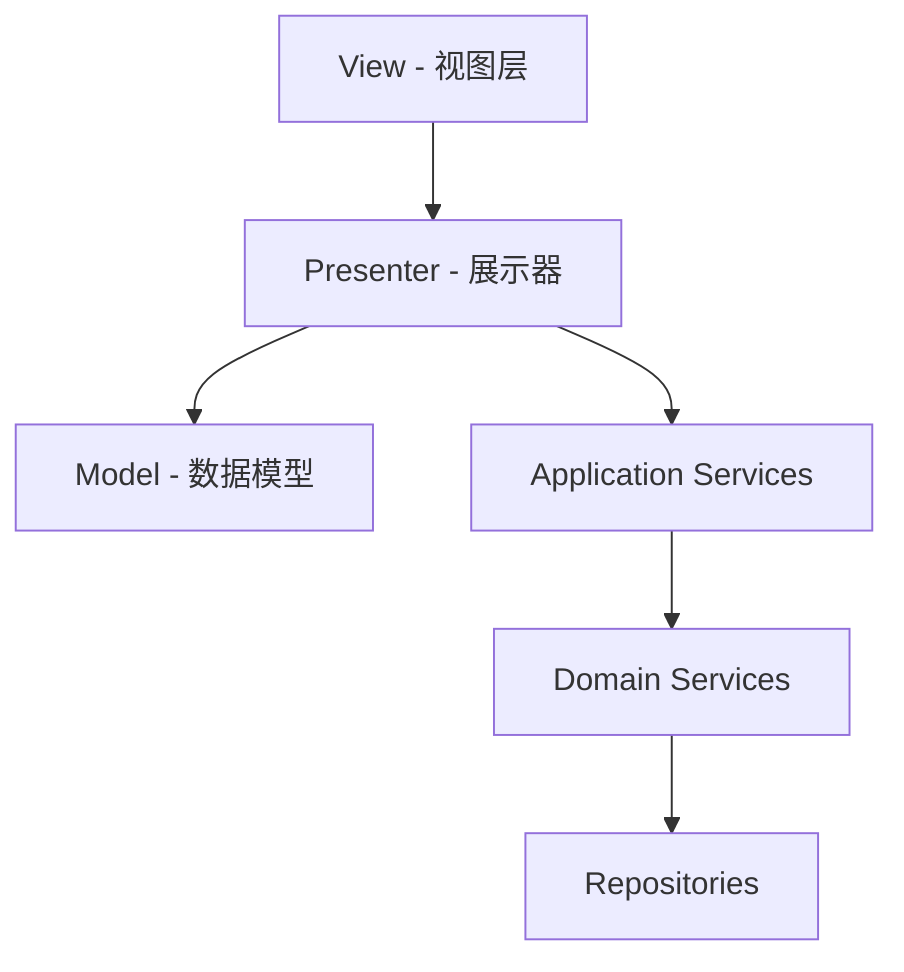
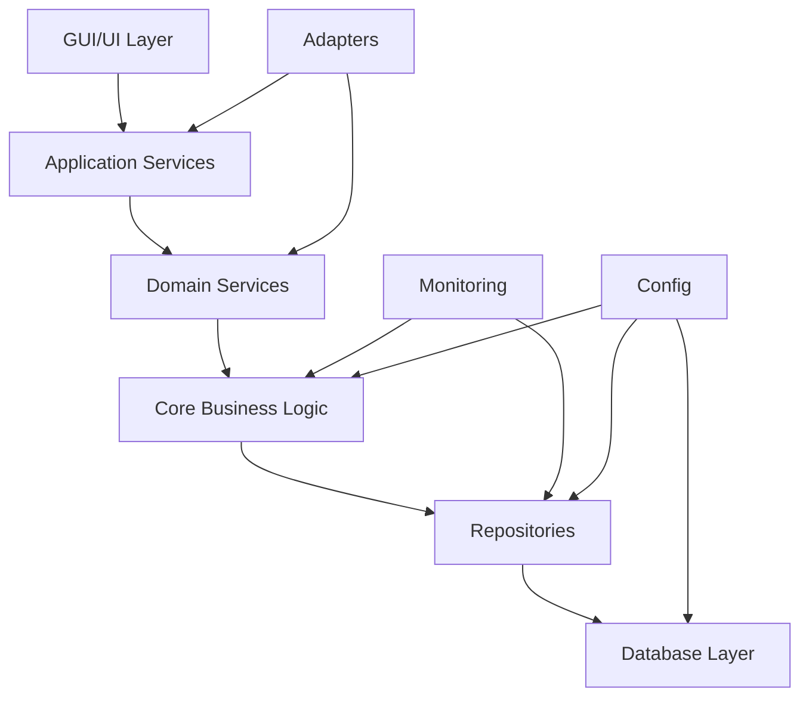

# xingtie项目结构分析文档

## 1. 项目概览

**项目名称**: 崩坏：星穹铁道自动化工具 (xingtie)  
**项目类型**: 桌面自动化应用程序  
**技术栈**: Python + PyQt6 + SQLite  
**架构模式**: 分层架构 + MVP模式  

## 2. 目录结构分析

### 2.1 根目录结构

```
xingtie/
├── .github/                    # CI/CD配置
├── .trae/documents/            # 项目文档
├── assets/                     # 静态资源
├── config/                     # 配置文件
├── data/                       # 数据文件
├── logs/                       # 日志文件
├── src/                        # 源代码目录
├── tests/                      # 测试代码
├── scripts/                    # 工具脚本
├── migrations/                 # 数据库迁移
├── requirements.txt            # 依赖管理
├── pyproject.toml             # 项目配置
└── main.py                    # 程序入口
```

### 2.2 核心源码结构 (src/)

```
src/
├── adapters/                   # 适配器层
│   ├── model_adapter.py
│   └── task_manager_adapter.py
├── application/                # 应用服务层
│   ├── automation_application_service.py
│   └── error_handling_service.py
├── automation/                 # 自动化模块
│   └── automation_controller.py
├── config/                     # 配置管理
│   ├── database_config.py
│   └── error_recovery_strategies.py
├── core/                       # 核心业务逻辑
│   ├── game_detector.py
│   ├── task_manager.py
│   ├── sync_adapter.py
│   ├── events.py
│   └── error_handling.py
├── database/                   # 数据访问层
│   ├── db_manager.py
│   ├── migration_manager.py
│   └── migrations/
├── gui/                        # GUI组件
│   ├── main_window.py
│   ├── automation_settings_widget.py
│   ├── game_settings_widget.py
│   └── common/gui_components.py
├── models/                     # 数据模型
│   └── task_models.py
├── monitoring/                 # 监控模块
│   ├── health_checker.py
│   ├── alert_manager.py
│   └── task_monitor.py
├── repositories/               # 仓储层
│   ├── base_repository.py
│   ├── task_repository.py
│   ├── config_repository.py
│   └── query_executor.py
├── services/                   # 领域服务
│   ├── automation_application_service.py
│   ├── event_bus.py
│   └── task_service.py
├── ui/                         # UI架构
│   ├── mvp/                    # MVP模式基础
│   │   ├── base_model.py
│   │   ├── base_view.py
│   │   └── base_presenter.py
│   └── main_window/            # 主窗口MVP实现
│       ├── main_window_model.py
│       ├── main_window_view.py
│       └── main_window_presenter.py
├── utils/                      # 工具类
│   └── helpers.py
├── main.py                     # 传统架构入口
└── main_mvp.py                # MVP架构入口
```

## 3. 架构层级分析

### 3.1 分层架构设计

项目采用经典的分层架构模式，从上到下分为：

#### 表示层 (Presentation Layer)
- **GUI组件** (`src/gui/`): 传统PyQt6界面组件
- **MVP架构** (`src/ui/`): 现代化的MVP模式实现
- **适配器** (`src/adapters/`): 不同架构间的适配

#### 应用服务层 (Application Service Layer)
- **应用服务** (`src/application/`): 应用级业务逻辑
- **领域服务** (`src/services/`): 领域级业务逻辑
- **自动化控制** (`src/automation/`): 自动化相关服务

#### 领域层 (Domain Layer)
- **核心业务** (`src/core/`): 核心业务逻辑和规则
- **数据模型** (`src/models/`): 领域实体和值对象
- **事件系统** (`src/core/events.py`): 领域事件处理

#### 基础设施层 (Infrastructure Layer)
- **数据访问** (`src/repositories/`): 数据持久化
- **数据库管理** (`src/database/`): 数据库连接和迁移
- **配置管理** (`src/config/`): 配置文件处理
- **监控系统** (`src/monitoring/`): 系统监控和告警

### 3.2 MVP模式实现

项目实现了完整的MVP架构模式：



**MVP组件职责**:
- **Model**: 数据管理、验证、状态维护
- **View**: 用户界面、用户交互、显示更新
- **Presenter**: 业务逻辑、事件处理、协调Model和View

## 4. 模块依赖关系分析

### 4.1 核心依赖图



### 4.2 模块间耦合分析

**高内聚模块**:
- `core/`: 核心业务逻辑高度内聚
- `repositories/`: 数据访问逻辑统一
- `ui/mvp/`: MVP模式组件内聚

**低耦合设计**:
- 通过接口和抽象类解耦
- 事件驱动架构减少直接依赖
- 依赖注入模式

**潜在耦合问题**:
- `gui/` 和 `ui/` 两套UI系统并存
- 部分模块直接依赖具体实现而非接口

## 5. 架构模式实现情况

### 5.1 已实现的模式

#### 分层架构 (Layered Architecture)
- ✅ 清晰的层级划分
- ✅ 单向依赖原则
- ✅ 职责分离

#### MVP模式 (Model-View-Presenter)
- ✅ 完整的MVP基础框架
- ✅ 信号槽机制实现
- ✅ 异步操作支持

#### 仓储模式 (Repository Pattern)
- ✅ 统一的数据访问接口
- ✅ 查询构建器
- ✅ 事务支持

#### 事件驱动架构 (Event-Driven Architecture)
- ✅ 完整的事件系统
- ✅ 事件总线实现
- ✅ 异步事件处理

#### 适配器模式 (Adapter Pattern)
- ✅ 同步/异步适配器
- ✅ 架构间适配

### 5.2 设计原则遵循情况

#### SOLID原则
- **单一职责原则 (SRP)**: ✅ 大部分类职责单一
- **开闭原则 (OCP)**: ✅ 通过接口和继承支持扩展
- **里氏替换原则 (LSP)**: ✅ 基类和派生类设计合理
- **接口隔离原则 (ISP)**: ⚠️ 部分接口过于庞大
- **依赖倒置原则 (DIP)**: ✅ 依赖抽象而非具体实现

## 6. 结构问题识别

### 6.1 架构层面问题

#### 双重UI架构
**问题**: 同时存在 `gui/` 和 `ui/` 两套UI系统
- `gui/`: 传统PyQt6组件
- `ui/`: MVP模式实现

**影响**: 
- 代码重复
- 维护复杂
- 架构不一致

#### 入口点混乱
**问题**: 存在多个程序入口
- `main.py`: 根目录入口
- `src/main.py`: 传统架构入口
- `src/main_mvp.py`: MVP架构入口

### 6.2 模块组织问题

#### 职责重叠
- `application/` 和 `services/` 职责边界模糊
- `automation/` 和 `core/` 部分功能重复

#### 命名不一致
- 部分模块使用复数形式 (`repositories/`, `services/`)
- 部分模块使用单数形式 (`automation/`, `config/`)

### 6.3 依赖关系问题

#### 循环依赖风险
- `adapters/` 可能与多个层级产生循环依赖
- `monitoring/` 模块依赖关系复杂

#### 过度依赖
- 某些模块依赖过多外部组件
- 缺少依赖注入容器统一管理

## 7. 优化建议

### 7.1 架构统一化

#### 统一UI架构
```
建议方案：
1. 全面迁移到MVP模式
2. 废弃传统gui/目录
3. 统一使用ui/目录下的组件
4. 保留一个主入口点
```

#### 简化入口点
```
建议保留：
- main.py (根目录) - 作为唯一入口
- 移除src/main.py和src/main_mvp.py
```

### 7.2 模块重组

#### 服务层重构
```
建议结构：
├── application/          # 应用服务（用例层）
│   ├── commands/        # 命令处理
│   ├── queries/         # 查询处理
│   └── handlers/        # 事件处理
├── domain/              # 领域层
│   ├── entities/        # 实体
│   ├── services/        # 领域服务
│   └── events/          # 领域事件
└── infrastructure/      # 基础设施层
    ├── repositories/    # 数据访问
    ├── external/        # 外部服务
    └── config/          # 配置管理
```

#### 统一命名规范
```
建议规范：
- 目录名使用复数形式
- 文件名使用单数形式
- 类名使用PascalCase
- 方法名使用snake_case
```

### 7.3 依赖管理优化

#### 引入依赖注入容器
```python
# 建议添加
src/
├── container/
│   ├── __init__.py
│   ├── service_container.py
│   └── bindings.py
```

#### 接口抽象化
```python
# 建议添加
src/
├── interfaces/
│   ├── repositories/
│   ├── services/
│   └── adapters/
```

### 7.4 监控和配置优化

#### 配置管理集中化
```
建议结构：
config/
├── environments/        # 环境配置
│   ├── development.json
│   ├── production.json
│   └── testing.json
├── features/           # 功能配置
└── schemas/            # 配置模式
```

#### 监控系统完善
```
建议增强：
1. 添加性能指标收集
2. 实现分布式追踪
3. 增加健康检查端点
4. 完善告警机制
```

## 8. 实施路线图

### 阶段一：架构统一 (2-3周)
1. 迁移GUI组件到MVP模式
2. 统一程序入口点
3. 清理重复代码

### 阶段二：模块重构 (3-4周)
1. 重组服务层结构
2. 统一命名规范
3. 优化模块职责划分

### 阶段三：依赖优化 (2-3周)
1. 引入依赖注入容器
2. 抽象化接口设计
3. 解决循环依赖问题

### 阶段四：系统完善 (2-3周)
1. 完善监控系统
2. 优化配置管理
3. 增强错误处理

## 9. 质量指标

### 当前状态
- **Pylint评分**: 8.54/10
- **测试覆盖率**: 91% (119/131)
- **代码重复率**: 已显著降低
- **架构一致性**: 部分符合

### 目标状态
- **Pylint评分**: 9.0+/10
- **测试覆盖率**: 95%+
- **代码重复率**: <5%
- **架构一致性**: 完全符合

## 10. 总结

xingtie项目整体架构设计良好，采用了现代化的分层架构和MVP模式。主要优势包括：

**优势**:
- 清晰的层级划分
- 完整的MVP模式实现
- 良好的事件驱动架构
- 统一的数据访问层
- 完善的错误处理机制

**待改进**:
- 双重UI架构需要统一
- 模块职责需要进一步明确
- 依赖关系需要优化
- 配置管理需要集中化

通过实施建议的优化方案，项目将具备更好的可维护性、可扩展性和可测试性。