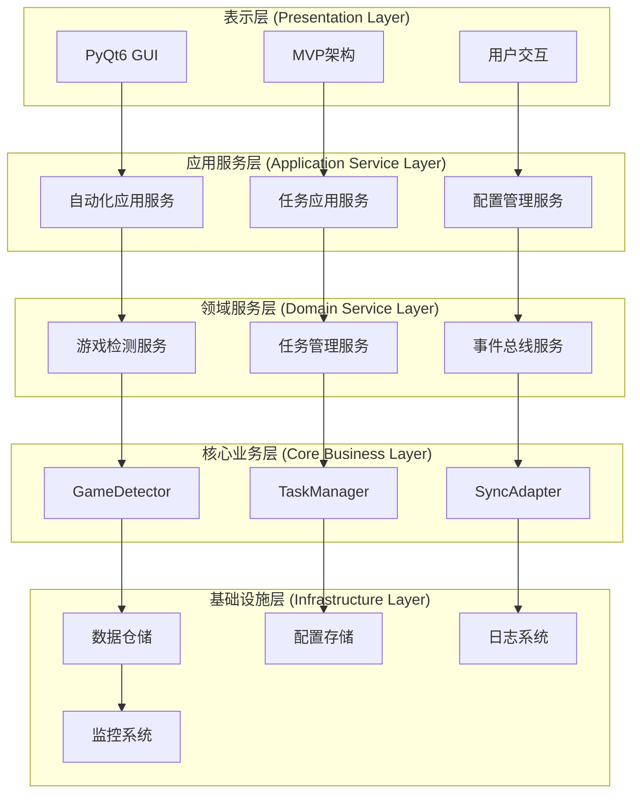
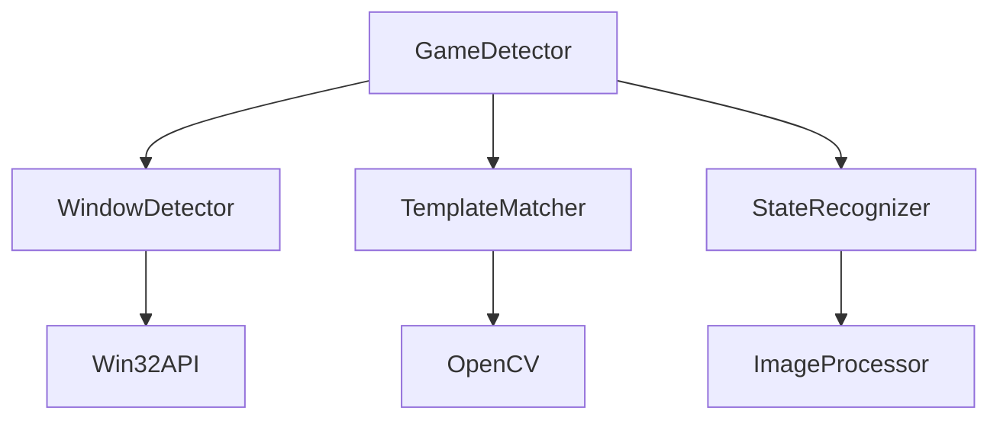
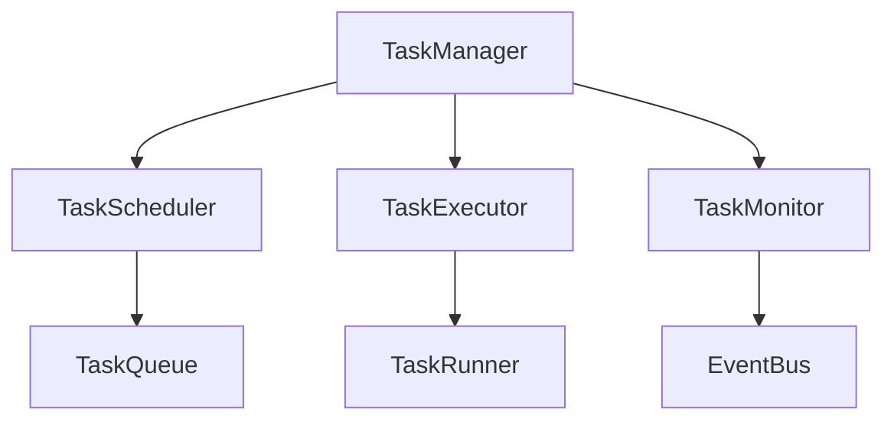
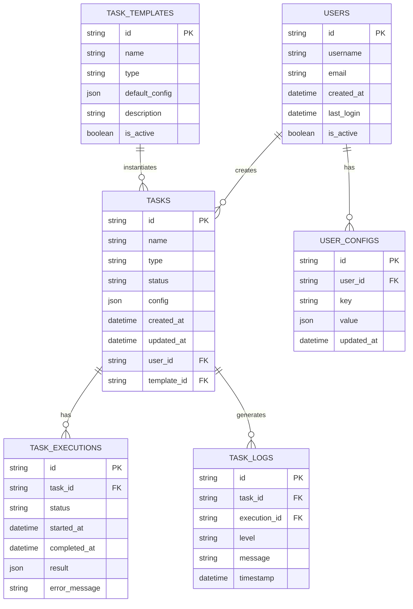
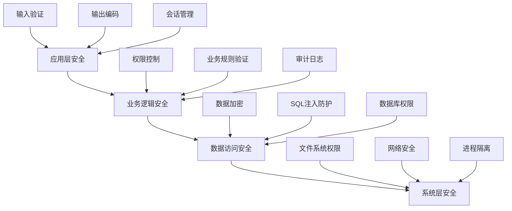

# xingtie项目设计文档

## 1. 项目概述

**项目名称**: 崩坏：星穹铁道自动化工具 (xingtie)  
**项目类型**: 桌面自动化应用程序  
**开发语言**: Python 3.8+  
**主要框架**: PyQt6 + asyncio  
**架构模式**: 分层架构 + MVP模式  
**目标平台**: Windows 10/11  

### 1.1 项目目标
- 提供稳定可靠的游戏自动化功能
- 支持多任务并发执行和管理
- 提供友好的用户界面和操作体验
- 确保系统的可扩展性和可维护性

### 1.2 核心价值
- **自动化效率**: 解放用户双手，提升游戏体验
- **稳定可靠**: 7x24小时稳定运行
- **智能识别**: 基于计算机视觉的游戏状态检测
- **灵活配置**: 支持个性化任务配置和调度

## 2. 系统架构设计

### 2.1 整体架构



### 2.2 分层架构详细设计

#### 表示层 (Presentation Layer)
**职责**: 用户界面展示和交互处理
- **GUI组件**: 基于PyQt6的窗口、控件和布局
- **MVP模式**: Model-View-Presenter架构模式
- **事件处理**: 用户操作事件的捕获和分发

**核心组件**:
- `MainWindow`: 主窗口界面
- `AutomationSettingsWidget`: 自动化设置界面
- `GameSettingsWidget`: 游戏设置界面
- `TaskListWidget`: 任务列表界面

#### 应用服务层 (Application Service Layer)
**职责**: 业务用例的编排和协调
- **用例编排**: 协调多个领域服务完成复杂业务流程
- **事务管理**: 确保业务操作的一致性
- **权限控制**: 用户权限验证和访问控制

**核心组件**:
- `AutomationApplicationService`: 自动化业务编排
- `TaskApplicationService`: 任务管理业务编排
- `ConfigurationService`: 配置管理服务

#### 领域服务层 (Domain Service Layer)
**职责**: 核心业务逻辑的实现
- **业务规则**: 实现复杂的业务规则和约束
- **领域事件**: 发布和处理领域事件
- **服务协调**: 协调多个领域对象完成业务操作

**核心组件**:
- `GameDetectionService`: 游戏检测业务逻辑
- `TaskManagementService`: 任务管理业务逻辑
- `EventBusService`: 事件总线服务

#### 核心业务层 (Core Business Layer)
**职责**: 核心领域对象和算法
- **领域实体**: 核心业务实体和值对象
- **业务算法**: 核心算法和计算逻辑
- **不变性约束**: 业务不变性规则的维护

**核心组件**:
- `GameDetector`: 游戏检测核心算法
- `TaskManager`: 任务管理核心逻辑
- `SyncAdapter`: 同步异步适配器

#### 基础设施层 (Infrastructure Layer)
**职责**: 技术基础设施和外部系统集成
- **数据持久化**: 数据库访问和文件存储
- **外部系统**: 第三方服务集成
- **技术服务**: 日志、监控、缓存等技术服务

**核心组件**:
- `DatabaseManager`: 数据库管理
- `ConfigRepository`: 配置数据仓储
- `LoggingService`: 日志服务
- `MonitoringService`: 监控服务

### 2.3 模块间通信设计

#### 同步通信
- **方法调用**: 同层内模块间的直接方法调用
- **接口依赖**: 跨层通过接口进行依赖注入
- **数据传输**: 使用数据传输对象(DTO)进行数据传递

#### 异步通信
- **事件驱动**: 基于事件总线的异步消息传递
- **回调机制**: 异步操作完成后的回调通知
- **信号槽**: PyQt6信号槽机制用于UI更新

#### 通信协议
```python
# 事件定义示例
class TaskStatusChangedEvent:
    def __init__(self, task_id: str, old_status: TaskStatus, new_status: TaskStatus):
        self.task_id = task_id
        self.old_status = old_status
        self.new_status = new_status
        self.timestamp = datetime.now()

# 事件发布
event_bus.publish(TaskStatusChangedEvent(task_id, old_status, new_status))

# 事件订阅
@event_bus.subscribe(TaskStatusChangedEvent)
def handle_task_status_changed(event: TaskStatusChangedEvent):
    # 处理任务状态变更
    pass
```

## 3. 技术选型说明

### 3.1 核心技术栈

| 技术领域 | 选型 | 版本 | 选择理由 |
|---------|------|------|----------|
| **编程语言** | Python | 3.8+ | 丰富的生态系统，适合快速开发 |
| **GUI框架** | PyQt6 | 6.4+ | 成熟稳定，功能强大，跨平台支持 |
| **异步框架** | asyncio | 内置 | Python原生异步支持，性能优秀 |
| **数据库** | SQLite | 3.36+ | 轻量级，无需额外部署，适合桌面应用 |
| **图像处理** | OpenCV | 4.5+ | 强大的计算机视觉库，游戏检测必需 |
| **数值计算** | NumPy | 1.21+ | 高性能数值计算，图像处理基础 |
| **测试框架** | pytest | 7.0+ | 功能强大，插件丰富，易于使用 |
| **代码质量** | pylint, black | 最新 | 代码质量保证，统一代码风格 |

### 3.2 架构模式选择

#### MVP模式 (Model-View-Presenter)
**选择理由**:
- **职责分离**: 清晰的职责划分，便于维护
- **可测试性**: Presenter可以独立测试，提高测试覆盖率
- **可扩展性**: 易于添加新的视图和业务逻辑

**实现方式**:
```python
# Model: 数据和业务逻辑
class TaskModel(BaseModel):
    def get_tasks(self) -> List[Task]:
        return self.task_repository.find_all()
    
    def create_task(self, config: TaskConfig) -> Task:
        return self.task_service.create_task(config)

# View: 用户界面
class TaskView(BaseView):
    task_created = pyqtSignal(Task)
    
    def display_tasks(self, tasks: List[Task]):
        self.task_list.clear()
        for task in tasks:
            self.task_list.addItem(TaskListItem(task))

# Presenter: 协调Model和View
class TaskPresenter(BasePresenter):
    def __init__(self, model: TaskModel, view: TaskView):
        self.model = model
        self.view = view
        self.view.task_created.connect(self.on_task_created)
    
    def load_tasks(self):
        tasks = self.model.get_tasks()
        self.view.display_tasks(tasks)
```

#### 分层架构模式
**选择理由**:
- **关注点分离**: 每层专注于特定的技术关注点
- **依赖管理**: 单向依赖，降低耦合度
- **可维护性**: 层次清晰，易于理解和维护

#### 事件驱动架构
**选择理由**:
- **松耦合**: 组件间通过事件通信，降低直接依赖
- **可扩展性**: 易于添加新的事件处理器
- **异步处理**: 支持异步事件处理，提高性能

### 3.3 第三方库选择

#### 图像处理库
- **OpenCV**: 计算机视觉和图像处理
- **Pillow**: 图像格式转换和基础处理
- **NumPy**: 数值计算和数组操作

#### 系统交互库
- **pywin32**: Windows系统API调用
- **psutil**: 系统进程和资源监控
- **keyboard**: 键盘事件监听和模拟
- **mouse**: 鼠标事件监听和模拟

#### 数据处理库
- **SQLAlchemy**: ORM和数据库抽象层
- **pydantic**: 数据验证和序列化
- **dataclasses**: 数据类定义

## 4. 核心功能设计

### 4.1 游戏检测功能设计

#### 功能概述
游戏检测功能负责识别游戏窗口、检测游戏状态、定位UI元素等核心任务。

#### 架构设计


#### 核心类设计
```python
class GameDetector:
    """游戏检测器主类"""
    
    def __init__(self):
        self.window_detector = WindowDetector()
        self.template_matcher = TemplateMatcher()
        self.state_recognizer = StateRecognizer()
        self.last_screenshot = None
        self.current_window = None
    
    def detect_game_window(self) -> Optional[GameWindow]:
        """检测游戏窗口"""
        windows = self.window_detector.find_windows_by_title("崩坏：星穹铁道")
        if windows:
            self.current_window = windows[0]
            return GameWindow(
                handle=windows[0].handle,
                title=windows[0].title,
                rect=windows[0].rect
            )
        return None
    
    def is_game_running(self) -> bool:
        """检查游戏是否运行"""
        return self.detect_game_window() is not None
    
    def find_template(self, template_path: str, threshold: float = 0.8) -> Optional[TemplateInfo]:
        """模板匹配查找UI元素"""
        if not self.current_window:
            return None
        
        screenshot = self.capture_window()
        if screenshot is None:
            return None
        
        result = self.template_matcher.match(
            screenshot, template_path, threshold
        )
        return result
    
    def capture_window(self) -> Optional[np.ndarray]:
        """截取游戏窗口"""
        if not self.current_window:
            return None
        
        screenshot = self.window_detector.capture_window(self.current_window)
        self.last_screenshot = screenshot
        return screenshot

class TemplateMatcher:
    """模板匹配器"""
    
    def __init__(self):
        self.template_cache = {}
    
    def match(self, image: np.ndarray, template_path: str, threshold: float) -> Optional[TemplateInfo]:
        """执行模板匹配"""
        template = self._load_template(template_path)
        if template is None:
            return None
        
        result = cv2.matchTemplate(image, template, cv2.TM_CCOEFF_NORMED)
        min_val, max_val, min_loc, max_loc = cv2.minMaxLoc(result)
        
        if max_val >= threshold:
            return TemplateInfo(
                template_path=template_path,
                confidence=max_val,
                location=max_loc,
                size=template.shape[:2]
            )
        return None
    
    def _load_template(self, template_path: str) -> Optional[np.ndarray]:
        """加载模板图像"""
        if template_path in self.template_cache:
            return self.template_cache[template_path]
        
        try:
            template = cv2.imread(template_path, cv2.IMREAD_COLOR)
            if template is not None:
                self.template_cache[template_path] = template
            return template
        except Exception as e:
            logger.error(f"Failed to load template {template_path}: {e}")
            return None
```

#### 数据模型
```python
@dataclass
class GameWindow:
    """游戏窗口信息"""
    handle: int
    title: str
    rect: Tuple[int, int, int, int]
    is_active: bool = False

@dataclass
class TemplateInfo:
    """模板匹配信息"""
    template_path: str
    confidence: float
    location: Tuple[int, int]
    size: Tuple[int, int]

@dataclass
class UIElement:
    """UI元素信息"""
    name: str
    template_path: str
    location: Optional[Tuple[int, int]] = None
    confidence: float = 0.0
    is_visible: bool = False
```

### 4.2 任务管理功能设计

#### 功能概述
任务管理功能负责任务的创建、调度、执行、监控和生命周期管理。

#### 架构设计


#### 核心类设计
```python
class TaskManager:
    """任务管理器主类"""
    
    def __init__(self):
        self.scheduler = TaskScheduler()
        self.executor = TaskExecutor()
        self.monitor = TaskMonitor()
        self.tasks: Dict[str, Task] = {}
        self.event_bus = EventBus()
    
    def create_task(self, config: TaskConfig) -> str:
        """创建新任务"""
        task_id = str(uuid.uuid4())
        task = Task(
            id=task_id,
            name=config.name,
            type=config.type,
            config=config,
            status=TaskStatus.CREATED,
            created_at=datetime.now()
        )
        
        self.tasks[task_id] = task
        self.event_bus.publish(TaskCreatedEvent(task))
        return task_id
    
    def start_task(self, task_id: str) -> bool:
        """启动任务"""
        task = self.tasks.get(task_id)
        if not task:
            return False
        
        if task.status != TaskStatus.CREATED:
            return False
        
        task.status = TaskStatus.RUNNING
        task.started_at = datetime.now()
        
        self.executor.execute_task(task)
        self.event_bus.publish(TaskStartedEvent(task))
        return True
    
    def stop_task(self, task_id: str) -> bool:
        """停止任务"""
        task = self.tasks.get(task_id)
        if not task:
            return False
        
        if task.status != TaskStatus.RUNNING:
            return False
        
        task.status = TaskStatus.STOPPED
        task.stopped_at = datetime.now()
        
        self.executor.stop_task(task_id)
        self.event_bus.publish(TaskStoppedEvent(task))
        return True
    
    def get_task_status(self, task_id: str) -> Optional[TaskStatus]:
        """获取任务状态"""
        task = self.tasks.get(task_id)
        return task.status if task else None

class TaskExecutor:
    """任务执行器"""
    
    def __init__(self):
        self.running_tasks: Dict[str, asyncio.Task] = {}
        self.task_runners: Dict[TaskType, TaskRunner] = {
            TaskType.DAILY_MISSION: DailyMissionRunner(),
            TaskType.RESOURCE_FARMING: ResourceFarmingRunner(),
            TaskType.BATTLE_PASS: BattlePassRunner(),
        }
    
    async def execute_task(self, task: Task):
        """执行任务"""
        runner = self.task_runners.get(task.type)
        if not runner:
            raise ValueError(f"No runner found for task type: {task.type}")
        
        async_task = asyncio.create_task(runner.run(task))
        self.running_tasks[task.id] = async_task
        
        try:
            await async_task
            task.status = TaskStatus.COMPLETED
            task.completed_at = datetime.now()
        except asyncio.CancelledError:
            task.status = TaskStatus.CANCELLED
        except Exception as e:
            task.status = TaskStatus.FAILED
            task.error_message = str(e)
        finally:
            self.running_tasks.pop(task.id, None)
    
    def stop_task(self, task_id: str):
        """停止任务执行"""
        async_task = self.running_tasks.get(task_id)
        if async_task:
            async_task.cancel()
```

#### 任务类型设计
```python
class TaskType(Enum):
    """任务类型枚举"""
    DAILY_MISSION = "daily_mission"
    RESOURCE_FARMING = "resource_farming"
    BATTLE_PASS = "battle_pass"
    CUSTOM_SCRIPT = "custom_script"

class TaskStatus(Enum):
    """任务状态枚举"""
    CREATED = "created"
    RUNNING = "running"
    PAUSED = "paused"
    COMPLETED = "completed"
    FAILED = "failed"
    CANCELLED = "cancelled"
    STOPPED = "stopped"

@dataclass
class TaskConfig:
    """任务配置"""
    name: str
    type: TaskType
    schedule: Optional[str] = None  # Cron表达式
    max_retries: int = 3
    timeout: int = 3600  # 秒
    parameters: Dict[str, Any] = field(default_factory=dict)

@dataclass
class Task:
    """任务实体"""
    id: str
    name: str
    type: TaskType
    config: TaskConfig
    status: TaskStatus
    created_at: datetime
    started_at: Optional[datetime] = None
    completed_at: Optional[datetime] = None
    stopped_at: Optional[datetime] = None
    error_message: Optional[str] = None
    retry_count: int = 0
```

### 4.3 UI架构设计

#### MVP模式实现
```python
# 基础MVP框架
class BaseModel(QObject):
    """MVP模式基础Model类"""
    data_changed = pyqtSignal()
    
    def __init__(self):
        super().__init__()
        self._data = {}
    
    def set_data(self, key: str, value: Any):
        """设置数据"""
        self._data[key] = value
        self.data_changed.emit()
    
    def get_data(self, key: str, default=None):
        """获取数据"""
        return self._data.get(key, default)

class BaseView(QWidget):
    """MVP模式基础View类"""
    
    def __init__(self, parent=None):
        super().__init__(parent)
        self.presenter = None
    
    def set_presenter(self, presenter):
        """设置Presenter"""
        self.presenter = presenter
    
    def show_message(self, message: str, message_type: str = "info"):
        """显示消息"""
        if message_type == "error":
            QMessageBox.critical(self, "错误", message)
        elif message_type == "warning":
            QMessageBox.warning(self, "警告", message)
        else:
            QMessageBox.information(self, "信息", message)

class BasePresenter:
    """MVP模式基础Presenter类"""
    
    def __init__(self, model: BaseModel, view: BaseView):
        self.model = model
        self.view = view
        self.view.set_presenter(self)
        self._connect_signals()
    
    def _connect_signals(self):
        """连接信号槽"""
        self.model.data_changed.connect(self.on_data_changed)
    
    def on_data_changed(self):
        """数据变更处理"""
        pass
```

#### 主窗口MVP实现
```python
class MainWindowModel(BaseModel):
    """主窗口数据模型"""
    
    def __init__(self):
        super().__init__()
        self.task_service = TaskService()
        self.automation_service = AutomationService()
    
    def get_tasks(self) -> List[Task]:
        """获取任务列表"""
        return self.task_service.get_all_tasks()
    
    def start_automation(self) -> bool:
        """启动自动化"""
        return self.automation_service.start()
    
    def stop_automation(self) -> bool:
        """停止自动化"""
        return self.automation_service.stop()

class MainWindowView(BaseView):
    """主窗口视图"""
    
    # 信号定义
    start_automation_requested = pyqtSignal()
    stop_automation_requested = pyqtSignal()
    task_creation_requested = pyqtSignal(dict)
    
    def __init__(self):
        super().__init__()
        self.setup_ui()
        self.connect_signals()
    
    def setup_ui(self):
        """设置UI界面"""
        layout = QVBoxLayout()
        
        # 工具栏
        toolbar = QHBoxLayout()
        self.start_button = QPushButton("开始自动化")
        self.stop_button = QPushButton("停止自动化")
        self.create_task_button = QPushButton("创建任务")
        
        toolbar.addWidget(self.start_button)
        toolbar.addWidget(self.stop_button)
        toolbar.addWidget(self.create_task_button)
        
        # 任务列表
        self.task_list = QListWidget()
        
        # 状态栏
        self.status_label = QLabel("就绪")
        
        layout.addLayout(toolbar)
        layout.addWidget(self.task_list)
        layout.addWidget(self.status_label)
        
        self.setLayout(layout)
    
    def connect_signals(self):
        """连接信号"""
        self.start_button.clicked.connect(self.start_automation_requested.emit)
        self.stop_button.clicked.connect(self.stop_automation_requested.emit)
        self.create_task_button.clicked.connect(self.on_create_task_clicked)
    
    def on_create_task_clicked(self):
        """创建任务按钮点击"""
        # 弹出任务创建对话框
        dialog = TaskCreationDialog(self)
        if dialog.exec() == QDialog.Accepted:
            task_config = dialog.get_task_config()
            self.task_creation_requested.emit(task_config)
    
    def update_task_list(self, tasks: List[Task]):
        """更新任务列表"""
        self.task_list.clear()
        for task in tasks:
            item = QListWidgetItem(f"{task.name} - {task.status.value}")
            item.setData(Qt.UserRole, task)
            self.task_list.addItem(item)
    
    def update_status(self, status: str):
        """更新状态"""
        self.status_label.setText(status)

class MainWindowPresenter(BasePresenter):
    """主窗口展示器"""
    
    def __init__(self, model: MainWindowModel, view: MainWindowView):
        super().__init__(model, view)
        self.connect_view_signals()
        self.load_initial_data()
    
    def connect_view_signals(self):
        """连接视图信号"""
        self.view.start_automation_requested.connect(self.on_start_automation)
        self.view.stop_automation_requested.connect(self.on_stop_automation)
        self.view.task_creation_requested.connect(self.on_create_task)
    
    def load_initial_data(self):
        """加载初始数据"""
        tasks = self.model.get_tasks()
        self.view.update_task_list(tasks)
    
    def on_start_automation(self):
        """启动自动化"""
        try:
            if self.model.start_automation():
                self.view.update_status("自动化已启动")
                self.view.show_message("自动化启动成功")
            else:
                self.view.show_message("自动化启动失败", "error")
        except Exception as e:
            self.view.show_message(f"启动失败: {str(e)}", "error")
    
    def on_stop_automation(self):
        """停止自动化"""
        try:
            if self.model.stop_automation():
                self.view.update_status("自动化已停止")
                self.view.show_message("自动化停止成功")
            else:
                self.view.show_message("自动化停止失败", "error")
        except Exception as e:
            self.view.show_message(f"停止失败: {str(e)}", "error")
    
    def on_create_task(self, task_config: dict):
        """创建任务"""
        try:
            # 创建任务逻辑
            task_id = self.model.task_service.create_task(TaskConfig(**task_config))
            self.view.show_message(f"任务创建成功: {task_id}")
            self.load_initial_data()  # 刷新任务列表
        except Exception as e:
            self.view.show_message(f"任务创建失败: {str(e)}", "error")
```

## 5. 数据库设计

### 5.1 数据库架构

#### 技术选型
- **数据库**: SQLite 3.36+
- **ORM**: SQLAlchemy 1.4+
- **迁移工具**: Alembic
- **连接池**: SQLite内置

#### 数据库文件结构
```
data/
├── xingtie.db          # 主数据库文件
├── xingtie_backup.db   # 备份数据库文件
└── migrations/         # 数据库迁移文件
    ├── versions/
    └── alembic.ini
```

### 5.2 数据模型设计

#### 核心实体关系图


### 5.3 数据表定义

#### 任务表 (tasks)
```sql
CREATE TABLE tasks (
    id VARCHAR(36) PRIMARY KEY,
    name VARCHAR(255) NOT NULL,
    type VARCHAR(50) NOT NULL,
    status VARCHAR(20) NOT NULL DEFAULT 'created',
    config JSON NOT NULL,
    created_at TIMESTAMP DEFAULT CURRENT_TIMESTAMP,
    updated_at TIMESTAMP DEFAULT CURRENT_TIMESTAMP,
    user_id VARCHAR(36),
    template_id VARCHAR(36),
    
    FOREIGN KEY (user_id) REFERENCES users(id),
    FOREIGN KEY (template_id) REFERENCES task_templates(id)
);

-- 索引
CREATE INDEX idx_tasks_status ON tasks(status);
CREATE INDEX idx_tasks_type ON tasks(type);
CREATE INDEX idx_tasks_user_id ON tasks(user_id);
CREATE INDEX idx_tasks_created_at ON tasks(created_at);
```

#### 任务执行记录表 (task_executions)
```sql
CREATE TABLE task_executions (
    id VARCHAR(36) PRIMARY KEY,
    task_id VARCHAR(36) NOT NULL,
    status VARCHAR(20) NOT NULL DEFAULT 'running',
    started_at TIMESTAMP DEFAULT CURRENT_TIMESTAMP,
    completed_at TIMESTAMP NULL,
    result JSON NULL,
    error_message TEXT NULL,
    
    FOREIGN KEY (task_id) REFERENCES tasks(id) ON DELETE CASCADE
);

-- 索引
CREATE INDEX idx_task_executions_task_id ON task_executions(task_id);
CREATE INDEX idx_task_executions_status ON task_executions(status);
CREATE INDEX idx_task_executions_started_at ON task_executions(started_at);
```

#### 任务日志表 (task_logs)
```sql
CREATE TABLE task_logs (
    id VARCHAR(36) PRIMARY KEY,
    task_id VARCHAR(36) NOT NULL,
    execution_id VARCHAR(36),
    level VARCHAR(10) NOT NULL,
    message TEXT NOT NULL,
    timestamp TIMESTAMP DEFAULT CURRENT_TIMESTAMP,
    
    FOREIGN KEY (task_id) REFERENCES tasks(id) ON DELETE CASCADE,
    FOREIGN KEY (execution_id) REFERENCES task_executions(id) ON DELETE CASCADE
);

-- 索引
CREATE INDEX idx_task_logs_task_id ON task_logs(task_id);
CREATE INDEX idx_task_logs_execution_id ON task_logs(execution_id);
CREATE INDEX idx_task_logs_level ON task_logs(level);
CREATE INDEX idx_task_logs_timestamp ON task_logs(timestamp);
```

#### 用户表 (users)
```sql
CREATE TABLE users (
    id VARCHAR(36) PRIMARY KEY,
    username VARCHAR(50) UNIQUE NOT NULL,
    email VARCHAR(255) UNIQUE,
    created_at TIMESTAMP DEFAULT CURRENT_TIMESTAMP,
    last_login TIMESTAMP NULL,
    is_active BOOLEAN DEFAULT TRUE
);

-- 索引
CREATE INDEX idx_users_username ON users(username);
CREATE INDEX idx_users_email ON users(email);
```

#### 用户配置表 (user_configs)
```sql
CREATE TABLE user_configs (
    id VARCHAR(36) PRIMARY KEY,
    user_id VARCHAR(36) NOT NULL,
    key VARCHAR(100) NOT NULL,
    value JSON NOT NULL,
    updated_at TIMESTAMP DEFAULT CURRENT_TIMESTAMP,
    
    FOREIGN KEY (user_id) REFERENCES users(id) ON DELETE CASCADE,
    UNIQUE(user_id, key)
);

-- 索引
CREATE INDEX idx_user_configs_user_id ON user_configs(user_id);
CREATE INDEX idx_user_configs_key ON user_configs(key);
```

#### 任务模板表 (task_templates)
```sql
CREATE TABLE task_templates (
    id VARCHAR(36) PRIMARY KEY,
    name VARCHAR(255) NOT NULL,
    type VARCHAR(50) NOT NULL,
    default_config JSON NOT NULL,
    description TEXT,
    is_active BOOLEAN DEFAULT TRUE,
    created_at TIMESTAMP DEFAULT CURRENT_TIMESTAMP,
    updated_at TIMESTAMP DEFAULT CURRENT_TIMESTAMP
);

-- 索引
CREATE INDEX idx_task_templates_type ON task_templates(type);
CREATE INDEX idx_task_templates_is_active ON task_templates(is_active);
```

### 5.4 数据访问层设计

#### Repository模式实现
```python
class BaseRepository:
    """基础仓储类"""
    
    def __init__(self, db_manager: DatabaseManager):
        self.db_manager = db_manager
    
    async def get_connection(self):
        """获取数据库连接"""
        return await self.db_manager.get_connection()
    
    async def execute_query(self, sql: str, params: tuple = ()) -> List[Row]:
        """执行查询"""
        async with self.get_connection() as conn:
            cursor = await conn.execute(sql, params)
            return await cursor.fetchall()
    
    async def execute_command(self, sql: str, params: tuple = ()) -> int:
        """执行命令"""
        async with self.get_connection() as conn:
            cursor = await conn.execute(sql, params)
            await conn.commit()
            return cursor.rowcount

class TaskRepository(BaseRepository):
    """任务仓储"""
    
    async def create(self, task: Task) -> str:
        """创建任务"""
        sql = """
            INSERT INTO tasks (id, name, type, status, config, user_id, template_id)
            VALUES (?, ?, ?, ?, ?, ?, ?)
        """
        params = (
            task.id, task.name, task.type.value, task.status.value,
            json.dumps(task.config.__dict__), task.user_id, task.template_id
        )
        await self.execute_command(sql, params)
        return task.id
    
    async def find_by_id(self, task_id: str) -> Optional[Task]:
        """根据ID查找任务"""
        sql = "SELECT * FROM tasks WHERE id = ?"
        rows = await self.execute_query(sql, (task_id,))
        return self._map_to_task(rows[0]) if rows else None
    
    async def find_by_status(self, status: TaskStatus) -> List[Task]:
        """根据状态查找任务"""
        sql = "SELECT * FROM tasks WHERE status = ? ORDER BY created_at DESC"
        rows = await self.execute_query(sql, (status.value,))
        return [self._map_to_task(row) for row in rows]
    
    async def update_status(self, task_id: str, status: TaskStatus) -> bool:
        """更新任务状态"""
        sql = "UPDATE tasks SET status = ?, updated_at = CURRENT_TIMESTAMP WHERE id = ?"
        rowcount = await self.execute_command(sql, (status.value, task_id))
        return rowcount > 0
    
    def _map_to_task(self, row) -> Task:
        """映射数据行到任务对象"""
        config_dict = json.loads(row['config'])
        return Task(
            id=row['id'],
            name=row['name'],
            type=TaskType(row['type']),
            status=TaskStatus(row['status']),
            config=TaskConfig(**config_dict),
            created_at=datetime.fromisoformat(row['created_at']),
            updated_at=datetime.fromisoformat(row['updated_at']),
            user_id=row['user_id'],
            template_id=row['template_id']
        )
```

## 6. 接口设计规范

### 6.1 内部接口设计

#### 接口定义原则
- **单一职责**: 每个接口只负责一个明确的功能
- **稳定性**: 接口一旦发布，保持向后兼容
- **可测试性**: 接口易于模拟和测试
- **文档完整**: 提供详细的接口文档和示例

#### 核心接口定义
```python
from abc import ABC, abstractmethod
from typing import List, Optional, Dict, Any

class IGameDetector(ABC):
    """游戏检测接口"""
    
    @abstractmethod
    def detect_game_window(self) -> Optional[GameWindow]:
        """检测游戏窗口
        
        Returns:
            GameWindow: 游戏窗口信息，如果未找到返回None
        """
        pass
    
    @abstractmethod
    def is_game_running(self) -> bool:
        """检查游戏是否运行
        
        Returns:
            bool: 游戏是否正在运行
        """
        pass
    
    @abstractmethod
    def find_template(self, template_path: str, threshold: float = 0.8) -> Optional[TemplateInfo]:
        """模板匹配查找UI元素
        
        Args:
            template_path: 模板图片路径
            threshold: 匹配阈值，默认0.8
            
        Returns:
            TemplateInfo: 匹配结果信息，如果未找到返回None
        """
        pass

class ITaskManager(ABC):
    """任务管理接口"""
    
    @abstractmethod
    def create_task(self, config: TaskConfig) -> str:
        """创建新任务
        
        Args:
            config: 任务配置
            
        Returns:
            str: 任务ID
            
        Raises:
            TaskCreationError: 任务创建失败
        """
        pass
    
    @abstractmethod
    def start_task(self, task_id: str) -> bool:
        """启动任务
        
        Args:
            task_id: 任务ID
            
        Returns:
            bool: 启动是否成功
            
        Raises:
            TaskNotFoundError: 任务不存在
            TaskStateError: 任务状态不允许启动
        """
        pass
    
    @abstractmethod
    def stop_task(self, task_id: str) -> bool:
        """停止任务
        
        Args:
            task_id: 任务ID
            
        Returns:
            bool: 停止是否成功
        """
        pass
    
    @abstractmethod
    def get_task_status(self, task_id: str) -> Optional[TaskStatus]:
        """获取任务状态
        
        Args:
            task_id: 任务ID
            
        Returns:
            TaskStatus: 任务状态，如果任务不存在返回None
        """
        pass

class IRepository(ABC):
    """仓储基础接口"""
    
    @abstractmethod
    async def create(self, entity: Any) -> str:
        """创建实体
        
        Args:
            entity: 实体对象
            
        Returns:
            str: 实体ID
        """
        pass
    
    @abstractmethod
    async def find_by_id(self, entity_id: str) -> Optional[Any]:
        """根据ID查找实体
        
        Args:
            entity_id: 实体ID
            
        Returns:
            实体对象或None
        """
        pass
    
    @abstractmethod
    async def update(self, entity: Any) -> bool:
        """更新实体
        
        Args:
            entity: 实体对象
            
        Returns:
            bool: 更新是否成功
        """
        pass
    
    @abstractmethod
    async def delete(self, entity_id: str) -> bool:
        """删除实体
        
        Args:
            entity_id: 实体ID
            
        Returns:
            bool: 删除是否成功
        """
        pass
```

### 6.2 事件接口设计

#### 事件系统架构
```python
class IEvent(ABC):
    """事件基础接口"""
    
    @property
    @abstractmethod
    def event_type(self) -> str:
        """事件类型"""
        pass
    
    @property
    @abstractmethod
    def timestamp(self) -> datetime:
        """事件时间戳"""
        pass
    
    @property
    @abstractmethod
    def data(self) -> Dict[str, Any]:
        """事件数据"""
        pass

class IEventHandler(ABC):
    """事件处理器接口"""
    
    @abstractmethod
    async def handle(self, event: IEvent) -> None:
        """处理事件
        
        Args:
            event: 事件对象
        """
        pass
    
    @property
    @abstractmethod
    def supported_events(self) -> List[str]:
        """支持的事件类型列表"""
        pass

class IEventBus(ABC):
    """事件总线接口"""
    
    @abstractmethod
    def subscribe(self, event_type: str, handler: IEventHandler) -> None:
        """订阅事件
        
        Args:
            event_type: 事件类型
            handler: 事件处理器
        """
        pass
    
    @abstractmethod
    def unsubscribe(self, event_type: str, handler: IEventHandler) -> None:
        """取消订阅
        
        Args:
            event_type: 事件类型
            handler: 事件处理器
        """
        pass
    
    @abstractmethod
    async def publish(self, event: IEvent) -> None:
        """发布事件
        
        Args:
            event: 事件对象
        """
        pass
```

#### 具体事件定义
```python
@dataclass
class TaskCreatedEvent(IEvent):
    """任务创建事件"""
    task: Task
    timestamp: datetime = field(default_factory=datetime.now)
    
    @property
    def event_type(self) -> str:
        return "task.created"
    
    @property
    def data(self) -> Dict[str, Any]:
        return {
            "task_id": self.task.id,
            "task_name": self.task.name,
            "task_type": self.task.type.value,
            "user_id": self.task.user_id
        }

@dataclass
class TaskStatusChangedEvent(IEvent):
    """任务状态变更事件"""
    task_id: str
    old_status: TaskStatus
    new_status: TaskStatus
    timestamp: datetime = field(default_factory=datetime.now)
    
    @property
    def event_type(self) -> str:
        return "task.status_changed"
    
    @property
    def data(self) -> Dict[str, Any]:
        return {
            "task_id": self.task_id,
            "old_status": self.old_status.value,
            "new_status": self.new_status.value
        }

@dataclass
class GameStateChangedEvent(IEvent):
    """游戏状态变更事件"""
    old_state: str
    new_state: str
    window_info: Optional[GameWindow] = None
    timestamp: datetime = field(default_factory=datetime.now)
    
    @property
    def event_type(self) -> str:
        return "game.state_changed"
    
    @property
    def data(self) -> Dict[str, Any]:
        return {
            "old_state": self.old_state,
            "new_state": self.new_state,
            "window_handle": self.window_info.handle if self.window_info else None
        }
```

### 6.3 配置接口设计

```python
class IConfigManager(ABC):
    """配置管理接口"""
    
    @abstractmethod
    def get(self, key: str, default: Any = None) -> Any:
        """获取配置值
        
        Args:
            key: 配置键，支持点分隔的嵌套键
            default: 默认值
            
        Returns:
            配置值或默认值
        """
        pass
    
    @abstractmethod
    def set(self, key: str, value: Any) -> None:
        """设置配置值
        
        Args:
            key: 配置键
            value: 配置值
        """
        pass
    
    @abstractmethod
    def has(self, key: str) -> bool:
        """检查配置是否存在
        
        Args:
            key: 配置键
            
        Returns:
            bool: 配置是否存在
        """
        pass
    
    @abstractmethod
    def remove(self, key: str) -> bool:
        """删除配置
        
        Args:
            key: 配置键
            
        Returns:
            bool: 删除是否成功
        """
        pass
    
    @abstractmethod
    def save(self) -> None:
        """保存配置到持久化存储"""
        pass
    
    @abstractmethod
    def reload(self) -> None:
        """从持久化存储重新加载配置"""
        pass
```

## 7. 安全设计

### 7.1 安全威胁分析

#### 主要安全威胁
1. **恶意代码注入**: 用户输入的脚本或配置可能包含恶意代码
2. **权限提升**: 程序可能被利用获取系统管理员权限
3. **数据泄露**: 敏感配置信息可能被未授权访问
4. **拒绝服务**: 恶意输入可能导致程序崩溃或资源耗尽
5. **中间人攻击**: 网络通信可能被拦截或篡改

#### 风险评估矩阵
| 威胁类型 | 可能性 | 影响程度 | 风险等级 | 缓解措施 |
|---------|--------|----------|----------|----------|
| 恶意代码注入 | 中 | 高 | 高 | 输入验证、沙箱执行 |
| 权限提升 | 低 | 高 | 中 | 最小权限原则 |
| 数据泄露 | 中 | 中 | 中 | 数据加密、访问控制 |
| 拒绝服务 | 高 | 低 | 中 | 资源限制、异常处理 |
| 中间人攻击 | 低 | 中 | 低 | HTTPS、证书验证 |

### 7.2 安全架构设计

#### 安全层次架构


### 7.3 输入验证和数据安全

#### 输入验证框架
```python
from typing import Any, Dict, List, Optional
from dataclasses import dataclass
from enum import Enum

class ValidationError(Exception):
    """验证错误异常"""
    pass

class ValidationType(Enum):
    """验证类型"""
    STRING = "string"
    INTEGER = "integer"
    FLOAT = "float"
    BOOLEAN = "boolean"
    EMAIL = "email"
    PATH = "path"
    JSON = "json"

@dataclass
class ValidationRule:
    """验证规则"""
    type: ValidationType
    required: bool = True
    min_length: Optional[int] = None
    max_length: Optional[int] = None
    min_value: Optional[float] = None
    max_value: Optional[float] = None
    pattern: Optional[str] = None
    allowed_values: Optional[List[Any]] = None

class InputValidator:
    """输入验证器"""
    
    def __init__(self):
        self.rules: Dict[str, ValidationRule] = {}
    
    def add_rule(self, field: str, rule: ValidationRule):
        """添加验证规则"""
        self.rules[field] = rule
    
    def validate(self, data: Dict[str, Any]) -> Dict[str, Any]:
        """验证输入数据
        
        Args:
            data: 待验证的数据
            
        Returns:
            验证后的清洁数据
            
        Raises:
            ValidationError: 验证失败
        """
        cleaned_data = {}
        errors = []
        
        for field, rule in self.rules.items():
            value = data.get(field)
            
            try:
                cleaned_value = self._validate_field(field, value, rule)
                if cleaned_value is not None:
                    cleaned_data[field] = cleaned_value
            except ValidationError as e:
                errors.append(f"{field}: {str(e)}")
        
        if errors:
            raise ValidationError("; ".join(errors))
        
        return cleaned_data
    
    def _validate_field(self, field: str, value: Any, rule: ValidationRule) -> Any:
        """验证单个字段"""
        # 必填检查
        if value is None or value == "":
            if rule.required:
                raise ValidationError(f"Field '{field}' is required")
            return None
        
        # 类型验证
        if rule.type == ValidationType.STRING:
            return self._validate_string(value, rule)
        elif rule.type == ValidationType.INTEGER:
            return self._validate_integer(value, rule)
        elif rule.type == ValidationType.FLOAT:
            return self._validate_float(value, rule)
        elif rule.type == ValidationType.BOOLEAN:
            return self._validate_boolean(value)
        elif rule.type == ValidationType.EMAIL:
            return self._validate_email(value)
        elif rule.type == ValidationType.PATH:
            return self._validate_path(value)
        elif rule.type == ValidationType.JSON:
            return self._validate_json(value)
        else:
            raise ValidationError(f"Unknown validation type: {rule.type}")
    
    def _validate_string(self, value: Any, rule: ValidationRule) -> str:
        """验证字符串"""
        if not isinstance(value, str):
            value = str(value)
        
        if rule.min_length and len(value) < rule.min_length:
            raise ValidationError(f"String too short, minimum length: {rule.min_length}")
        
        if rule.max_length and len(value) > rule.max_length:
            raise ValidationError(f"String too long, maximum length: {rule.max_length}")
        
        if rule.pattern:
            import re
            if not re.match(rule.pattern, value):
                raise ValidationError(f"String does not match pattern: {rule.pattern}")
        
        if rule.allowed_values and value not in rule.allowed_values:
            raise ValidationError(f"Value not in allowed list: {rule.allowed_values}")
        
        return value
    
    def _validate_integer(self, value: Any, rule: ValidationRule) -> int:
        """验证整数"""
        try:
            int_value = int(value)
        except (ValueError, TypeError):
            raise ValidationError("Invalid integer value")
        
        if rule.min_value is not None and int_value < rule.min_value:
            raise ValidationError(f"Value too small, minimum: {rule.min_value}")
        
        if rule.max_value is not None and int_value > rule.max_value:
            raise ValidationError(f"Value too large, maximum: {rule.max_value}")
        
        return int_value

#### 数据加密和存储安全
```python
import hashlib
import secrets
from cryptography.fernet import Fernet
from cryptography.hazmat.primitives import hashes
from cryptography.hazmat.primitives.kdf.pbkdf2 import PBKDF2HMAC
import base64

class SecurityManager:
    """安全管理器"""
    
    def __init__(self):
        self.encryption_key = self._generate_key()
        self.cipher_suite = Fernet(self.encryption_key)
    
    def _generate_key(self) -> bytes:
        """生成加密密钥"""
        # 从用户配置或环境变量获取密码
        password = self._get_master_password()
        salt = self._get_or_create_salt()
        
        kdf = PBKDF2HMAC(
            algorithm=hashes.SHA256(),
            length=32,
            salt=salt,
            iterations=100000,
        )
        key = base64.urlsafe_b64encode(kdf.derive(password.encode()))
        return key
    
    def encrypt_sensitive_data(self, data: str) -> str:
        """加密敏感数据"""
        encrypted_data = self.cipher_suite.encrypt(data.encode())
        return base64.urlsafe_b64encode(encrypted_data).decode()
    
    def decrypt_sensitive_data(self, encrypted_data: str) -> str:
        """解密敏感数据"""
        try:
            encrypted_bytes = base64.urlsafe_b64decode(encrypted_data.encode())
            decrypted_data = self.cipher_suite.decrypt(encrypted_bytes)
            return decrypted_data.decode()
        except Exception as e:
            raise SecurityError(f"Failed to decrypt data: {e}")
    
    def hash_password(self, password: str) -> str:
        """密码哈希"""
        salt = secrets.token_hex(16)
        password_hash = hashlib.pbkdf2_hmac('sha256', password.encode(), salt.encode(), 100000)
        return f"{salt}:{password_hash.hex()}"
    
    def verify_password(self, password: str, stored_hash: str) -> bool:
        """验证密码"""
        try:
            salt, hash_value = stored_hash.split(':')
            password_hash = hashlib.pbkdf2_hmac('sha256', password.encode(), salt.encode(), 100000)
            return password_hash.hex() == hash_value
        except Exception:
            return False
```

### 7.4 权限控制和访问管理

#### 基于角色的访问控制(RBAC)
```python
from enum import Enum
from typing import Set, Dict, List

class Permission(Enum):
    """权限枚举"""
    # 任务管理权限
    TASK_CREATE = "task.create"
    TASK_READ = "task.read"
    TASK_UPDATE = "task.update"
    TASK_DELETE = "task.delete"
    TASK_EXECUTE = "task.execute"
    
    # 配置管理权限
    CONFIG_READ = "config.read"
    CONFIG_WRITE = "config.write"
    
    # 系统管理权限
    SYSTEM_ADMIN = "system.admin"
    LOG_VIEW = "log.view"
    MONITOR_VIEW = "monitor.view"

class Role(Enum):
    """角色枚举"""
    GUEST = "guest"
    USER = "user"
    ADMIN = "admin"

class AccessControlManager:
    """访问控制管理器"""
    
    def __init__(self):
        self.role_permissions: Dict[Role, Set[Permission]] = {
            Role.GUEST: {
                Permission.TASK_READ,
                Permission.CONFIG_READ
            },
            Role.USER: {
                Permission.TASK_CREATE,
                Permission.TASK_READ,
                Permission.TASK_UPDATE,
                Permission.TASK_EXECUTE,
                Permission.CONFIG_READ,
                Permission.CONFIG_WRITE
            },
            Role.ADMIN: set(Permission)  # 管理员拥有所有权限
        }
        self.user_roles: Dict[str, Set[Role]] = {}
    
    def assign_role(self, user_id: str, role: Role):
        """分配角色"""
        if user_id not in self.user_roles:
            self.user_roles[user_id] = set()
        self.user_roles[user_id].add(role)
    
    def has_permission(self, user_id: str, permission: Permission) -> bool:
        """检查用户是否有指定权限"""
        user_roles = self.user_roles.get(user_id, set())
        for role in user_roles:
            if permission in self.role_permissions.get(role, set()):
                return True
        return False
    
    def require_permission(self, permission: Permission):
        """权限装饰器"""
        def decorator(func):
            def wrapper(*args, **kwargs):
                # 从上下文获取当前用户ID
                user_id = self._get_current_user_id()
                if not self.has_permission(user_id, permission):
                    raise PermissionError(f"User {user_id} does not have permission: {permission.value}")
                return func(*args, **kwargs)
            return wrapper
        return decorator
```

## 8. 性能设计

### 8.1 性能目标

#### 关键性能指标(KPI)
| 指标类型 | 目标值 | 测量方法 | 优化策略 |
|---------|--------|----------|----------|
| **响应时间** | UI操作<100ms | 用户交互计时 | 异步处理、缓存 |
| **游戏检测延迟** | <500ms | 检测周期计时 | 算法优化、并行处理 |
| **任务执行效率** | >95%成功率 | 任务完成统计 | 错误重试、状态监控 |
| **内存使用** | <512MB | 进程监控 | 内存池、垃圾回收 |
| **CPU使用率** | <30% | 系统监控 | 算法优化、负载均衡 |
| **启动时间** | <5秒 | 应用启动计时 | 延迟加载、预编译 |

### 8.2 性能优化策略

#### 图像处理优化
```python
import cv2
import numpy as np
from concurrent.futures import ThreadPoolExecutor
from typing import List, Tuple
import time

class OptimizedGameDetector:
    """优化的游戏检测器"""
    
    def __init__(self):
        self.template_cache = {}  # 模板缓存
        self.result_cache = {}    # 结果缓存
        self.thread_pool = ThreadPoolExecutor(max_workers=4)
        self.last_screenshot = None
        self.last_screenshot_time = 0
        self.screenshot_cache_duration = 0.1  # 100ms缓存
    
    def detect_with_cache(self, template_paths: List[str]) -> List[TemplateInfo]:
        """带缓存的批量检测"""
        current_time = time.time()
        
        # 检查截图缓存
        if (self.last_screenshot is None or 
            current_time - self.last_screenshot_time > self.screenshot_cache_duration):
            self.last_screenshot = self._capture_optimized_screenshot()
            self.last_screenshot_time = current_time
        
        # 并行模板匹配
        futures = []
        for template_path in template_paths:
            future = self.thread_pool.submit(
                self._match_template_optimized, 
                self.last_screenshot, 
                template_path
            )
            futures.append(future)
        
        # 收集结果
        results = []
        for future in futures:
            result = future.result()
            if result:
                results.append(result)
        
        return results
    
    def _capture_optimized_screenshot(self) -> np.ndarray:
        """优化的截图捕获"""
        # 使用更高效的截图方法
        # 可以考虑使用DirectX或其他硬件加速方法
        screenshot = self._capture_window_fast()
        
        # 预处理优化
        if screenshot is not None:
            # 转换为灰度图以提高匹配速度
            screenshot = cv2.cvtColor(screenshot, cv2.COLOR_BGR2GRAY)
            # 可选：降低分辨率以提高速度
            # screenshot = cv2.resize(screenshot, None, fx=0.8, fy=0.8)
        
        return screenshot
    
    def _match_template_optimized(self, image: np.ndarray, template_path: str) -> TemplateInfo:
        """优化的模板匹配"""
        # 检查结果缓存
        cache_key = f"{template_path}_{hash(image.tobytes())}"
        if cache_key in self.result_cache:
            return self.result_cache[cache_key]
        
        # 加载模板（带缓存）
        template = self._load_template_cached(template_path)
        if template is None:
            return None
        
        # 使用更快的匹配方法
        result = cv2.matchTemplate(image, template, cv2.TM_CCOEFF_NORMED)
        min_val, max_val, min_loc, max_loc = cv2.minMaxLoc(result)
        
        template_info = None
        if max_val >= 0.8:  # 阈值
            template_info = TemplateInfo(
                template_path=template_path,
                confidence=max_val,
                location=max_loc,
                size=template.shape[:2]
            )
        
        # 缓存结果
        self.result_cache[cache_key] = template_info
        
        # 限制缓存大小
        if len(self.result_cache) > 1000:
            # 删除最旧的缓存项
            oldest_key = next(iter(self.result_cache))
            del self.result_cache[oldest_key]
        
        return template_info
```

#### 异步任务优化
```python
import asyncio
from asyncio import Queue, Semaphore
from typing import Callable, Any

class PerformanceOptimizedTaskManager:
    """性能优化的任务管理器"""
    
    def __init__(self, max_concurrent_tasks: int = 5):
        self.task_queue = Queue()
        self.semaphore = Semaphore(max_concurrent_tasks)
        self.running_tasks = {}
        self.task_pool = []
        self.performance_monitor = PerformanceMonitor()
    
    async def execute_task_optimized(self, task: Task):
        """优化的任务执行"""
        async with self.semaphore:  # 限制并发数
            start_time = time.time()
            
            try:
                # 预热阶段
                await self._warmup_task_environment(task)
                
                # 执行任务
                result = await self._execute_with_monitoring(task)
                
                # 记录性能指标
                execution_time = time.time() - start_time
                self.performance_monitor.record_task_performance(
                    task.id, execution_time, True
                )
                
                return result
                
            except Exception as e:
                execution_time = time.time() - start_time
                self.performance_monitor.record_task_performance(
                    task.id, execution_time, False
                )
                raise e
    
    async def _execute_with_monitoring(self, task: Task) -> Any:
        """带监控的任务执行"""
        # 创建性能监控上下文
        with self.performance_monitor.task_context(task.id):
            # 根据任务类型选择优化的执行器
            executor = self._get_optimized_executor(task.type)
            return await executor.execute(task)
    
    def _get_optimized_executor(self, task_type: TaskType):
        """获取优化的执行器"""
        # 为不同类型的任务使用不同的优化策略
        if task_type == TaskType.DAILY_MISSION:
            return OptimizedDailyMissionExecutor()
        elif task_type == TaskType.RESOURCE_FARMING:
            return OptimizedResourceFarmingExecutor()
        else:
            return DefaultTaskExecutor()

class PerformanceMonitor:
    """性能监控器"""
    
    def __init__(self):
        self.metrics = {
            'task_execution_times': [],
            'memory_usage': [],
            'cpu_usage': [],
            'error_rates': {}
        }
    
    def record_task_performance(self, task_id: str, execution_time: float, success: bool):
        """记录任务性能"""
        self.metrics['task_execution_times'].append({
            'task_id': task_id,
            'execution_time': execution_time,
            'success': success,
            'timestamp': time.time()
        })
    
    def get_performance_report(self) -> Dict[str, Any]:
        """获取性能报告"""
        execution_times = [m['execution_time'] for m in self.metrics['task_execution_times']]
        success_count = sum(1 for m in self.metrics['task_execution_times'] if m['success'])
        total_count = len(self.metrics['task_execution_times'])
        
        return {
            'average_execution_time': np.mean(execution_times) if execution_times else 0,
            'max_execution_time': max(execution_times) if execution_times else 0,
            'min_execution_time': min(execution_times) if execution_times else 0,
            'success_rate': success_count / total_count if total_count > 0 else 0,
            'total_tasks': total_count
        }
```

### 8.3 内存管理优化

```python
import gc
import weakref
from typing import Dict, Any
import psutil
import os

class MemoryManager:
    """内存管理器"""
    
    def __init__(self):
        self.object_pool = {}
        self.weak_references = weakref.WeakValueDictionary()
        self.memory_threshold = 400 * 1024 * 1024  # 400MB
    
    def get_memory_usage(self) -> Dict[str, float]:
        """获取内存使用情况"""
        process = psutil.Process(os.getpid())
        memory_info = process.memory_info()
        
        return {
            'rss': memory_info.rss / 1024 / 1024,  # MB
            'vms': memory_info.vms / 1024 / 1024,  # MB
            'percent': process.memory_percent()
        }
    
    def cleanup_if_needed(self):
        """根据需要清理内存"""
        memory_usage = self.get_memory_usage()
        
        if memory_usage['rss'] > self.memory_threshold / 1024 / 1024:
            self._force_cleanup()
    
    def _force_cleanup(self):
        """强制清理内存"""
        # 清理对象池
        self.object_pool.clear()
        
        # 清理缓存
        if hasattr(self, 'template_cache'):
            self.template_cache.clear()
        
        # 强制垃圾回收
        gc.collect()
        
        logger.info("Memory cleanup completed")
```

## 9. 部署架构设计

### 9.1 部署环境

#### 目标平台
- **操作系统**: Windows 10/11 (64位)
- **Python版本**: 3.8+
- **最小硬件要求**:
  - CPU: Intel i3 或 AMD 同等性能
  - 内存: 4GB RAM
  - 存储: 2GB 可用空间
  - 显卡: 支持DirectX 11

#### 推荐配置
- **CPU**: Intel i5 或 AMD Ryzen 5
- **内存**: 8GB RAM
- **存储**: SSD 5GB 可用空间
- **显卡**: 独立显卡（提升图像处理性能）

### 9.2 打包和分发

#### 打包策略
```python
# build_config.py
from pathlib import Path

BUILD_CONFIG = {
    'app_name': 'xingtie',
    'version': '1.0.0',
    'description': '崩坏：星穹铁道自动化工具',
    'author': 'Development Team',
    
    # PyInstaller配置
    'pyinstaller': {
        'entry_point': 'main.py',
        'icon': 'assets/icon.ico',
        'add_data': [
            ('assets', 'assets'),
            ('config', 'config'),
            ('templates', 'templates')
        ],
        'hidden_imports': [
            'cv2',
            'numpy',
            'PyQt6',
            'sqlite3'
        ],
        'exclude_modules': [
            'tkinter',
            'matplotlib',
            'scipy'
        ]
    },
    
    # 安装包配置
    'installer': {
        'create_desktop_shortcut': True,
        'create_start_menu_shortcut': True,
        'auto_start': False,
        'install_path': 'C:\\Program Files\\xingtie'
    }
}
```

#### 构建脚本
```bash
#!/bin/bash
# build.sh

echo "开始构建 xingtie 应用程序..."

# 清理之前的构建
rm -rf build/ dist/

# 安装依赖
pip install -r requirements.txt

# 运行测试
python -m pytest tests/ -v

# 代码质量检查
pylint src/
black src/

# 使用 PyInstaller 打包
pyinstaller --clean \
    --onefile \
    --windowed \
    --icon=assets/icon.ico \
    --add-data="assets;assets" \
    --add-data="config;config" \
    --add-data="templates;templates" \
    --hidden-import=cv2 \
    --hidden-import=numpy \
    --hidden-import=PyQt6 \
    --name=xingtie \
    main.py

# 创建安装包
makensis installer.nsi

echo "构建完成！"
```

### 9.3 配置管理

#### 配置文件结构
```
config/
├── app.json              # 应用主配置
├── database.json         # 数据库配置
├── logging.json          # 日志配置
├── security.json         # 安全配置
├── performance.json      # 性能配置
└── environments/         # 环境特定配置
    ├── development.json
    ├── testing.json
    └── production.json
```

#### 配置管理实现
```python
class ConfigurationManager:
    """配置管理器"""
    
    def __init__(self, config_dir: str = "config"):
        self.config_dir = Path(config_dir)
        self.configs = {}
        self.environment = os.getenv('XINGTIE_ENV', 'production')
        self.load_all_configs()
    
    def load_all_configs(self):
        """加载所有配置文件"""
        # 加载基础配置
        base_configs = ['app.json', 'database.json', 'logging.json', 'security.json']
        for config_file in base_configs:
            config_path = self.config_dir / config_file
            if config_path.exists():
                with open(config_path, 'r', encoding='utf-8') as f:
                    config_name = config_file.replace('.json', '')
                    self.configs[config_name] = json.load(f)
        
        # 加载环境特定配置
        env_config_path = self.config_dir / 'environments' / f'{self.environment}.json'
        if env_config_path.exists():
            with open(env_config_path, 'r', encoding='utf-8') as f:
                env_config = json.load(f)
                # 合并环境配置
                self._merge_configs(env_config)
    
    def get(self, key: str, default: Any = None) -> Any:
        """获取配置值"""
        keys = key.split('.')
        value = self.configs
        
        try:
            for k in keys:
                value = value[k]
            return value
        except (KeyError, TypeError):
            return default
    
    def _merge_configs(self, env_config: Dict[str, Any]):
        """合并环境配置"""
        for section, values in env_config.items():
            if section in self.configs:
                self.configs[section].update(values)
            else:
                self.configs[section] = values
```

### 9.4 监控和日志

#### 日志配置
```json
{
  "version": 1,
  "disable_existing_loggers": false,
  "formatters": {
    "standard": {
      "format": "%(asctime)s [%(levelname)s] %(name)s: %(message)s"
    },
    "detailed": {
      "format": "%(asctime)s [%(levelname)s] %(name)s:%(lineno)d: %(message)s"
    }
  },
  "handlers": {
    "console": {
      "class": "logging.StreamHandler",
      "level": "INFO",
      "formatter": "standard",
      "stream": "ext://sys.stdout"
    },
    "file": {
      "class": "logging.handlers.RotatingFileHandler",
      "level": "DEBUG",
      "formatter": "detailed",
      "filename": "logs/xingtie.log",
      "maxBytes": 10485760,
      "backupCount": 5
    },
    "error_file": {
      "class": "logging.handlers.RotatingFileHandler",
      "level": "ERROR",
      "formatter": "detailed",
      "filename": "logs/error.log",
      "maxBytes": 10485760,
      "backupCount": 3
    }
  },
  "loggers": {
    "xingtie": {
      "level": "DEBUG",
      "handlers": ["console", "file", "error_file"],
      "propagate": false
    }
  },
  "root": {
    "level": "INFO",
    "handlers": ["console"]
  }
}
```

## 10. 总结

### 10.1 设计亮点

1. **清晰的分层架构**: 采用经典的分层架构模式，职责分离明确
2. **MVP模式实现**: 现代化的UI架构，提高可测试性和可维护性
3. **事件驱动设计**: 松耦合的组件通信，支持异步处理
4. **完善的安全机制**: 多层次的安全防护，保护用户数据和系统安全
5. **性能优化策略**: 针对性的性能优化，确保流畅的用户体验
6. **灵活的配置管理**: 支持多环境配置，便于部署和维护

### 10.2 技术优势

- **成熟的技术栈**: 基于Python生态系统，技术成熟稳定
- **跨平台兼容**: PyQt6提供良好的跨平台支持
- **高度可扩展**: 模块化设计，易于添加新功能
- **完善的测试**: 高测试覆盖率，保证代码质量
- **详细的文档**: 完整的设计文档和API文档

### 10.3 实施建议

1. **分阶段实施**: 按照功能模块逐步实现，降低风险
2. **持续集成**: 建立CI/CD流程，自动化测试和部署
3. **性能监控**: 实时监控系统性能，及时发现和解决问题
4. **用户反馈**: 建立用户反馈机制，持续改进产品
5. **安全审计**: 定期进行安全审计，确保系统安全

### 10.4 未来展望

- **AI集成**: 集成机器学习算法，提高游戏状态识别准确性
- **云端同步**: 支持配置和数据的云端同步
- **移动端支持**: 开发移动端应用，实现远程监控
- **插件系统**: 支持第三方插件，扩展功能
- **多游戏支持**: 扩展到其他游戏的自动化支持

---

**文档版本**: v1.0  
**创建日期**: 2025-01-06  
**最后更新**: 2025-01-06  
**维护人员**: 开发团队  
**审查周期**: 每季度